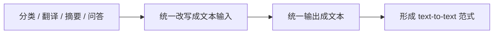

# T5【选修】

:::tip 本节定位
T5 很值得学，不是因为它只是一个具体模型，  
而是因为它把一个很重要的想法推得非常彻底：

> **把很多 NLP 任务统一写成“输入文本 -> 输出文本”。**

这件事看起来简单，但它对任务组织方式影响很大。
:::

## 学习目标

- 理解 T5 的 text-to-text 统一思路
- 理解它和 BERT / GPT 的任务组织差异
- 通过可运行示例建立“任务转文本”的直觉
- 理解为什么 T5 对很多生成型 NLP 任务很自然

---

## 先建立一张地图

T5 这节最适合新人的理解顺序不是“它又是一个新模型”，而是先看清：



所以这节真正想讲的不是“又多一个模型名字”，而是：

- 为什么任务组织方式可以被统一
- 为什么这会影响我们设计数据和接口的方式

### 一个更适合新人的总类比

你可以把 T5 理解成：

- 给很多 NLP 任务换上一种统一的题目格式

以前像是：

- 分类题用答题卡
- 翻译题用作文纸
- 问答题用问答纸

而 T5 更像是：

- 统一改成“把题目写进文本里，再把答案也写成文本”

这样一来，很多原本看起来不一样的任务，就开始能用同一种接口来组织。

## 一、T5 最重要的思想是什么？

### 1.1 把不同任务都写成文本到文本

例如：

- 翻译  
  `translate English to Chinese: hello`
- 摘要  
  `summarize: ...`
- 问答  
  `question: ... context: ...`
- 分类  
  `classify sentiment: ...`

### 1.2 为什么这很有意思？

因为它把原本看起来差异很大的任务，统一成了一个共同接口：

- 输入是一段文本
- 输出也是一段文本

### 1.3 一个类比

如果说传统做法像给每种任务配一个专门插头，  
T5 更像想用一套统一插口接更多设备。

---

## 二、T5 和 BERT / GPT 的差别在哪里？

### 2.1 BERT 更像表示学习底座

它擅长：

- 编码
- 理解

### 2.2 GPT 更像自回归生成器

它擅长：

- 连续生成
- 对话
- 写作

### 2.3 T5 更强调任务统一接口

它的特点是：

- Encoder-Decoder 结构
- text-to-text 任务表述

这让很多需要“输入一段文本，再输出另一段文本”的任务都很自然。

---

## 三、先跑一个最小 text-to-text 示例

```python
tasks = [
    {"input": "translate English to Chinese: hello world", "target": "你好 世界"},
    {"input": "summarize: 这门课程系统讲解了 NLP 核心技术。", "target": "课程讲解 NLP 核心技术"},
    {"input": "classify sentiment: 我非常喜欢这门课", "target": "positive"},
]

for item in tasks:
    print(item)
```

### 3.1 这段代码为什么有价值？

因为它让你非常直观地看到：

- 不同任务虽然目标不同
- 但在 T5 风格里都能统一成“文本输入 + 文本输出”

### 3.2 这和传统分类接口最大的差别是什么？

分类传统上可能输出：

- 一个 class id

而在 T5 范式里，  
它也可以输出：

- `positive`
- `negative`

也就是文本本身。

### 3.3 新人第一次学 T5，最该先记什么？

最值得先记的其实是：

1. T5 的特别之处不只是结构，还有任务表述方式
2. 它把很多 NLP 任务统一成“文本进，文本出”
3. 这会让你重新理解“分类也可以是生成”

### 3.4 再看一个最小“同一接口，不同任务”示例

```python
examples = [
    ("translate English to Chinese: good morning", "早上好"),
    ("summarize: 这门课系统讲解了机器学习与深度学习。", "课程讲解机器学习与深度学习"),
    ("question: 退款期限是多久? context: 课程购买后7天内可退款。", "7天内"),
    ("classify topic: 这篇文章主要讨论 GPU 显存优化", "hardware"),
]

for src, tgt in examples:
    print({"input": src, "target": tgt})
```

这个示例很适合初学者，因为它会把一个原本抽象的说法变得很具体：

- 原来分类、问答、翻译、摘要
- 都真的可以被改写成同一类“文本输入 -> 文本输出”

---

## 四、T5 为什么对很多任务特别自然？

### 4.1 因为很多 NLP 任务本来就能看成文本转换

例如：

- 句子 -> 另一种语言句子
- 长文 -> 摘要
- 问题 + 上下文 -> 答案

### 4.2 它对“生成式分类”也很友好

有些任务并不是必须输出一个整数标签。  
直接输出标签词本身，有时也很自然。

### 4.3 这带来的一个工程好处

任务接口更统一。  
你在思考数据格式时也更容易沿着同一条线组织。

### 4.4 第一次把任务改写成 text-to-text，最稳的默认顺序

更稳的顺序通常是：

1. 先写清楚任务前缀
2. 先定义输出文本长什么样
3. 先挑几个例子确认这种写法自然不自然
4. 再决定是否值得统一成同一接口

这样会比一上来就把所有任务硬改成 text-to-text 更稳。

---

## 五、最容易踩的坑

### 5.1 误区一：T5 就只是另一个 seq2seq 模型

不止。  
它更重要的地方在于：

- 任务表述方式

### 5.2 误区二：text-to-text 一定比其他范式更好

不是。  
它是一种统一思路，不代表所有任务都绝对最优。

### 5.3 误区三：统一接口就等于更简单

统一接口会带来很多好处，  
但也仍然需要仔细设计输入提示和输出格式。

## 如果把它做成笔记或项目，最值得展示什么

最值得展示的通常不是：

- “T5 也能做分类”

而是：

1. 同一接口下的多种任务样例
2. 输入前缀如何改变任务类型
3. 为什么这种方式对工程组织有帮助
4. 它和 BERT / GPT 的任务视角差异

这样别人会更容易看出：

- 你理解的是任务组织方式的变化
- 不只是又记住了一个模型名

---

## 小结

这节最重要的是建立一个任务组织直觉：

> **T5 的真正价值，不只是模型本身，而是它证明了很多 NLP 任务都可以被统一写成 text-to-text 的形式。**

只要这一层理解清楚，后面你看很多现代生成式任务时就会更自然。

---

## 这节最该带走什么

- T5 的价值不只在模型，而在 text-to-text 范式
- 统一任务接口会改变你组织数据和任务的方式
- 这也是后面很多生成式 NLP 工作流的重要前身

## 练习

1. 自己再写 3 个任务，把它们都改写成 text-to-text 格式。
2. 为什么说 T5 的重要性不只在模型，而在任务统一方式？
3. 想一想：哪些任务特别适合 text-to-text，哪些任务可能未必需要这么组织？
4. 用自己的话解释：T5 和 BERT / GPT 在任务视角上的差异。
