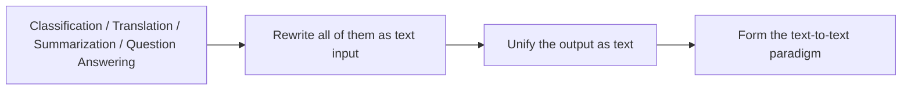

# 11.6.5 T5 [Elective]


:::tip Reading guide
The core idea of T5 is to rewrite classification, translation, summarization, and question answering into text-to-text. When reading the diagram, focus on how task prefixes, input text, and output text are unified into a single interface, rather than seeing T5 as just another seq2seq model.
:::

:::tip Where this section fits
T5 is worth learning not because it is just one specific model,
but because it pushes a very important idea all the way:

> **Unify many NLP tasks as "input text -> output text".**

This may sound simple, but it has a big impact on how tasks are organized.
:::

## Learning objectives

- Understand T5’s text-to-text unification idea
- Understand how its task organization differs from BERT / GPT
- Build intuition for "task as text" through runnable examples
- Understand why T5 feels very natural for many generation-style NLP tasks

---

## First, build a map

For beginners, the best way to understand this T5 section is not "it is another new model," but first to see clearly:



So what this section really wants to say is not "yet another model name," but:

- Why task organization can be unified
- Why this changes how we design data and interfaces

### A better overall analogy for beginners

You can think of T5 as:

- Giving many NLP tasks a unified problem format

Before, it was like:

- Classification used answer cards
- Translation used essay paper
- Question answering used Q&A sheets

T5 is more like:

- Unifying everything as "write the task into text, and write the answer as text too"

In this way, many tasks that originally seemed different can start to be organized with the same interface.

## What is the most important idea in T5?

### Rewrite different tasks as text-to-text

For example:

- Translation
  `translate English to Spanish: hello`
- Summarization
  `summarize: ...`
- Question answering
  `question: ... context: ...`
- Classification
  `classify sentiment: ...`

### Why is this interesting?

Because it turns tasks that seem very different into one shared interface:

- The input is a piece of text
- The output is also a piece of text

### An analogy

If traditional methods are like giving each task its own special plug,
T5 is more like trying to use one unified socket for more devices.

---

## What is the difference between T5 and BERT / GPT?

### BERT is more like a representation learning backbone

It is good at:

- Encoding
- Understanding

### GPT is more like an autoregressive generator

It is good at:

- Continuous generation
- Dialogue
- Writing

### T5 emphasizes a unified task interface

Its characteristics are:

- Encoder-Decoder structure
- text-to-text task formulation

This makes many tasks that need "take one text as input and produce another text as output" feel very natural.

---

## Run a minimal text-to-text example first

```python
tasks = [
    {"input": "translate English to Spanish: hello world", "target": "hola mundo"},
    {"input": "summarize: This course systematically explains the core technologies of NLP.", "target": "The course explains core NLP technologies."},
    {"input": "classify sentiment: I really like this course", "target": "positive"},
]

for item in tasks:
    print(item)
```

Expected output:

```text
{'input': 'translate English to Spanish: hello world', 'target': 'hola mundo'}
{'input': 'summarize: This course systematically explains the core technologies of NLP.', 'target': 'The course explains core NLP technologies.'}
{'input': 'classify sentiment: I really like this course', 'target': 'positive'}
```

Each row has the same shape: an input string that includes the task instruction, and a target string that the model should generate. This is the practical meaning of “text-to-text.”

### Why is this code valuable?

Because it makes it very intuitive to see:

- Different tasks have different goals
- But in the T5 style, they can all be unified as "text input + text output"

### What is the biggest difference from a traditional classification interface?

Traditional classification may output:

- A class id

But in the T5 paradigm,
it can also output:

- `positive`
- `negative`

That is, text itself.

### What should beginners remember first when learning T5?

What is most worth remembering is:

1. T5 is special not only because of its architecture, but also because of how tasks are formulated
2. It unifies many NLP tasks as "text in, text out"
3. This helps you rethink "classification can also be generation"

### Another minimal example of "same interface, different tasks"

```python
examples = [
    ("translate English to Spanish: good morning", "buenos dias"),
    ("summarize: This course systematically explains machine learning and deep learning.", "The course explains machine learning and deep learning."),
    ("question: What is the refund period? context: Refunds are available within 7 days after purchase.", "7 days"),
    ("classify topic: This article mainly discusses GPU memory optimization", "hardware"),
]

for src, tgt in examples:
    print({"input": src, "target": tgt})
```

Expected output:

```text
{'input': 'translate English to Spanish: good morning', 'target': 'buenos dias'}
{'input': 'summarize: This course systematically explains machine learning and deep learning.', 'target': 'The course explains machine learning and deep learning.'}
{'input': 'question: What is the refund period? context: Refunds are available within 7 days after purchase.', 'target': '7 days'}
{'input': 'classify topic: This article mainly discusses GPU memory optimization', 'target': 'hardware'}
```

This tiny dataset is not for training yet. It is a format audit: before choosing a model, first confirm that every task can be represented as a clear input text and a clear expected output text.

This example is very suitable for beginners, because it makes an abstract idea concrete:

- Classification, question answering, translation, and summarization
- Can all really be rewritten as the same kind of "text input -> text output"

---

## Why does T5 feel so natural for many tasks?

### Because many NLP tasks can already be viewed as text transformation

For example:

- Sentence -> sentence in another language
- Long article -> summary
- Question + context -> answer

### It is also friendly to "generative classification"

Some tasks do not have to output an integer label.
Directly outputting the label word itself can also be natural.

### One engineering benefit

The task interface becomes more unified.
When you think about data formats, it is also easier to organize them along the same line.

### The safest default order when rewriting a task as text-to-text for the first time

A more stable order is usually:

1. First write down the task prefix clearly
2. First define what the output text should look like
3. First try a few examples to check whether the wording feels natural
4. Then decide whether it is worth unifying everything into the same interface

This is more stable than forcing every task into text-to-text all at once.

---

## The most common pitfalls

### Mistake 1: T5 is just another seq2seq model

Not only that.
What matters more is:

- The way tasks are formulated

### Mistake 2: text-to-text is always better than other paradigms

No.
It is a unified way of thinking, not an absolute guarantee of optimality for every task.

### Mistake 3: A unified interface automatically means simplicity

A unified interface brings many benefits,
but it still requires careful design of the input prompt and output format.

## If you turn this into notes or a project, what is most worth showing?

What is usually most worth showing is not:

- "T5 can also do classification"

But rather:

1. Examples of multiple tasks under the same interface
2. How the input prefix changes the task type
3. Why this approach helps engineering organization
4. Its difference from BERT / GPT in how it views tasks

This makes it easier for others to see that:

- What you understand is the change in task organization
- Not just another model name

---

## Evidence to Keep

Keep this page's proof of learning as a small evidence card:

```text
model_choice: BERT, GPT, T5, Transformers pipeline, or other pretrained baseline
tokenizer_output: ids, masks, decoded text, or batch shape
task_result: classification, generation, extraction, or text-to-text output
failure_check: wrong model family, token limit, domain mismatch, cost, or latency
Expected_output: model call result plus a short choice rationale
```

## Summary

The most important thing in this section is to build intuition about task organization:

> **The real value of T5 is not just the model itself, but that it shows many NLP tasks can be unified as text-to-text.**

Once you understand this clearly, many modern generative tasks will feel more natural later on.

---

## What you should take away from this section

- T5’s value is not only in the model, but in the text-to-text paradigm
- A unified task interface changes how you organize data and tasks
- This is also an important predecessor of many later generative NLP workflows

## Exercises

1. Write 3 more tasks yourself and rewrite all of them into text-to-text format.
2. Why is T5 important not only because of the model, but because of the task unification approach?
3. Think about it: which tasks are especially suitable for text-to-text, and which tasks may not need to be organized this way?
4. Explain in your own words the difference in task perspective between T5 and BERT / GPT.

<details>
<summary>Solution approach and explanation</summary>

1. Good text-to-text rewrites include `classify sentiment: ... -> positive`, `summarize: ... -> ...`, and `extract date: ... -> 2026-05-20`.
2. T5 matters because it makes many tasks share the same input-output interface, not only because of one architecture.
3. Summarization, translation, QA, rewriting, and extraction fit text-to-text well; pure embedding retrieval or low-level token tagging may not need that interface.
4. BERT is usually understanding-oriented, GPT is causal generation-oriented, and T5 frames tasks as input text transformed into output text.

</details>
