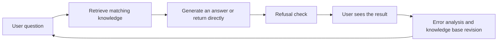

# 11.7.2 Project: Intelligent Question Answering System


:::tip Reading guide
A QA system is not finished just because it "generates something that looks like an answer." When reading the diagram, focus on how query, retrieval, evidence, answer, refusal, evaluation, and error log form a closed loop. This is also the core structure of later RAG projects.
:::

:::tip Where this section fits
A QA system is a great NLP portfolio project because it naturally demonstrates:

- Text representation
- Similarity
- Retrieval
- Refusal strategies

But to make it feel like a real "project" rather than just a demo that "can answer a few questions," the key is:

> **The knowledge boundary, retrieval quality, refusal mechanism, and evaluation method all need to be clearly explained.**
:::

## Learning goals

- Learn how to define the scope of a small, explainable QA system
- Learn how to design a knowledge base, retriever, and refusal strategy
- Learn how to use a minimal evaluation set to validate the system
- Learn how to package a QA system as a portfolio page

---

## How should we narrow the project topic?

A very solid starting point is:

> **Build a retrieval-based FAQ QA system for a course platform.**

Why this works well:

- The scope is clear
- The knowledge base is easy to prepare
- The causes of errors are easy to analyze

---

## The minimal closed loop of a portfolio-level QA project

1. Define the knowledge scope
2. Prepare the knowledge base
3. Build a retrieval baseline
4. Add refusal logic
5. Create an evaluation set
6. Present error analysis

As long as these 6 steps are clear, the project is already quite convincing.

### A loop diagram that looks more like a real system



This diagram matters a lot, because what a QA system truly delivers is not:

- just a reply that looks smart

but rather:

- a system with a clear knowledge boundary that also knows how to review its mistakes

## Recommended implementation order

For beginners, a safer order is usually:

1. Narrow the knowledge scope first
2. Build the simplest retrieval baseline next
3. Add a refusal mechanism after that
4. Finally add evaluation and presentation

This makes the project feel more like an "explainable system" rather than a demo that just happens to get a few answers right.

### Why is a QA system especially good for training "system boundary awareness"?

Because it forces you to keep asking three questions:

- What does the system actually know?
- What does it not know?
- When should it stop and not answer?

This is one of the most important layers of judgment in many real product systems.

### A better analogy for beginners

You can think of a QA system as:

- a help desk at a library

The front desk is not omniscient,
instead it:

- first looks in the library's materials
- answers if it finds something
- clearly says no if it cannot find anything

This analogy is important because it helps beginners build the right intuition early on:

- a QA system is first and foremost a knowledge-boundary system
- not a chat system that tries to say something about everything

---

## First build a more complete minimal system

```python
import re

knowledge_base = [
    {"question": "How long after purchase can I get a refund?", "answer": "Refunds can be requested within 7 days of purchase if your learning progress is below 20%."},
    {"question": "How do I get the certificate?", "answer": "You can receive the completion certificate after finishing all required projects and passing the final test."},
    {"question": "What is the learning order?", "answer": "It is recommended to study Python, data analysis, and machine learning first, then move on to deep learning and large models."},
    {"question": "Do I need a GPU for the first four stages?", "answer": "A GPU is not required for the first four stages; a regular computer is enough."},
]

STOPWORDS = {"a", "an", "the", "is", "do", "i", "can", "get", "how", "what", "for", "after"}


def tokenize(text):
    return {token for token in re.findall(r"[a-z0-9]+", text.lower()) if token not in STOPWORDS}


def answer_question(user_query):
    query_tokens = tokenize(user_query)
    scored = []

    for item in knowledge_base:
        score = len(query_tokens & tokenize(item["question"]))
        scored.append((score, item))

    scored.sort(key=lambda x: x[0], reverse=True)
    best_score, best_item = scored[0]
    return {
        "matched_question": best_item["question"],
        "answer": best_item["answer"],
        "score": best_score,
    }


print(answer_question("How long is the refund period?"))
print(answer_question("How do I get the certificate?"))
```

Expected output:

```text
{'matched_question': 'How long after purchase can I get a refund?', 'answer': 'Refunds can be requested within 7 days of purchase if your learning progress is below 20%.', 'score': 2}
{'matched_question': 'How do I get the certificate?', 'answer': 'You can receive the completion certificate after finishing all required projects and passing the final test.', 'score': 1}
```

The score is the number of shared meaningful tokens. It is intentionally simple, but it is already better than character matching because an unrelated question can now receive a score of `0`.

### Why does this example feel more like a project, not just a function?

Because it already has:

- A knowledge base
- Matching logic
- A matching score
- An explainable return value

### Why is `matched_question` worth showing?

Because it helps you answer:

- Did the system really answer correctly?
- Or did it just happen to sound right?

### Why is "what was retrieved" more important to inspect first than "whether the answer sounds smooth"?

Because many QA system errors are not errors in generation,
but instead:

- the system retrieved the wrong knowledge from the very beginning

If you do not see this clearly,
it becomes very hard to figure out where the problem actually is.

### Another minimal "match log" example

Add this below the previous code and run the file again.

```python
queries = ["How long is the refund period?", "How do I get the certificate?"]

for query in queries:
    result = answer_question(query)
    print(
        {
            "query": query,
            "matched_question": result["matched_question"],
            "score": result["score"],
        }
    )
```

Expected output:

```text
{'query': 'How long is the refund period?', 'matched_question': 'How long after purchase can I get a refund?', 'score': 2}
{'query': 'How do I get the certificate?', 'matched_question': 'How do I get the certificate?', 'score': 1}
```

If the matched question is wrong, do not tune the answer text first. Fix retrieval, tokenization, or the knowledge base boundary first.

This kind of log is one of the most useful things to look at in a real project:

- What did the user ask?
- Which knowledge item did the system match?
- Roughly how high was the match score?

Many issues can already be diagnosed at this stage.

---

## Why is a refusal mechanism the key to a portfolio-level QA system?

Without refusal, the system will easily:

- force an answer to every question

That is dangerous in real projects.

```python
def safe_answer_question(user_query, threshold=1):
    result = answer_question(user_query)
    if result["score"] < threshold:
        return {
            "answer": "There is not enough relevant information in the current knowledge base.",
            "matched_question": None,
            "score": result["score"],
        }
    return result


print(safe_answer_question("Which is stronger, DeepSeek or OpenAI?"))
```

Expected output:

```text
{'answer': 'There is not enough relevant information in the current knowledge base.', 'matched_question': None, 'score': 0}
```

This is the behavior you want: the system found no supporting knowledge, so it refused instead of guessing.

### Why is this step especially valuable?

Because it changes the system from:

- always wanting to say something

to:

- knowing when to stop

That is a big plus in a portfolio.

---

## How should a minimal evaluation set be designed?

```python
eval_data = [
    ("How long is the refund period?", "Refunds can be requested within 7 days of purchase if your learning progress is below 20%."),
    ("How do I get the certificate?", "You can receive the completion certificate after finishing all required projects and passing the final test."),
    ("Do I need a graphics card for the first four stages?", "A GPU is not required for the first four stages; a regular computer is enough."),
]


correct = 0
for q, gold in eval_data:
    pred = safe_answer_question(q, threshold=1)["answer"]
    if pred == gold:
        correct += 1

accuracy = correct / len(eval_data)
print("accuracy =", accuracy)
```

Expected output:

```text
accuracy = 1.0
```

This tiny evaluation set is not enough for a real product, but it proves the loop: normal questions answer correctly, paraphrases still retrieve the right item, and refusal can be tested separately.

### What else should be evaluated?

Besides accuracy, it is also worth checking:

- Whether refusal is reasonable
- Which questions are most likely to be mismatched
- Whether paraphrases are handled consistently

### A minimal evaluation table that works well for beginners

You can start with just this table:

| query | matched_question | answer | should_answer | actually_answered | correct |
|---|---|---|---|---|---|

This table is already enough to help you judge:

- Whether the match is correct
- Whether refusal is stable
- Whether the final answer is reliable

### The safest default order for your first QA project

A safer order is usually:

1. Write the knowledge base small and clearly
2. Build the simplest retrieval baseline first
3. Add a refusal layer
4. Then add an evaluation table and error analysis

This is easier than trying to pursue generation quality right away.

---

## The most valuable failure cases to show

For example:

- Matching fails after the wording of a question changes
- The knowledge base does not cover the question
- The system should not answer, but still gives a wrong answer

Listing these will make the project feel more like a course project than only showing correct examples.

### If you keep improving the project, what should you add first?

The most worthwhile additions are usually:

1. Paraphrase robustness tests
2. A more stable refusal strategy
3. Side-by-side display of retrieved results and final answers

This will make the project look more like a truly explainable QA system, instead of just a collection of FAQ text snippets.

---

## What to include when delivering the project

- A table explaining the knowledge boundary
- An example of retrieval success / refusal behavior
- A set of typical failure cases
- A short explanation of your next upgrade plan

## If you turn it into a portfolio project, what is most worth showing?

What is most worth showing is usually not:

- "Which questions the system answered correctly"

but rather:

1. The knowledge boundary
2. The retrieval log
3. Refusal examples
4. Error analysis
5. How the system will be improved next

That way, others will more easily feel that:

- you built a system
- not just a bundle of FAQ entries

## Evidence to Keep

Keep this page's proof of learning as a small evidence card:

```text
task_output: label, entity fields, summary, answer, retrieval result, or semantic graph
artifacts: raw text, processed text, predictions, metrics, and failure cases
metric: accuracy/F1, precision/recall, retrieval hit rate, faithfulness, or schema validity
failure_check: unclear labels, over-cleaning, boundary errors, hallucination, or unsupported answer
Expected_output: reproducible text pipeline folder with metrics and examples
```

## Summary

The most important idea in this section is to build a portfolio-level judgment:

> **The value of a QA system is not just that it can answer a few questions correctly, but that you can explain its knowledge boundary, retrieval logic, refusal strategy, and error analysis as one complete closed loop.**

Once that loop is in place, this project becomes very suitable for a portfolio.

## What should you take away from this section?

- A QA system is first a "knowledge-boundary system," and only then an "answering system"
- Retrieval hits, refusal, and error analysis are the three most worth showing parts of the project
- If you can clearly explain "why it answered," "why it did not answer," and "why it answered incorrectly," then the project will feel very much like a portfolio-level project

---


## Suggested version roadmap

| Version | Goal | Delivery focus |
|---|---|---|
| Basic version | Run the minimal closed loop | Can accept input, process it, and output results, while keeping a set of examples |
| Standard version | Become a presentable project | Add configuration, logs, error handling, README, and screenshots |
| Advanced version | Approach portfolio quality | Add evaluation, comparison experiments, failure sample analysis, and a next-step roadmap |

It is recommended to finish the basic version first; do not try to build something huge and complete from the beginning. Each time you upgrade a version, write in the README what new capability was added, how it was verified, and what problems still remain.

## Exercises

1. Add 5 more course FAQ entries to the knowledge base and see how the matching results change.
2. Why does a refusal mechanism significantly improve the credibility of the project?
3. Think about this: if two questions are very similar but have different answers, what is the system most likely to get wrong?
4. If you were presenting a portfolio project, which 3 parts would you most want to show the interviewer?

<details>
<summary>Reference answers and explanation</summary>

1. Adding five FAQ entries should improve coverage only if their wording and expected answers are clear; also add near-duplicate questions to test confusion.
2. A refusal mechanism improves credibility because users can distinguish supported answers from guesses.
3. When two questions are similar but answers differ, the system is likely to retrieve the wrong entry or answer with a blended response.
4. For a portfolio, show the knowledge base, retrieval evidence, refusal tests, failure cases, and a small improvement log.

</details>
