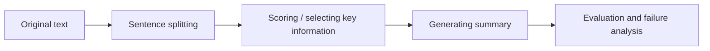

# 11.7.3 Project: Text Summarization System


:::tip Reading tip
Evaluation is the part summarization projects most easily overlook. When reading this diagram, think about extractive summary, generative summary, coverage, faithfulness, length control, and human scoring together. First make sure the summary does not lose facts, then pursue better expression.
:::

:::tip Where this section fits
A summarization project is a great portfolio piece because it forces you to answer a few very real questions:

- What counts as key information?
- How do you compress long text?
- How do you tell whether a summary is actually good?

This section will not stop at “I can extract a few sentences.” Instead, it will clearly explain the parts of a project-level deliverable that matter most.
:::

## Learning objectives

- Learn how to define the minimum end-to-end loop of a summarization project
- Learn how to turn an extractive baseline into an explainable system
- Learn how to design minimal evaluation and failure analysis
- Learn how to package this topic as a complete NLP project

---

## First, build a map

For beginners, the best way to understand a text summarization project is not to “chase a stronger model first,” but to first see the full project loop clearly:



So what this section really wants to solve is:

- What does it mean to “keep the main thread”?
- How do you evaluate and present a summarization project?

### A better overall analogy for beginners

You can think of text summarization as:

- Making a reading card for a long article

The real difficulty is not “making the text shorter,” but:

- Not losing the main thread
- Not keeping only side details
- Making the final summary read smoothly

## How should you narrow the project topic?

A good starter project could be:

> **Generate a 2-sentence summary for long course articles.**

This type of task is good because:

- The domain is clear
- The text length is moderate
- The summarization goal is easy to understand

### When doing your first summarization project, how do you choose a safer topic?

A safer starting point usually has these three traits:

- The original text has a clear structure
- The main thread is concentrated
- It is easy for readers to judge whether the key points are missing

So texts like:

- course introductions
- news briefs
- meeting minutes

are often great practice topics.

### A useful early judgment for beginners

When you do a summarization project for the first time, the most worthwhile thing to choose first is:

- Texts where readers can easily tell which parts are the key points

Because the hardest layer of summarization is:

- What exactly counts as key information?

---

## The minimum project loop for a portfolio-level summarization project

1. Select a text collection
2. Split into sentences
3. Score sentences
4. Select the top-k sentences
5. Do human evaluation
6. Summarize failure patterns

### A project checklist that beginners can remember first

| Step | What should you confirm first? |
|---|---|
| Sentence splitting | Whether sentence boundaries are stable |
| Scoring | What standard is used to decide “more important” |
| Summary generation | Whether the top-k sentences preserve the main thread |
| Evaluation | Whether you are only checking “does it read smoothly,” or also “does it miss key points” |

This table is useful for beginners because it turns a summarization project back into a chain of steps that can be checked, rather than “just extract a few sentences and stop.”

## Recommended order of progress

For beginners, a safer order is usually:

1. Build an extractive baseline first
2. Add minimal human evaluation
3. Do failure case analysis
4. Only then consider a comparison with generative summarization

This way, you can more easily see what the summarization system is actually improving.

---

## Start with a more complete extractive summarization system

```python
import re

article = """
The learning path for AI courses is usually divided into a foundation stage and an advanced stage.
The foundation stage includes Python programming, data analysis, and machine learning.
Only after learners master these topics can they move more steadily into deep learning and large model application development.
Many people want to jump straight into large models at the beginning, but they often get stuck quickly because their foundation is not solid enough.
If the learning goal is AI application engineering, understanding data processing, model training, and system deployment is all very important.
""".strip()


def split_sentences(text):
    parts = re.split(r"[。！？\n]+", text)
    return [p.strip() for p in parts if p.strip()]


def sentence_score(sentence, all_sentences):
    # Extremely simple frequency-based scoring: sentences with more high-frequency words get higher scores
    tokens = "".join(all_sentences)
    return sum(tokens.count(ch) for ch in sentence if ch.strip())


def summarize(text, top_k=2):
    sentences = split_sentences(text)
    scored = [
        (sentence_score(sent, sentences), idx, sent)
        for idx, sent in enumerate(sentences)
    ]
    top = sorted(sorted(scored, reverse=True)[:top_k], key=lambda x: x[1])
    return "。".join(item[2] for item in top) + "。", scored


summary, scored = summarize(article, top_k=2)
print("summary:", summary)
print("scores:", scored)
```

### Why does this example feel more like a project?

Because it does not only give you the result,
it also keeps:

- the sentence-splitting result
- the scoring result

This lets you do:

- explanation
- debugging
- failure analysis

### Why is it especially worth showing intermediate scores in a summarization project?

Because whether a summary is good or bad is inherently subjective.
The intermediate scoring process helps others understand:

- how you made your selection

### Here is another minimal example for “summary length control”

```python
for k in [1, 2, 3]:
    summary_k, _ = summarize(article, top_k=k)
    print(f"top_k={k} -> {summary_k}")
```

This example is great for beginners because it helps you build one key intuition:

- A summary is not better just because it has more sentences
- Nor is it more advanced just because it is shorter

Rather, it is about:

- Preserving the main thread as much as possible under length constraints

---

## What should a minimal human evaluation table look like?

```python
eval_cases = [
    {
        "text": article,
        "gold_focus": ["foundation stage", "deep learning and large models", "system deployment"],
    }
]

for case in eval_cases:
    pred_summary, _ = summarize(case["text"], top_k=2)
    covered = [item for item in case["gold_focus"] if item in pred_summary]
    print({
        "summary": pred_summary,
        "covered_focus": covered,
        "coverage_ratio": round(len(covered) / len(case["gold_focus"]), 4),
    })
```

### Why is this evaluation simple but useful?

Because it forces you to answer:

- Did the summary keep the main thread or not?

That is more concrete than only asking whether it “reads smoothly.”

---

## The failure cases most worth showing in a summarization project

For example:

- Repeated sentence selection
- Missing key information
- Unnatural sentence order

### Why are these worth showing?

Because they happen to reflect the typical limitations of extractive summarization.

### A failure analysis framework that is easy for beginners to use directly

You can first categorize them into these three types:

1. Missing main-thread information
2. Repeated or redundant sentences
3. The individual sentences are fine, but the combination feels unnatural

This is easier to move forward with than just saying “the summary is not very good.”

### An error bucket table that beginners can copy directly

| Error type | What should you probably improve next? |
|---|---|
| Missing main-thread information | Sentence scoring rules |
| Repeated sentences | Redundancy removal strategy |
| Unnatural combination | Sentence ordering or generative rewriting |

This table is helpful for beginners because it helps turn “the summary is not very good” back into concrete problems that can be improved.

---

## How can you push this project toward portfolio quality?

### Add a generative summarization comparison

### Include more text types

For example:

- news
- course introductions
- meeting minutes

### Make a one-page before / after display

For example:

- original text
- baseline summary
- tuned summary
- failure analysis

---

## What you should ideally include when delivering the project

- Original text / summary comparison
- Intermediate sentence score table
- A set of failed summary examples
- A short explanation of what you define as “key information”

## If you turn it into a portfolio piece, what should you emphasize most?

What is usually most worth emphasizing is not:

- “I built a summarization model”

but rather:

1. How your baseline selects sentences
2. How you define “keeping the main thread”
3. How you present intermediate sentence scores
4. What the main error cases are

This makes it easier for others to see that:

- You understand the evaluation criteria of a summarization project
- Not just that you shortened the text

## If you keep going, what is most worth adding next?

The most worthwhile additions, in order, are usually:

1. More stable sentence scoring features
2. Better human evaluation criteria
3. A comparison page for extractive and generative summarization

Then your project can grow from “it runs” into “it can compare, explain, and present.”

---

## Summary

The most important takeaway from this section is to build a portfolio-level judgment:

> **The key to a summarization project is not just extracting a few sentences, but whether you can explain sentence splitting, scoring, generation, evaluation, and failure analysis as one explainable loop.**

As long as this loop is clear, a text summarization project will feel very much like a mature NLP deliverable.


## Suggested version roadmap

| Version | Goal | Delivery focus |
|---|---|---|
| Basic version | Run the minimum loop | Can input, process, and output, while keeping a set of examples |
| Standard version | Become a presentable project | Add configuration, logging, error handling, a README, and screenshots |
| Advanced version | Approach portfolio quality | Add evaluation, comparison experiments, failure sample analysis, and a next-step roadmap |

It is recommended to finish the basic version first. Do not chase a large, all-in-one solution from the beginning. Each time you improve a version, write down in the README what new capability was added, how it was validated, and what problems still remain.

## Exercises

1. Change `top_k` to 1 and 3, and observe how the summary changes.
2. Why is it especially worthwhile for a summarization project to show the “intermediate scoring results”?
3. Think about it: what type of failure is extractive summarization most likely to have?
4. If you were to put this project into a portfolio, which 4 parts would you prioritize showing?
