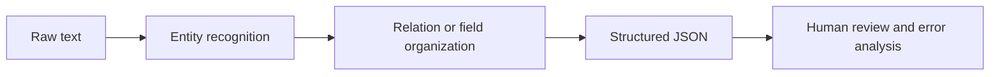

# Project: Information Extraction


:::tip Reading Guide
The key to information extraction is to define the schema first, then let the text reliably map to fields, entities, and relationships. When reading the diagram, focus on how rules, NER, relation extraction, JSON output, and human review connect into a deliverable workflow.
:::

:::tip Section Positioning
The goal of an information extraction project is not to make the model “understand every text,” but to reliably turn key entities, relationships, or fields in text into structured data. It is an important bridge between traditional NLP, RAG document processing, and LLM structured output.
:::

## Project Goal

Build a “small course announcement information extractor”: given a course announcement or event notice, output structured fields such as time, location, topic, speaker, and target audience.



## Minimal Version

For the basic version, you do not need to train a model first. Use rules and regular expressions to extract fields. For example, extract clearly formatted information such as dates, times, and locations from text.

```python
import re

text = "This Saturday at 19:30, there will be an introductory RAG livestream on Tencent Meeting, hosted by Teacher Zhang."

result = {
    "time": re.findall(r"\d{1,2}:\d{2}", text),
    "platform": "Tencent Meeting" if "Tencent Meeting" in text else None,
    "topic": "RAG Introduction" if "RAG Introduction" in text else None,
}

print(result)
```

Although this version is simple, it helps you understand the core of information extraction: extracting usable fields from unstructured text.

## Standard Version

The standard version can introduce NER or LLM structured output. You can use an off-the-shelf NER model to identify names, organizations, and locations, then use rules or a Prompt to organize the results into JSON. The focus is not perfection, but building a workflow where extraction results can be checked.

A recommended output format is:

```json
{
  "event_name": "RAG Intro Livestream",
  "time": "Saturday 19:30",
  "location": "Tencent Meeting",
  "speaker": "Teacher Zhang",
  "audience": "Beginners in AI applications",
  "confidence": "medium"
}
```

## Challenge Version

The challenge version can add batch extraction and human validation. For example, if you input 20 course announcements, the system generates JSON in batches, and then a person marks which fields are correct, which fields are missing, and which fields were extracted incorrectly. Finally, calculate field-level accuracy.

| Field | Accuracy | Common Errors |
|---|---|---|
| time | 90% | Relative time is not normalized |
| location | 85% | Online platforms and locations are confused |
| speaker | 80% | The boundary between title and name is unclear |
| topic | 75% | The topic is too long or missing keywords |

## Connection to RAG / Agent

Information extraction can be used to build metadata for RAG documents. For example, extract stages, chapters, key concepts, and target audience from course documents, and use them as retrieval filters. It can also serve as a tool for an Agent: when an Agent needs to organize meetings, contracts, tickets, or course materials, it can first extract structured fields and then make follow-up decisions.

## Project Deliverables

The README should include: project goals, input examples, output JSON schema, extraction method, field explanations, evaluation method, failed samples, and next steps. When presenting your portfolio, it is best to include a comparison table showing “original text -> JSON -> human correction.”

## Common Mistakes

The first mistake is showing only successful examples without field-level evaluation. The second mistake is an unstable JSON schema, which makes downstream programs unusable. The third mistake is ignoring boundary issues—for example, in “Teacher Zhang will share at Peking University,” Peking University may be a location or an organization. The fourth mistake is sending LLM output directly into the database without validation.


## Suggested Version Roadmap

| Version | Goal | Delivery Focus |
|---|---|---|
| Basic Version | Complete the minimal loop | Able to input, process, and output, while keeping a set of examples |
| Standard Version | Form a presentable project | Add configuration, logging, error handling, README, and screenshots |
| Challenge Version | Close to portfolio quality | Add evaluation, comparison experiments, failed sample analysis, and next-step roadmap |

It is recommended to finish the basic version first; do not try to make everything comprehensive from the start. Every time you upgrade a version, write into the README what new capability was added, how it was verified, and what problems remain.

## Exercises

1. Design a JSON schema for extracting course announcements.
2. Test rule-based extraction on 5 sample announcements and record whether each field is correct.
3. Find 3 failed extraction cases and analyze whether the issue is entity boundary errors, missing fields, or unclear schema design.
4. Think about how these structured fields help subsequent RAG retrieval.

## Passing Criteria

After completing the project, you should be able to explain the difference between information extraction, text classification, and NER; design a stable output schema; evaluate extraction quality with field-level metrics; and explain how it serves RAG or Agent systems.
