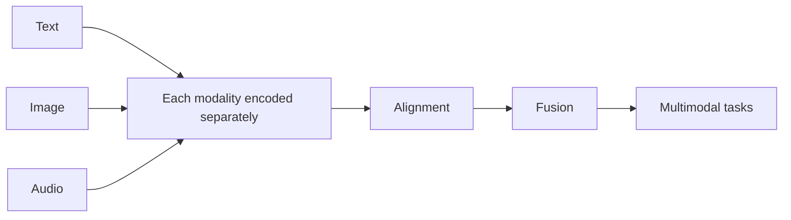

# 12.1.2 Fundamentals of Multimodal Learning


## Learning Objectives

After completing this section, you will be able to:

- Understand what a “modality” is
- Explain why multimodal systems are closer to the real world
- Understand the intuition behind fusion and alignment
- Run a tiny image-text matching example

## Historical Background: Why Did Multimodal Suddenly Become a Mainstream Direction?

The most important historical milestone in this section is:

| Year | Paper / Method | Key Author(s) | What it most importantly solved |
|---|---|---|---|
| 2021 | CLIP | Radford et al. | Aligned images and text into the same semantic space, significantly advancing image-text retrieval, vision-language understanding, and the path toward multimodal foundation models |

For beginners, the most important thing to remember first is:

> **The significance of CLIP is not just that “image-text retrieval got better,” but that it made the route of “align different modalities first, then solve tasks” truly take hold.**

So the “alignment” and “shared semantic space” you see in this section are not abstract concepts.
They are the foundation that made many later multimodal systems actually work.

### Why Did Work Like CLIP Make Many People Feel, for the First Time, That “Multimodal Is Really Here”?

Because earlier image-text systems often felt more like:

- Building a separate model for a single task
- Rebuilding everything whenever the task changed

What CLIP brought was very different:

- Images and text might first learn a shared space
- Once that alignment is stable, many tasks can grow on top of it

This feels a bit like many people’s first experience with BERT / GPT:

- It is no longer just “one task performs better”
- It feels more like “the foundation itself has become stronger”

So what made CLIP exciting was not only the image-text retrieval results,
but also the fact that it made “multimodal foundation models” feel, for the first time, like a real direction that could continue to grow.

### Why Did Work Like CLIP Make Multimodal Suddenly Feel “Like an Era”?

Because before that, many image-text tasks felt more like:

- Building a separate system for each task

But CLIP gave many people a strong first impression that:

- Maybe images and text can first learn the same shared semantic space
- Then many tasks can grow out of that foundation

This is very similar to the feeling that pretraining models brought to NLP:

- It is no longer just “doing a task”
- It is about building a more general foundation

So the most attractive part of CLIP for many beginners is:

> **It made the idea that “images and text can truly understand each other” feel, for the first time, not just like a demo, but like a stable technical path.**

---

## First Build a Mental Map

If you just finished the earlier text systems and Agent main line, you can think of this section as follows:

- Earlier systems mostly handled text only
- This section starts answering: if a system also needs to see images, hear audio, and understand video, how should it put all that information into the same pipeline?

So what matters most here is not piling up concepts, but:

- Building the smallest possible intuition for multimodal understanding and multimodal generation

For beginners, the best order for understanding multimodal basics is not “memorize the terms first,” but to first see clearly:



So what this section really wants to solve is:

- What does “modality” mean?
- Why are alignment and fusion the two core actions in multimodal systems?

## What Is a Modality?

A modality can be understood simply as a “form of information.”

Common modalities include:

- Text
- Images
- Audio
- Video
- Structured tables

So a multimodal system is a system that handles two or more forms of information at the same time.

As an analogy:

> Humans do not understand the world by reading text only; we also look, listen, read, and speak. Multimodal AI is moving in that direction too.

### When Learning Multimodal for the First Time, What Should You Focus on Most?

What you should focus on first is not the list of modality types, but this sentence:

> **What multimodal learning really wants to solve is how to put information from different sources into the same understanding pipeline.**

Once this idea is stable, when you look at:

- Image-text retrieval
- Visual question answering
- Multimodal chat

it becomes more natural to first ask: how are these systems actually aligning different signals?

---

## Why Is the Real World Naturally Multimodal?

Think about everyday situations:

- View a product image + read the product description
- Read medical notes + look at medical images
- Watch surveillance video + hear an alarm sound
- Upload a screenshot + ask “What error is this?”

If AI can only read text, it is like “working with its eyes closed.”
If it can only see images, it is like “not knowing how to read instructions.”

So the importance of multimodal systems is that:

> **They can combine information from different sources to understand things together.**

---

## What Multimodal Tasks Are There?

| Task | Example |
|---|---|
| Image captioning | Generate a sentence description for an image |
| Image-text retrieval | Find images using text, or find text using an image |
| Visual question answering | Answer questions based on an image |
| OCR + understanding | Read the text in an image and understand it |
| Video understanding | Summarize video content |
| Voice assistants | Understand spoken input and respond |

---

## What Does Fusion Mean?

Fusion can be understood as:

> Combining information from different modalities to form a more complete understanding.

For example, when doing product recommendation:

- Looking only at the image may reveal style
- Looking only at the text may reveal purpose
- Looking at image and text together gives a more complete understanding

### A Tiny Example

Suppose we extract features from both the product image and the text, then combine them:

```python
import numpy as np

# Image features: brightness, redness, roundness
image_feature = np.array([0.8, 0.7, 0.2])

# Text features: fashion sense, sporty feel, business feel
text_feature = np.array([0.6, 0.2, 0.1])

# Simplest fusion: concatenation
fused_feature = np.concatenate([image_feature, text_feature])

print("Image features:", image_feature)
print("Text features:", text_feature)
print("Fused features:", fused_feature)
print("Fused feature shape:", fused_feature.shape)
```

Expected output:

```text
Image features: [0.8 0.7 0.2]
Text features: [0.6 0.2 0.1]
Fused features: [0.8 0.7 0.2 0.6 0.2 0.1]
Fused feature shape: (6,)
```


The fused vector has 6 dimensions because it keeps the 3 image dimensions and appends the 3 text dimensions. This is only a toy method, but it makes the core idea visible.

Real models are of course much more complex than this, but the idea of “combining information from multiple sources” is exactly this.

### What Should You Remember Most About Fusion: the Method or the Goal?

What you should remember most is:

- A single modality does not tell the whole story
- Multimodal learning exists so the system can make more complete judgments

So fusion is not just about concatenating vectors; it is about answering:

- Which information sources should be viewed together?
- Which pieces of information complement each other?

---

## What Does Alignment Mean?

Alignment is another key concept in multimodal learning.

You can understand it as:

> **Making representations of the same meaning from different modalities move closer together in the embedding space.**

For example:

- An image of a cat
- The text “a cute cat”

If the model learns well, their vector representations should be close to each other.

### Why Has “Alignment” Become One of the Most Core Words in Multimodal Learning?

Because if representations from different modalities do not match at all, then almost nothing can be done later:

- Text-to-image search
- Image-text question answering
- Image captioning

All of these abilities depend on one prerequisite:

- Different modalities must first “know they are talking about the same thing” in some shared space

---

## A Runnable Toy Example for Image-Text Matching

```python
import numpy as np

images = {
    "red_apple.jpg": np.array([0.9, 0.1, 0.0]),   # Red, round, not a vehicle
    "blue_car.jpg": np.array([0.1, 0.2, 1.0]),    # Not red, slightly round, is a vehicle
    "orange_ball.jpg": np.array([0.8, 0.9, 0.0])  # Warm color, very round, not a vehicle
}

texts = {
    "red fruit": np.array([0.95, 0.2, 0.0]),
    "vehicle": np.array([0.0, 0.1, 1.0]),
    "round toy": np.array([0.7, 0.95, 0.0])
}

def cosine_similarity(a, b):
    return float(np.dot(a, b) / (np.linalg.norm(a) * np.linalg.norm(b)))

for text_name, text_vec in texts.items():
    print(f"\nQuery text: {text_name}")
    scores = []
    for image_name, image_vec in images.items():
        scores.append((cosine_similarity(text_vec, image_vec), image_name))
    scores.sort(reverse=True)
    for score, image_name in scores:
        print(f"  {image_name}: {score:.4f}")
```

Expected output:

```text
Query text: red fruit
  red_apple.jpg: 0.9953
  orange_ball.jpg: 0.8041
  blue_car.jpg: 0.1357

Query text: vehicle
  blue_car.jpg: 0.9905
  orange_ball.jpg: 0.0744
  red_apple.jpg: 0.0110

Query text: round toy
  orange_ball.jpg: 0.9958
  red_apple.jpg: 0.6785
  blue_car.jpg: 0.2150
```

The highest score is the retrieved image. If the top result is wrong, the first place to inspect is whether the two modalities are really aligned in the same feature space.


:::tip Reading the retrieval scores
The filename is not what makes the match work. The text vector and image vector land in the same feature space, and the highest cosine similarity becomes the retrieved result.
:::

This is the most minimal version of cross-modal retrieval:

- Convert both text and images into vectors
- Then compare similarity

---

## Why Is Multimodal Harder?

Because it has to solve two kinds of problems at the same time:

1. How to model each modality internally
2. How to align and fuse different modalities

For example, images have their own challenges:

- Spatial structure
- Lighting changes
- Viewpoint changes

And text has its own challenges:

- Ambiguity
- Context
- Long-text structure

Once the two are combined, the complexity naturally becomes higher.

---

## Evidence to Keep

Keep this page's proof of learning as a small evidence card:

```text
source_asset: image, screenshot, PDF, audio, video, or text input with version/source note
structured_record: visible text, objects, regions, timestamp, transcript, or uncertainty
fusion_result: answer, retrieval record, route decision, or multimodal feature comparison
failure_check: missing source, OCR error, alignment mistake, uncertainty, or unsupported claim
Expected_output: structured record that can be cited or reviewed later
```

## Common Multimodal Paths Today

### Dual-tower retrieval path

One encoder for images, one encoder for text, and then compare vector similarity.

### Unified Transformer path

Map images and text into a unified sequence space, then model them together.

### Large model extension path

Attach modules such as image encoders and audio encoders in front of a language model.

This is why many systems today can do:

- Image question answering
- Image-text chat
- OCR understanding

---

## Common Beginner Mistakes

### Thinking multimodal means only “images + text”

Not true.
Speech, video, and sensor signals are also modalities.

### Thinking multimodal is always better than unimodal

Not necessarily.
If the extra modality is low quality, it may instead introduce noise.

### Only looking at flashy demos and ignoring alignment

The real difficulty in multimodal learning is often alignment and fusion.

---

## Summary

The most important sentence in this lesson is:

> **The value of multimodal learning lies in combining different information sources to form a more complete understanding.**

When you continue learning vision-language models later, you will see how this “image-text alignment” is truly used inside models.

---

## What You Should Take Away

- The essence of multimodal systems is putting different forms of information into the same understanding pipeline
- “Alignment” and “fusion” are the two core actions you should remember first
- Thinking clearly about inputs and tasks is more important than chasing model names right away

If we compress it into one sentence, it is:

> **The key to multimodal learning is not having more modalities, but that systems finally begin to place different information sources within the same decision-making framework.**

---

## Exercises

1. Modify the image and text vectors above and observe how the matching ranking changes.
2. Design your own toy vector space for “food / vehicles / animals.”
3. Think about why a “screenshot of an error + a question in text” is more suitable for a multimodal system than error text alone.

<details>
<summary>Operation guide and checkpoints</summary>

1. A good check is whether the top match changes for the right reason. If the image vector moves closer to the text vector on the same meaning dimensions, its ranking should rise; if it only changes on an unrelated dimension, the ranking should stay similar.
2. One simple toy space is `sweet/salty`, `moving/static`, and `living/non-living`. Fruit can sit near sweet and living, vehicles near moving and non-living, and animals near moving and living. The important part is not the exact numbers, but whether nearby points share useful meaning.
3. The screenshot carries layout, color, error position, button state, and visual context that plain copied text loses. A multimodal system can combine those visual clues with the user's question, so it can answer what is wrong and where the user should look next.

</details>
