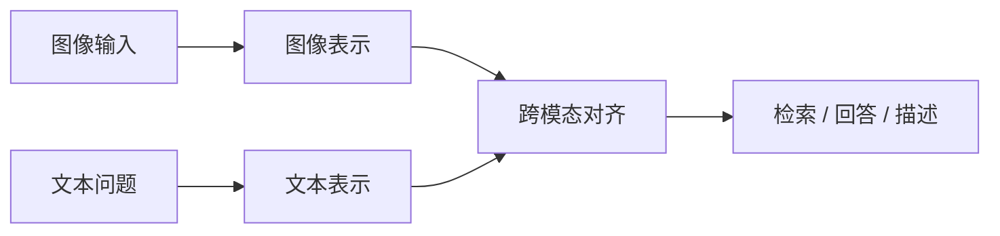
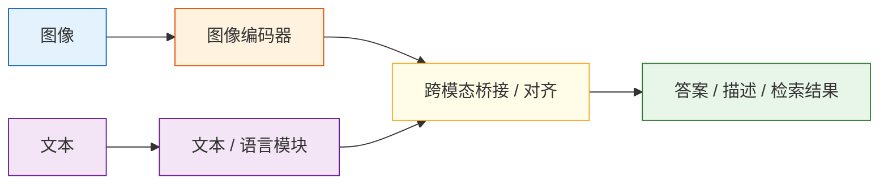

# 视觉-语言模型

:::tip 本节定位
视觉-语言模型最容易被新人理解成：

- 图片喂进去，再让模型说点什么

但真实一点的理解应该是：

- 图像信息和文本问题要先被放进同一套推理链里

所以这节最重要的不是“它会看图”，而是：

> **它怎么把图和文真正接起来。**
:::

## 学习目标

完成本节后，你将能够：

- 理解视觉-语言模型（VLM）和普通图像模型、文本模型的区别
- 说清楚图像编码器、语言模型和桥接模块的大概角色
- 跑通一个简化版图文检索 / 图像问答示例
- 明白 VLM 适合什么任务、有哪些常见限制

---

## 先建立一张地图

视觉-语言模型更适合按“图像怎么进系统、文字怎么问系统”来理解：



所以这节真正想解决的是：

- 为什么 VLM 不是简单的“图片 + 文本拼一起”
- 为什么图像信息必须先被表示、再和语言问题对齐

---

## 一、什么是视觉-语言模型？

视觉-语言模型（Vision-Language Model, VLM）可以理解成：

> **既能看图，又能理解文字，还能把两者联系起来的模型。**

和普通模型相比：

- 纯视觉模型：擅长识别图片内容
- 纯语言模型：擅长理解和生成文字
- 视觉语言模型：擅长“图和文一起处理”

这让它特别适合：

- 图像问答
- 图文检索
- 图片描述
- 界面理解
- 文档截图问答

### 1.1 一个更适合新人的总类比

你可以把 VLM 理解成：

- 一个同时会看图和看题目的助手

如果只会看图，不会理解问题，  
那它只能说：

- “图里大概有什么”

如果只会读问题，不会看图，  
那它也没法回答：

- “这张图里到底发生了什么”

所以 VLM 真正特别的地方是：

- 把“看图”和“理解提问”放进同一套系统里

---

## 二、VLM 的直觉结构

先不用被复杂架构吓到，抓住最粗的骨架就够了：



### 你可以先这么理解它们的职责

| 模块 | 作用 |
|---|---|
| 图像编码器 | 把图片变成向量 / 特征 |
| 文本模块 | 理解提示词、生成回答 |
| 桥接模块 | 让图像特征和语言系统能接上 |

---

## 三、一个最小图文检索例子

为了保证代码能直接运行，我们用手工定义的图像特征和文本特征，模拟 VLM 的“同空间对齐”思想。

```python
import numpy as np

image_embeddings = {
    "cat_photo": np.array([0.95, 0.10, 0.05]),
    "car_photo": np.array([0.05, 0.20, 0.95]),
    "cake_photo": np.array([0.60, 0.85, 0.10])
}

text_embeddings = {
    "a small cat": np.array([0.90, 0.15, 0.05]),
    "a vehicle": np.array([0.05, 0.10, 0.98]),
    "a sweet dessert": np.array([0.55, 0.90, 0.10])
}

def cosine_similarity(a, b):
    return float(np.dot(a, b) / (np.linalg.norm(a) * np.linalg.norm(b)))

for text, text_vec in text_embeddings.items():
    print(f"\\n文本查询: {text}")
    results = []
    for image_name, image_vec in image_embeddings.items():
        results.append((cosine_similarity(text_vec, image_vec), image_name))
    results.sort(reverse=True)
    for score, image_name in results:
        print(f"  {image_name}: {score:.4f}")
```

如果一个模型学会了好的跨模态对齐，相关图文就会更靠近。

### 3.1 一个很适合初学者先记的判断表

| 任务 | VLM 最擅长补哪一块 |
|---|---|
| 图文检索 | 图和文放进同一空间比较 |
| 图像问答 | 问题和图像联合推理 |
| 图片描述 | 从视觉内容走向自然语言 |
| 界面理解 | 结合截图和指令定位信息 |

这个表很适合新人，因为它能帮助你先区分：

- 视觉模型在看什么
- VLM 又多补了什么

---

## 四、图像问答（VQA）是什么味道？

图像问答的目标是：

> 给模型一张图，再问它一个问题，让它基于图像内容回答。

在真实 VLM 中，模型会：

1. 看图得到视觉特征
2. 结合文本问题理解需求
3. 综合两者生成答案

我们先写一个非常简化的“玩具版”。

```python
image_features = {
    "screen_error": {
        "has_text": True,
        "is_ui": True,
        "main_color": "dark",
        "topic": "error_message"
    },
    "food_photo": {
        "has_text": False,
        "is_ui": False,
        "main_color": "warm",
        "topic": "dessert"
    }
}

def ask_vlm(image_name, question):
    feat = image_features[image_name]
    question = question.lower()

    if "有没有文字" in question or "has text" in question:
        return "有文字" if feat["has_text"] else "没有明显文字"
    if "是不是界面" in question or "ui" in question:
        return "像是一个界面截图" if feat["is_ui"] else "不像界面截图"
    if "主题" in question:
        return f"这张图的主题更接近：{feat['topic']}"
    return "当前玩具模型无法回答这个问题"

print(ask_vlm("screen_error", "这张图有没有文字？"))
print(ask_vlm("screen_error", "是不是界面截图？"))
print(ask_vlm("food_photo", "主题是什么？"))
```

当然，真实 VLM 不是靠手写规则，但这个例子能帮你理解：

- 图像信息要先被表示
- 问题也要被理解
- 最终回答依赖“图像 + 问题”的联合推理

### 4.1 再看一个最小“先判断任务类型”示例

```python
def vlm_task_type(question):
    if "有没有" in question or "有没有文字" in question:
        return "attribute_check"
    if "主题" in question or "是什么" in question:
        return "semantic_qa"
    if "像不像" in question:
        return "classification_judgement"
    return "generic_vlm_task"


for question in ["这张图有没有文字？", "主题是什么？", "这像不像界面截图？"]:
    print(question, "->", vlm_task_type(question))
```

这个示例很适合初学者，因为它会提醒你：

- 视觉语言系统也需要先判断用户到底在问哪一类问题

---

## 五、VLM 和 OCR 是什么关系？

很多人会把两者混在一起。

### OCR

重点是：

- 识别图里的文字是什么

### VLM

重点是：

- 不只看文字，还要理解整张图和问题之间的关系

比如一张报错截图：

- OCR 负责认出报错文本
- VLM 可以进一步回答“这更像网络错误还是权限错误？”

---

## 六、VLM 最适合哪些任务？

### 很适合

- 看图问答
- 截图解释
- 图文检索
- 电商商品图理解
- 文档图像理解

### 不一定适合

- 完全不需要图像信息的纯文本任务
- 极度精细的专业图像诊断任务
- 对像素级精度要求非常高的任务

这时候可能还需要专门视觉模型配合。

---

## 七、为什么 VLM 很容易“看错”或“答偏”？

因为它要同时跨越两层难度：

1. 图像理解本身就不容易
2. 图像和文字之间的关系建模更难

常见问题包括：

- 视觉细节漏看
- OCR 读错字
- 问题理解偏了
- 生成答案时夸大或脑补

所以做 VLM 产品时，验证和护栏同样重要。

---

## 八、今天很多产品为什么离不开 VLM？

因为用户真实输入往往不是“纯文字”。

比如：

- 发一张页面截图问“这里哪里报错了？”
- 发一张发票照片问“金额是多少？”
- 发一张菜品图片问“这像什么食物？”

这些任务如果只给文字模型，信息是不完整的。

---

## 九、初学者常见误区

### 1. 以为 VLM 就是“图片喂给 GPT”

更准确地说，是“图像信息经过编码和对齐后，再进入语言系统”。

### 2. 以为 VLM 天生会 OCR、定位、推理，一切都很稳

真实效果取决于模型能力、提示词、图像质量和任务难度。

### 3. 以为能看图就一定比纯文本模型更好

只有当图像信息真的有价值时，多模态才有优势。

## 如果把它做成项目，最值得展示什么

最值得展示的通常不是：

- “模型能看图”

而是：

1. 输入图片
2. 用户问题
3. 模型如何判断任务类型
4. 最终回答或检索结果
5. 一组典型失败案例

这样别人会更容易看出：

- 你理解的是多模态推理链
- 不只是接了一个看图接口

---

## 小结

这节课最重要的一句话是：

> **VLM 的关键，不只是“看图”，而是把图像和语言放进同一套理解流程里。**

这也是多模态系统从“能看”走向“能解释、能回答、能交互”的关键一步。

---

## 练习

1. 修改图文检索例子里的向量，让“cake_photo” 更接近 “a sweet dessert”。
2. 给玩具版 `ask_vlm()` 再加一个问题类型，比如“这张图更像生活照片还是软件界面？”
3. 思考：如果用户上传的是一张模糊截图，VLM 可能会在哪些环节出错？
