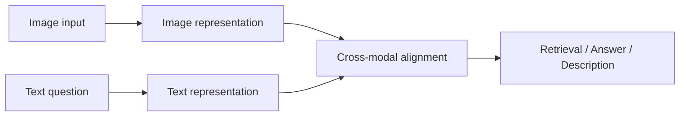
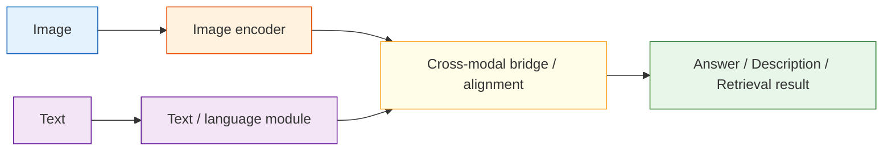

# 12.1.3 Vision-Language Models


:::tip Section focus
Beginners often understand vision-language models as:

- Feed in an image, then let the model say something

But a more accurate understanding is:

- Image information and text questions need to be placed into the same reasoning chain first

So the most important thing in this section is not “it can see images,” but:

> **How it truly connects images and text.**
:::

## Learning goals

After completing this section, you will be able to:

- Understand the difference between vision-language models (VLMs), ordinary image models, and text models
- Explain the rough roles of the image encoder, language model, and bridge module
- Run a simplified image-text retrieval / visual question answering example
- Understand what tasks VLMs are suitable for, and what common limitations they have

---

## First, build a map

Vision-language models are easier to understand as “how images enter the system, and how text asks the system”:



So what this section really wants to solve is:

- Why VLMs are not simply “image + text pasted together”
- Why image information must first be represented, then aligned with language questions

---

## What is a vision-language model?

A vision-language model (VLM) can be understood as:

> **A model that can both see images, understand text, and connect the two.**

Compared with ordinary models:

- Pure vision models: good at recognizing image content
- Pure language models: good at understanding and generating text
- Vision-language models: good at handling images and text together

This makes them especially suitable for:

- Visual question answering
- Image-text retrieval
- Image captioning
- UI understanding
- Document screenshot question answering

### A more beginner-friendly analogy

You can think of a VLM as:

- An assistant that can both look at images and read questions

If it can only look at images and not understand the question,
then it can only say:

- “There seems to be something in the image”

If it can only read the question and not look at the image,
then it cannot answer:

- “What exactly is happening in this image?”

So what makes a VLM special is:

- It puts “looking at images” and “understanding questions” into the same system

---

## The intuitive structure of a VLM

No need to be scared by complicated architectures first. Just grasp the rough skeleton:



### You can first understand their responsibilities like this

| Module | Role |
|---|---|
| Image encoder | Turns images into vectors / features |
| Text module | Understands prompts and generates answers |
| Bridge module | Connects image features and the language system |

---

## A minimal image-text retrieval example

To make sure the code can run directly, we use manually defined image features and text features to simulate the VLM idea of “alignment in the same space.”

```python
import numpy as np

image_embeddings = {
    "cat_photo": np.array([0.95, 0.10, 0.05]),
    "car_photo": np.array([0.05, 0.20, 0.95]),
    "cake_photo": np.array([0.60, 0.85, 0.10])
}

text_embeddings = {
    "a small cat": np.array([0.90, 0.15, 0.05]),
    "a vehicle": np.array([0.05, 0.10, 0.98]),
    "a sweet dessert": np.array([0.55, 0.90, 0.10])
}

def cosine_similarity(a, b):
    return float(np.dot(a, b) / (np.linalg.norm(a) * np.linalg.norm(b)))

for text, text_vec in text_embeddings.items():
    print(f"\nText query: {text}")
    results = []
    for image_name, image_vec in image_embeddings.items():
        results.append((cosine_similarity(text_vec, image_vec), image_name))
    results.sort(reverse=True)
    for score, image_name in results:
        print(f"  {image_name}: {score:.4f}")
```

Expected output:

```text
Text query: a small cat
  cat_photo: 0.9982
  cake_photo: 0.7041
  car_photo: 0.1379

Text query: a vehicle
  car_photo: 0.9944
  cake_photo: 0.2066
  cat_photo: 0.1129

Text query: a sweet dessert
  cake_photo: 0.9978
  cat_photo: 0.6093
  car_photo: 0.2937
```

The top result changes with the text query. That is the central idea of image-text retrieval: both sides are compared in one aligned vector space.

If a model learns good cross-modal alignment, related images and text will be closer to each other.


:::tip Read the ranking, not the filename
Each text query becomes a vector, compares with every image vector, and retrieves the image with the highest cosine similarity. If the top-1 image is wrong, the first suspect is cross-modal alignment.
:::

### A beginner-friendly table to remember first

| Task | What VLMs are best at adding |
|---|---|
| Image-text retrieval | Putting images and text into the same space for comparison |
| Visual question answering | Joint reasoning over the question and the image |
| Image captioning | Turning visual content into natural language |
| UI understanding | Combining screenshots and instructions to locate information |

This table is useful for beginners because it helps you separate:

- What the vision model is looking at
- What extra ability the VLM adds

---

## What does visual question answering (VQA) feel like?

The goal of visual question answering is:

> Give the model an image, ask it a question, and let it answer based on the image content.

In a real VLM, the model will:

1. Look at the image to get visual features
2. Combine the text question to understand the need
3. Generate an answer by reasoning over both

Let's first write a very simplified toy version.

```python
image_features = {
    "screen_error": {
        "has_text": True,
        "is_ui": True,
        "main_color": "dark",
        "topic": "error_message"
    },
    "food_photo": {
        "has_text": False,
        "is_ui": False,
        "main_color": "warm",
        "topic": "dessert"
    }
}

def ask_vlm(image_name, question):
    feat = image_features[image_name]
    question = question.lower()

    if "have text" in question or "has text" in question:
        return "Yes, it has text" if feat["has_text"] else "No obvious text"
    if "is it a ui" in question or "ui" in question:
        return "It looks like a UI screenshot" if feat["is_ui"] else "It does not look like a UI screenshot"
    if "topic" in question:
        return f"The topic of this image is closer to: {feat['topic']}"
    return "This toy model cannot answer the question"

print(ask_vlm("screen_error", "Does this image have text?"))
print(ask_vlm("screen_error", "Is it a UI screenshot?"))
print(ask_vlm("food_photo", "What is the topic?"))
```

Expected output:

```text
Yes, it has text
It looks like a UI screenshot
The topic of this image is closer to: dessert
```


:::tip Match question type to image facts
The image record stores several facts, but the question decides which one matters. A wrong answer often means the system picked the wrong fact or misunderstood the question type.
:::

The answer depends on both inputs: the image record provides visual facts, while the user question decides which fact should be used.

Of course, real VLMs do not rely on hand-written rules, but this example can help you understand:

- Image information must first be represented
- The question also needs to be understood
- The final answer depends on joint reasoning over “image + question”

### Another minimal example: first identify the task type

```python
def vlm_task_type(question):
    if "have" in question or "has text" in question:
        return "attribute_check"
    if "topic" in question or "what is" in question:
        return "semantic_qa"
    if "look like" in question or "looks like" in question:
        return "classification_judgement"
    return "generic_vlm_task"


for question in ["Does this image have text?", "What is the topic?", "Does this look like a UI screenshot?"]:
    print(question, "->", vlm_task_type(question))
```

Expected output:

```text
Does this image have text? -> attribute_check
What is the topic? -> semantic_qa
Does this look like a UI screenshot? -> classification_judgement
```

This example is great for beginners because it reminds you:

- A vision-language system also needs to first judge what kind of question the user is asking

---

## What is the relationship between VLM and OCR?

Many people mix them up.

### OCR

The focus is:

- Recognizing what text is in the image

### VLM

The focus is:

- Not only reading text, but also understanding the relationship between the whole image and the question

For example, in an error screenshot:

- OCR is responsible for recognizing the error text
- VLM can further answer: “Is this more like a network error or a permission error?”

---

## What tasks are VLMs best suited for?

### Very suitable

- Image question answering
- Screenshot explanation
- Image-text retrieval
- E-commerce product image understanding
- Document image understanding

### Not always suitable

- Pure text tasks that do not need image information at all
- Extremely fine-grained professional image diagnosis tasks
- Tasks that require very high pixel-level precision

In those cases, you may still need specialized vision models to work together with them.

---

## Why do VLMs so easily “misread” or “answer off track”?

Because they have to cross two levels of difficulty at the same time:

1. Image understanding is already difficult
2. Modeling the relationship between images and text is even harder

Common problems include:

- Missing visual details
- OCR reading errors
- Misunderstanding the question
- Exaggerating or hallucinating when generating answers

So when building VLM products, evaluation and guardrails are equally important.

---

## Why are so many products inseparable from VLMs today?

Because real user inputs are often not “pure text.”

For example:

- Sending a page screenshot and asking “Where is the error?”
- Sending a receipt photo and asking “What is the amount?”
- Sending a dish photo and asking “What food is this similar to?”

If you only give these tasks to a text model, the information is incomplete.

---

## Common beginner mistakes

### Thinking VLM just means “feed images to GPT”

More accurately, it means “image information goes through encoding and alignment, then enters the language system.”

### Thinking VLMs naturally do OCR, localization, reasoning, and everything perfectly

Real performance depends on model capability, prompts, image quality, and task difficulty.

### Thinking that being able to see images is always better than a pure text model

Multimodal only has an advantage when the image information is truly valuable.

## If you turn it into a project, what is most worth showing?

What is usually most worth showing is not:

- “The model can see images”

But rather:

1. Input image
2. User question
3. How the model determines the task type
4. Final answer or retrieval result
5. A set of typical failure cases

This way, others can more easily see:

- You understand the multimodal reasoning chain
- You are not just connecting an image viewing interface

---

## Summary

The most important sentence in this lesson is:

> **The key to a VLM is not just “seeing images,” but putting images and language into the same understanding process.**

This is also the key step for multimodal systems to move from “can see” to “can explain, can answer, and can interact.”

---

## Exercises

1. Modify the vectors in the image-text retrieval example so that `cake_photo` is closer to `a sweet dessert`.
2. Add another question type to the toy `ask_vlm()`, such as “Does this image look more like a real-life photo or a software interface?”
3. Think about this: if the user uploads a blurry screenshot, which parts of the VLM pipeline might fail?
