# 12.1.4 Multimodal Application Development


:::tip Reading Guide
Multimodal applications do not end when “the model can see images.” When reading this diagram, focus on how input quality, OCR/VLM responsibilities, retrieval or tool calls, user feedback, failure fallback, and privacy compliance come together into a real product pipeline.
:::

## Learning Objectives

By the end of this section, you will be able to:

- Identify common product forms of multimodal applications
- Understand the basic engineering pipeline of multimodal applications
- Run a toy application for “image information + text question”
- Know which engineering issues matter most when deploying multimodal systems

---

## What Do Multimodal Applications Actually Look Like?

### It’s not “adding images for coolness”; it’s about having more complete input

For many tasks, text alone is actually incomplete.

For example:

- Screenshot error analysis
- Invoice recognition and Q&A
- Product image search
- Image moderation
- Document photo parsing

These are all naturally suited to multimodal applications.

### Common product forms

| Form | User input | System output |
|---|---|---|
| Screenshot assistant | Screenshot + question | Error explanation / action suggestions |
| Image-text customer support | Product image + user inquiry | Product description / after-sales advice |
| Document understanding | Invoice / contract image + question | Key information extraction / answer |
| Teaching assistant | Problem image + student question | Explanation and hints |

---

## The Basic Engineering Pipeline for Multimodal Applications

### A very common processing pipeline

```mermaid
flowchart LR
    A["User uploads image / audio / text"] --> B["Preprocessing"]
    B --> C["Feature extraction / OCR / encoding"]
    C --> D["Multimodal model or workflow"]
    D --> E["Result post-processing"]
    E --> F["Final display to the user"]

    style A fill:#e3f2fd,stroke:#1565c0,color:#333
    style B fill:#fff3e0,stroke:#e65100,color:#333
    style C fill:#f3e5f5,stroke:#6a1b9a,color:#333
    style D fill:#e8f5e9,stroke:#2e7d32,color:#333
    style E fill:#fffde7,stroke:#f9a825,color:#333
    style F fill:#ffebee,stroke:#c62828,color:#333
```



### Why are many multimodal applications not “one model does everything”?

Because real systems often combine multiple modules:

- OCR
- Image classification
- VLM
- Rule-based logic
- Database queries

So multimodal applications are often not “pure model products,” but rather “multi-module collaboration products.”

---

## A Runnable Toy Screenshot Assistant

To make sure the code runs directly, we use structured image information to simulate the output of a vision module.

```python
image_info = {
    "type": "screenshot",
    "has_text": True,
    "ocr_text": "Error 401 Unauthorized",
    "dominant_area": "login_page"
}

def multimodal_assistant(image_info, user_question):
    user_question = user_question.lower()

    if image_info["type"] == "screenshot" and image_info["has_text"]:
        if "401" in image_info["ocr_text"] or "unauthorized" in image_info["ocr_text"].lower():
            if "how do i fix it" in user_question or "what should i do" in user_question:
                return "This looks like an authentication failure. Check the API Key, login status, or permission settings first."
            return "The core error in the screenshot is: 401 Unauthorized."

    return "I can’t extract enough information from this image and question right now."

print(multimodal_assistant(image_info, "What error is this?"))
print(multimodal_assistant(image_info, "How do I fix it?"))
```

Expected output:

```text
The core error in the screenshot is: 401 Unauthorized.
This looks like an authentication failure. Check the API Key, login status, or permission settings first.
```


This small example is already a real product pattern: first read the visual/OCR state, then answer from the angle requested by the user.

Even though this is a toy example, it already reflects the real feel of multimodal applications:

- The image provides visual context
- OCR provides the text content
- The user question determines the angle of the answer

---

## Why Do Multimodal Applications Often Need OCR?

### Because many “look at the image” problems are also “read the image” problems

For example:

- Error screenshots
- Contract photos
- Invoice images
- Form screenshots

In these scenarios, if you don’t do OCR, the model will miss a lot of key text information.

### The division of labor between OCR and VLM

You can think of it like this:

- OCR: reads the text in the image
- VLM: understands the image content together with the question

In many engineering setups, using both together is more robust than relying on either one alone.

---

## A Small Example of an Image-Text Product Assistant

The example below simulates making a judgment using both “image features + text requirements.”

```python
product_image_feature = {
    "color": "white",
    "style": "sport",
    "category": "shoes"
}

def match_product(image_feature, user_text):
    user_text = user_text.lower()

    if image_feature["category"] == "shoes":
        if "run" in user_text:
            return "This image looks more like sports shoes, so it may be suitable for running-related recommendations."
        if "office" in user_text:
            return "These shoes have a sporty style and may not be the best match for a commuting scenario."

    return "More image and text information is needed to make a further judgment."

print(match_product(product_image_feature, "I want a pair of shoes suitable for running"))
print(match_product(product_image_feature, "Are they suitable for commuting to work?"))
```

Expected output:

```text
This image looks more like sports shoes, so it may be suitable for running-related recommendations.
These shoes have a sporty style and may not be the best match for a commuting scenario.
```


This kind of image-text collaboration is very common in e-commerce, recommendation systems, and customer support.

---

## The Most Common Engineering Problems in Real Systems

### Input quality issues

For example:

- Blurry images
- Incomplete screenshots
- OCR misreads
- Low image resolution

### Latency and cost issues

Multimodal models are usually heavier than pure text models.
So you especially need to pay attention to:

- Inference latency
- Concurrency capacity
- Cost per request

### Privacy and data compliance

Many images may contain:

- Faces
- ID cards
- Internal company screenshots
- Contract content

So multimodal applications are often more likely than pure text applications to run into privacy requirements.

---

## A Very Practical Product Design Habit

### Don’t let the model carry all the responsibility alone

Mature systems often add mechanisms like:

- Low-confidence warnings
- Manual review entry points
- Source display
- Requesting additional images when recognition fails

### A simple fallback idea

```python
def safe_multimodal_reply(image_info, user_question):
    if not image_info.get("has_text") and "error" in user_question:
        return "Not enough text was recognized in this image. Please upload a clearer, complete screenshot."
    return multimodal_assistant(image_info, user_question)

print(safe_multimodal_reply({"type": "screenshot", "has_text": False}, "What error is this?"))
```

Expected output:

```text
Not enough text was recognized in this image. Please upload a clearer, complete screenshot.
```


Often, a good fallback prompt is more valuable than forcing out a wrong answer.

---

## When Is It Worth Building a Multimodal Application?

### Strong signs that it is worth it

If your users’ questions often depend on:

- Image content
- Layout structure
- Screen state
- Visual context

Then multimodal is very worthwhile.

### Signs that it may not be worth it

If your task is essentially just:

- FAQ text Q&A
- Text search
- Text summarization

Then it is usually more cost-effective to first build a strong pure-text pipeline.

---

## Evidence to Keep

Keep this page's proof of learning as a small evidence card:

```text
source_asset: image, screenshot, PDF, audio, video, or text input with version/source note
structured_record: visible text, objects, regions, timestamp, transcript, or uncertainty
fusion_result: answer, retrieval record, route decision, or multimodal feature comparison
failure_check: missing source, OCR error, alignment mistake, uncertainty, or unsupported claim
Expected_output: structured record that can be cited or reviewed later
```

## Common Beginner Misconceptions

### Thinking multimodal applications must directly use the most complex model

In many cases:

- OCR + a text model
- An image classifier + a rule system

Can already solve quite a few problems.

### Thinking “can see images” means the system automatically “understands the scenario”

A multimodal model can extract information, but that does not mean it naturally understands business rules.

### Ignoring failure-scenario design

Blurry images, low light, and cropped screenshots are all common high-frequency production cases.

---

## Summary

The most important takeaway from this section is:

> Multimodal applications are not as simple as “feeding images into a model.” They are about organizing visual input, text questions, engineering workflows, and failure fallback into a usable system.

Truly useful multimodal products often win through system design, not just the model itself.

---

## Exercises

1. Add another error type to the toy screenshot assistant, such as `404 Not Found`.
2. Add another image attribute to the product assistant, such as `material`, and extend the matching logic.
3. Think about this: if the user uploads a blurry screenshot, how should the system prompt the user to provide more information?

<details>
<summary>Operation guide and checkpoints</summary>

1. A useful `404 Not Found` branch should identify the missing route or resource, then suggest checks such as URL path, server route registration, deployment rewrite rules, and whether the backend is running.
2. Add `material` as an attribute only if the visual signal can support it. For example, `cotton`, `leather`, or `metal` can be useful for product matching, but the assistant should mark it as uncertain when the image is low resolution or stylized.
3. The prompt should ask for one or two concrete missing signals instead of saying only “image unclear.” For example: “Please upload a sharper screenshot that includes the full error message and browser address bar.” That keeps the recovery path actionable.

</details>
