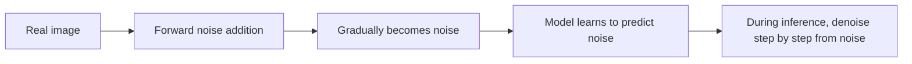

# 12.2.2 Principles of Diffusion Models


:::tip Section overview
There are many paths for generative models:

- GANs try to generate in one shot
- VAEs try to learn the latent-space distribution

Diffusion models, however, take a very different approach:

> **First corrupt the real sample step by step, then learn how to clean it step by step.**

This idea later became a very important main thread in image generation.
:::

## Learning objectives

- Understand why image generation is such a hard problem
- Understand the two directions in diffusion models: “adding noise” and “removing noise”
- Understand a minimal example of forward noise addition
- Understand what the model is really learning during training
- Build a stable intuition for the overall diffusion pipeline

## Historical background: How did diffusion models become a main thread?

Diffusion models did not become mainstream overnight. For beginners, the two most important milestones to know are:

| Year | Paper | Key authors | What it mainly solved |
|---|---|---|---|
| 2020 | *Denoising Diffusion Probabilistic Models (DDPM)* | Ho et al. | Turned diffusion models into a high-quality, stable generative approach |
| 2022 | *High-Resolution Image Synthesis with Latent Diffusion Models* | Rombach et al. | Moved diffusion from pixel space to latent space, greatly reducing cost and becoming the main line behind Stable Diffusion |

For beginners, the most important thing to remember first is:

> **The reason diffusion models matter is not just that “the images look better,” but that they provide a generation path that is more stable and controllable than many GAN approaches.**

Latent Diffusion then further solved this problem:

- The image space is too large, and direct diffusion is too expensive

So many text-to-image systems you see today are, in essence, built on this historical line.

---

## First, build a map

If you already accept the premise that “image generation is not classification,” then the most natural continuation of the previous section is:

- You already know the system is moving from “understanding input” toward “constructing output”
- This section explains why diffusion models became such an important main line in image generation

So what matters most here is not a pile of formulas, but:

- First establish the generation chain of “noise addition -> learning denoising -> sampling from noise”

For beginners, the best way to understand diffusion models is not to “memorize formulas first,” but to first see clearly:



So what this section really wants to solve is:

- Why diffusion models first “dirty” the data
- What the model is actually learning during training
- Why inference starts from noise

## Why is image generation so hard?

### First look at the difference between classification and generation

In classification, you are asking:

- Is this image a cat?

In generation, you are asking:

- Generate an image that looks like a cat.

These two tasks sound similar, but their difficulty is not on the same level.

### What is the real difficulty?

Because the image space is huge.
If you randomly generate pixels, most results will look like noise rather than a “reasonable image.”

So what the generative model really needs to learn is:

> **How to land in the regions that look like real images out of an almost infinite number of pixel combinations.**

The power of diffusion models is that they do not try to do this in one leap. Instead, they break the problem into many smaller denoising steps.

### When learning diffusion models for the first time, what should you focus on first?

What you should focus on first is not the formula, but this sentence:

> **A diffusion model does not directly learn “how to draw.” It learns “how to turn noise back into structure step by step.”**

Once this idea becomes solid, the following will all fall naturally into the same main thread:

- Forward process
- Reverse process
- Noise prediction
- Sampling

---

## The core intuition of diffusion models

### Forward process: add noise to the image step by step

If you have a real image, and you keep adding noise to it:

- At first, you can still see the structure
- Then it becomes more and more blurred
- Eventually it almost turns into pure noise

This process is very easy to define.

### Reverse process: learn to denoise step by step

The hard part is the reverse direction:

- Given a noisy image
- You need to guess how to remove a bit of noise

If you do this many times, you may eventually recover a structured image from noise.

### A memorable analogy

You can think of it like this:

- Forward: keep smearing ink over a clean photo
- Reverse: learn how to remove the ink little by little

The hard part is not dirtying the image, but cleaning it back up.

### Why is this decomposition especially valuable for generation tasks?

Because it turns a very difficult one-shot generation problem into many smaller local problems:

- How much noise should be removed at this step
- How much structure is still preserved in the current image

This is also one of the reasons diffusion models later felt “more stable but slower.”

---

## A minimal runnable example of forward noise addition

Let’s not use images first. Instead, let’s look at a 1D vector so the “step-by-step noise addition” process is easier to see.

```python
import numpy as np

np.random.seed(42)

x0 = np.array([1.0, 0.5, -0.5, -1.0], dtype=np.float32)
print("x0 =", x0)

x = x0.copy()
for step in range(1, 6):
    noise = np.random.randn(*x.shape).astype(np.float32) * 0.2
    x = 0.8 * x + noise
    print(f"step {step}: {np.round(x, 3)}")
```

Expected output:

```text
x0 = [ 1.   0.5 -0.5 -1. ]
step 1: [ 0.899  0.372 -0.27  -0.495]
step 2: [ 0.673  0.251  0.099 -0.243]
step 3: [ 0.444  0.309 -0.013 -0.287]
step 4: [ 0.404 -0.135 -0.355 -0.342]
step 5: [ 0.12  -0.045 -0.466 -0.556]
```

Run it once and read the rows from top to bottom. The values do not become random immediately; the old signal is weakened while new noise is mixed in, which is exactly the forward diffusion intuition.


:::tip Read the rows as a process
Do not treat the printout as six unrelated arrays. Each row is the previous signal after one more controlled noise mix, so the trend matters more than any single number.
:::

### What is this code teaching?

It teaches you two very important facts:

1. Each step preserves part of the original structure
2. Each step also mixes in some new noise

As the number of steps increases, the structure becomes less and less clear.

This is the intuitive version of forward diffusion.

---

## Why is the forward process easy, but the reverse process hard?

### Because the forward process is defined by you

You completely know:

- How much noise was added in this step
- How much the original signal was attenuated

So the forward process is almost “human-controlled.”

### Why is the reverse process hard?

Because when you only see a noisy sample, you do not know:

- Which part is the original structure
- Which part is the noise added later

It is like receiving a paper that has been smeared, but not knowing what the original drawing looked like.

So what the model really needs to learn is:

> **How to predict the noise component from a noisy state.**

---

## What is the model really learning during training?

### A very important point

During diffusion training, the model is usually not directly taught to “learn to draw,” but instead to learn:

> Given a noisy sample, predict the noise inside it.

### Why is this smart?

Because the noise is added by you during training, the supervision signal comes for free:

- You know the original sample
- You also know the noise

So the problem becomes a fairly clear supervised learning task.

### Why is this the key turning point for understanding diffusion models?

Because many beginners, when first learning diffusion models, mistakenly think:

- The model is directly learning the “correct appearance” of the whole image

But a more accurate understanding is:

- During training, it is more like learning a conditional denoiser

Once this view is stable, it becomes much easier to understand Stable Diffusion, conditional generation, and image editing later on.

### A minimal “learning objective” example

```python
import numpy as np

x_clean = np.array([1.0, -0.5, 0.8], dtype=np.float32)
noise = np.array([0.2, -0.1, 0.3], dtype=np.float32)
x_noisy = 0.9 * x_clean + noise

print("clean =", x_clean)
print("noise =", noise)
print("noisy =", x_noisy)
```

Expected output:

```text
clean = [ 1.  -0.5  0.8]
noise = [ 0.2 -0.1  0.3]
noisy = [ 1.1  -0.55  1.02]
```


In training, `clean` and `noise` are both known because you created the noisy sample yourself. That is why diffusion training can turn image generation into a supervised “predict the added noise” task.

If the model learns to predict `noise` from `x_noisy`,
it can strip noise away step by step during inference.

---

## Why do we start sampling from pure noise?

### Because there is no original image during inference

When generating, there is no `x0`; there is only noise.

So the system usually starts from:

- A blob of random noise

Then it repeatedly does:

1. Predict the current noise
2. Remove a little bit of noise
3. Get a slightly cleaner state

### The difference between step-by-step denoising and one-shot generation

GANs are more like:

- Generate directly in one step

Diffusion models are more like:

- Sculpt gradually

This is also why diffusion models often feel “more stable but slower.”

---

## Why did this route become so powerful later?

### Training is usually more stable

Compared with the adversarial instability in many GAN trainings, diffusion model training is often more stable.

### Conditioning is very natural

Once you can inject condition information into the denoising process, you can do:

- Text-to-image
- Image editing
- Local inpainting

This is one of the key reasons it became powerful so quickly.

### What should beginners remember first when learning diffusion models?

The most important things to remember first are:

1. The forward process is easy to define
2. During training, the model mainly learns to “predict noise”
3. During inference, the system is gradually wiping the noise away

### Why does this connect directly to the later Stable Diffusion main line?

Because although later systems become more complex in structure, the underlying intuition does not change:

- There is still a noise process
- There is still a denoising network
- It is still conditional generation

So what matters most in this section is establishing the skeleton of “diffusion-based generation.”

---

## What is the cost of diffusion models?

### Sampling is slow

Because generation is not done in one step, but through many denoising steps.

### Computation is heavy

Especially for high-resolution images, the cost can be relatively high.

### So what did people later focus on?

Mainly two things:

- Improving sampling efficiency
- Reducing the spatial cost of diffusion operations

This also leads directly to the next section:

> Why Stable Diffusion moves diffusion into latent space.

---

## Summary

The most important thing in this section is not memorizing formulas, but grasping this main thread:

> **A diffusion model does not directly learn to “draw images.” It learns how to denoise a noisy sample step by step back into something structured.**

As long as this intuition is stable, the structure of Stable Diffusion will feel much more natural later on.

## What you should take away from this section

- Diffusion models do not generate in one shot; they denoise step by step
- Their training objective is closer to supervised learning than many people expect
- This is one of the main reasons they became a major path in image generation

---

## Exercises

1. Change the decay coefficient `0.8` in the example in this section and observe how the structure disappears at different speeds.
2. Explain in your own words: why is diffusion model training more like “learning denoising” rather than “learning to draw directly”?
3. Think about why diffusion models are usually slower than one-shot generation methods.
4. If you were explaining diffusion models to someone else, how would you use the analogy of “first dirty it, then clean it” to describe them?
