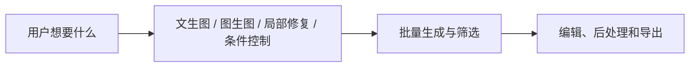

# SD 应用

:::tip 本节定位
前面两节已经把：

- 扩散模型原理
- Stable Diffusion 架构

讲清楚了。  
这一节要把镜头从“模型怎么工作”切到“用户和产品怎么用它”。

很多时候，真正决定一个模型有没有价值的，不只是它会不会生成，而是：

> **它能不能进入具体工作流。**
:::

## 学习目标

- 理解 Stable Diffusion 最常见的应用形态
- 分清文生图、图生图、局部修复和风格控制
- 理解为什么真实应用通常是“模型 + 工作流”
- 建立对 SD 产品形态的系统直觉

---

## 先建立一张地图

SD 应用更适合按“用户目标 -> 生成形态 -> 工作流”来理解：



所以这节真正想解决的是：

- 为什么 SD 在真实产品里很少只靠一个按钮
- 为什么工作流设计常常比单次生成更重要

---

## 一、为什么 Stable Diffusion 特别容易形成产品？

因为它离用户需求非常近。  
很多用户问题都可以直接映射成生成任务：

- 我想要一张海报
- 我想把这张草图变成成图
- 我想改掉图里的某一块
- 我想把这张图变成另一种风格

也就是说，Stable Diffusion 很容易从：

- 模型能力

走到：

- 产品能力

这就是它应用生态爆发的根本原因。

### 1.1 一个更适合新人的总类比

你可以把 Stable Diffusion 应用理解成：

- 一个创意工作台

文生图像是：

- 从空白画布开始画

图生图像是：

- 拿着草图继续打磨

局部修复像是：

- 只改画面里某一小块

这样理解后，为什么它会自然长成产品，而不只是模型 demo，就会清楚很多。

---

## 二、第一类：文生图（text-to-image）

### 2.1 最经典的入口

用户输入：

- 一段 prompt

系统输出：

- 一张图

例如：

```python
text_to_image_task = {
    "prompt": "一只坐在窗边的橘猫，夕阳，电影感",
    "output": "generated_image"
}

print(text_to_image_task)
```

### 2.2 为什么它这么直观？

因为它第一次把“语言意图 -> 图像结果”这件事变得特别直接。  
用户不一定懂模型，只要会描述，就能开始创造。

---

## 三、第二类：图生图（img2img）

### 3.1 它和文生图最大的差别

文生图更像：

- 从零开始

图生图更像：

- 基于已有图改造

例如：

```python
img2img_task = {
    "image": "rough_sketch.png",
    "prompt": "把它变成赛博朋克风格插画"
}

print(img2img_task)
```

### 3.2 为什么这个模式很有价值？

因为很多创作任务并不是“完全从零生图”，而是：

- 先有草图
- 先有参考图
- 先有构图

用户更关心“沿着已有方向改”，而不是重新赌一张。

---

## 四、第三类：局部修复（inpainting）

### 4.1 为什么这个功能特别像产品功能？

因为真实用户经常不是想整张重做，而是只想改一个局部。

例如：

- 去掉背景里一个路人
- 把空白桌面补满
- 把某个小区域替换成别的东西

### 4.2 一个任务示意

```python
inpainting_task = {
    "image": "scene.png",
    "mask": "mask.png",
    "prompt": "把被遮住区域补成一张木桌"
}

print(inpainting_task)
```

这里最关键的新元素是：

- `mask`

也就是说，模型不仅要知道“生成什么”，还要知道“改哪里”。

---

## 五、第四类：风格控制和条件控制

很多时候用户真正想控制的不是“画什么”，而是：

- 画成什么风格
- 保持什么构图
- 使用什么线稿
- 沿用什么姿态

这就让很多“控制式生成”工作流变得很重要。

例如：

- 线稿 -> 成图
- 姿态图 -> 人物
- 深度图 -> 场景

所以真实应用中，用户输入常常不止一个 prompt，而是一组条件。

### 5.1 一个很适合初学者先记的选择表

| 用户需求 | 更适合哪种形态 |
|---|---|
| 从零做一张海报 | 文生图 |
| 已有草图，想变精美 | 图生图 |
| 只想改掉局部元素 | 局部修复 |
| 想固定姿态、构图或结构 | 条件控制 |

这个表很适合新人，因为它能帮助你把“功能名”直接翻译成“什么时候该用它”。

---

## 六、为什么真实 SD 应用通常不是“一个模型 + 一个 prompt”？

因为一旦产品化，你通常还会加很多层：

- prompt 模板
- 风格预设
- negative prompt
- 批量生成
- 候选筛选
- 后处理

这时系统更像：

> **模型 + 参数面板 + 工作流。**

这也是为什么很多 AI 绘图产品最终看起来像一个创作工作台，而不是单一生成按钮。

---

## 七、一个工作流产品示意

```python
poster_workflow = {
    "task": "海报生成",
    "inputs": {
        "prompt": "科技会议海报，蓝色霓虹风格",
        "style_preset": "futuristic",
        "negative_prompt": "模糊, 低清晰度, 畸形文字",
        "num_images": 4
    },
    "steps": [
        "构造提示词",
        "批量采样",
        "筛选候选图",
        "后处理"
    ]
}

print(poster_workflow)
```

这个例子最重要的意义是：

> 应用层真正关心的通常不是“只生成一张图”，而是“怎样稳定地产出一个用户可接受的结果”。 

### 7.1 再看一个最小“工作流选择器”示例

```python
def choose_sd_mode(request):
    if "改图" in request or "修图" in request:
        return "inpainting_or_img2img"
    if "草图" in request:
        return "img2img"
    if "姿态" in request or "线稿" in request:
        return "controlled_generation"
    return "text_to_image"


for request in ["做一张海报", "把这张草图变成插画", "改图：去掉右上角的人"]:
    print(request, "->", choose_sd_mode(request))
```

这个示例很适合初学者，因为它会提醒你：

- 产品层先要判断用户处于哪一种创作模式
- 再决定后面的参数和流程

---

## 八、为什么应用里经常要批量生成？

因为图像生成天然有随机性。  
同一个 prompt：

- 可能这次很好
- 下次一般
- 再下次偏题

所以很多应用不会只生成 1 张，而会：

- 一次生成多张
- 再让用户选

这就是产品层面对模型随机性的应对方式。

---

## 九、Stable Diffusion 应用最常见的失败点

### 9.1 文本控制不够稳定

用户描述越复杂，结果越容易偏。

### 9.2 局部细节难控制

尤其是：

- 文字
- 手部
- 精细结构

### 9.3 用户真正的问题往往不是“生成”，而是“编辑”

这也是为什么很多产品后面越来越强调：

- img2img
- inpainting
- control

而不是只强调单次文生图。

## 如果把它做成项目，最值得展示什么

最值得展示的通常不是：

- “我能生成图片”

而是：

1. 不同创作需求如何路由到不同工作流
2. 候选图如何批量生成和筛选
3. 编辑环节如何接上
4. 最终结果如何导出

这样别人会更容易看出：

- 你理解的是创作工作台
- 不只是单次生图按钮

---

## 小结

这一节最重要的不是记住几种应用名字，而是理解：

> **Stable Diffusion 的应用价值，在于它能被组织进不同类型的创作工作流，而不只是单次图像生成。**

一旦你从“工作流”视角去看，就更容易理解为什么它能形成这么丰富的产品形态。

---

## 练习

1. 为文生图、图生图、局部修复各设计一个你自己的应用场景。
2. 想一想：为什么真实 SD 产品通常会支持一次生成多张候选图？
3. 用自己的话解释：为什么说 SD 产品更像“工作台”，而不是“一个模型按钮”？
4. 如果你要做电商产品图，你会更需要哪类 SD 应用形态？为什么？
