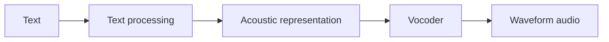
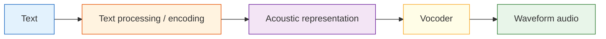

# Speech Synthesis


:::tip Reading tip
TTS is not about reading characters one by one. When reading this diagram, focus on how text normalization, phonemes/prosody, acoustic features, the vocoder, voice timbre, and real-time performance work together to determine how “human-like” the speech sounds.
:::

:::tip Section overview
If video generation is about solving “continuous visuals,” then speech synthesis is about solving:

> **How do you turn a piece of text into a voice that sounds natural, stable, and controllable?**

It sounds intuitive, but it is not simple in practice, because speech is not just “pronunciation”; it also includes:

- rhythm
- pitch
- pauses
- emotion
:::

## Learning goals

- Understand why speech synthesis is much more complex than “text to audio”
- Understand what modules a TTS system is usually broken into
- Read a minimal text-to-speech pipeline diagram
- Understand what multi-speaker, emotion control, and voice cloning each try to solve

---

## First, build a map

For beginners, the best way to understand this section is not “text directly becomes audio,” but first to see clearly:



So what this section is really trying to answer is:

- Why TTS is a multi-stage generation task
- Why it is both a language task and an audio generation task

### A better beginner-friendly analogy

You can think of TTS as:

- A voice actor working in a recording studio

They do not just look at text and read it out mechanically,
but naturally handle:

- where to pause
- which word to stress
- whether the tone should be calm or excited

This analogy is especially helpful for beginners, because it helps you first grasp:

- The real goal of TTS is not “making sound”
- It is “making sound that feels like a person speaking”

## 1. What exactly does speech synthesis do?

### 1.1 It is not just reading characters out one by one

If you mechanically read the text character by character, the result will usually sound very stiff.
Natural speech contains much more than just the text content, for example:

- phrasing
- stress
- tone
- speaking speed
- emotion

So the real problem in TTS is not:

> “Can it make sound?”

but:

> “Can it make speech that sounds like a person?”

### 1.2 A very important intuition

At its core, speech synthesis does:

- text understanding
- pronunciation modeling
- acoustic feature generation
- waveform reconstruction

In other words, it is not a single conversion step, but a multi-stage generation problem.

---

## 2. What does a minimal TTS pipeline look like?

You can roughly think of it as these steps:

1. Text preprocessing
2. Generate an intermediate acoustic representation
3. Turn it into waveform through a vocoder



The most important thing about this diagram is that it helps you build the right mental model:

> Speech synthesis is not a one-step process, but a multi-layer pipeline.

### 2.1 A module table that beginners should remember first

| Module | Most important thing to remember |
|---|---|
| Text processing | Organizes text into a form that is easier to pronounce |
| Acoustic representation | Describes “how it should be spoken” |
| Vocoder | Turns the acoustic representation into actual waveform |

This table is useful for beginners because it breaks TTS, which can feel like a black box, into three clearer responsibilities.

---

## 3. Why can’t we skip text processing?

### 3.1 Because text itself is not the same as pronunciation information

For example, the same sentence may have different pauses and tone in different situations:

- “You’re here.”
- “You’re here?”

The words are very similar, but the spoken expression is completely different.

### 3.2 What does text processing usually do?

- Tokenization / phoneme mapping
- Number reading conversion
- Punctuation and pause handling
- Tone feature hints

In other words, the TTS system first needs to translate “text” into a representation that is closer to pronunciation.

---

## 4. What is an acoustic representation?

### 4.1 Why not go directly from text to waveform?

It is hard to generate waveform directly from text in one step, because waveform data is very long, very detailed, and very sensitive.

So many TTS systems first generate an intermediate representation, such as:

- mel spectrogram

You can think of it as:

> **A “heatmap” of the sound’s frequencies.**

### 4.2 An intuitive example

```python
tts_pipeline = {
    "input": "Hello, welcome to the AI full-stack course.",
    "intermediate": "mel_spectrogram",
    "output": "waveform"
}

print(tts_pipeline)
```

Although this example is only a structural illustration, it already shows:

- Text does not become sound directly
- There is an intermediate representation that is easier to model

---

## 5. What does the vocoder do?

### 5.1 Its role is a bit like “translating a frequency map into actual audible sound”

If the earlier modules generate a kind of “acoustic blueprint,” then the vocoder is responsible for turning that blueprint into waveform.

### 5.2 A very practical way to understand it

You can remember it like this:

- Acoustic model: decides “what it should sound like”
- Vocoder: decides “how to actually produce it”

These two modules are often designed and optimized separately.

---

## 6. A minimal multi-speaker control example

Many modern speech synthesis systems do not just “read text”; they also control:

- speaker
- speaking speed
- emotion

For example:

```python
tts_config = {
    "text": "Welcome to the course.",
    "speaker": "female_voice_01",
    "speed": 1.0,
    "emotion": "neutral"
}

print(tts_config)
```

### 6.1 What is this example showing?

It is showing a very important beginner idea:

> TTS input is often not just text, but also control conditions for “how to speak.”

This is one of the reasons modern speech synthesis is much more powerful than early systems.

### 6.2 What is this example teaching?

It is teaching you:

> The input to TTS is often not just text, but also control conditions for “how to speak.”

This is one of the reasons modern speech synthesis is much more powerful than early systems.

### 6.3 A beginner-friendly decision table

| User need | What the TTS system should prioritize |
|---|---|
| Want a different voice timbre | speaker |
| Want it faster or slower | speed |
| Want it more like customer support or a broadcaster | style / emotion |
| Want to imitate a specific person | voice cloning / speaker adaptation |

This table is useful for beginners because it turns “controllable TTS” into a few concrete knobs.

---

## 7. Why is speech synthesis more like a generation task than you might think?

Because it also has these typical generation challenges:

- The output must sound natural
- The output must be stable
- The output must be controllable

And like image generation, it also faces:

- style control
- personalization
- trade-offs between quality and speed

So you can think of TTS as:

> A generation model problem in the audio world.

---

## 8. The most important directions in real TTS products

### 8.1 Multi-speaker

Can the system switch between different voice timbres?

### 8.2 Emotion and prosody control

Can the system express:

- happiness
- calmness
- seriousness

### 8.3 Voice cloning

Can the system learn the voice characteristics of a specific person?

### 8.4 Real-time performance

If this is a conversational assistant, latency becomes very important.

---

## 9. What should beginners remember first when learning TTS?

The most important things to remember first are:

1. Text is not the same as pronunciation information
2. Acoustic representation is an intermediate layer, not optional
3. The vocoder decides how it is actually turned into sound

---

## 10. Common mistakes beginners make

### 10.1 Thinking TTS just means “reading text aloud”

In fact, it is more like “generating a natural speaking process.”

### 10.2 Only paying attention to voice timbre, not rhythm and pauses

A lot of “unnaturalness” actually comes from prosody, not timbre itself.

### 10.3 Thinking TTS is naturally real-time

Many high-quality models are not necessarily low-latency.

## If you turn this into a project or system design, what is most worth showing?

What is most worth showing is usually not:

- “I converted text into audio”

but:

1. How text enters the TTS pipeline
2. What control conditions are used
3. Which layer determines naturalness and which layer determines final audio quality
4. How the trade-off between latency and quality is handled

That way, others can more easily see:

- You understand the TTS workflow
- You did not just wire up a voice-generation API

---

## Summary

The most important thing in this section is not memorizing a specific TTS model name, but building this intuition:

> **The essence of speech synthesis is to gradually turn text and speech control information into natural, audible, and controllable waveform audio.**

Once you understand this main idea, video avatars, dubbing systems, and voice assistants will make much more sense.

## What you should take away from this section

- TTS is not as simple as reading text aloud
- It is essentially a generation pipeline from text to acoustics to waveform
- “Natural, stable, and controllable” is closer to the real product requirement than just “being able to make sound”

---

## Exercises

1. In your own words, explain why TTS cannot be simply understood as “reading characters one by one.”
2. Think about why many TTS systems treat “speaker, speaking speed, and emotion” as input too.
3. If you are building a real-time voice assistant, why would TTS latency become a key engineering metric?
4. In your own words, explain what problem the acoustic model and the vocoder are each more like solving.
