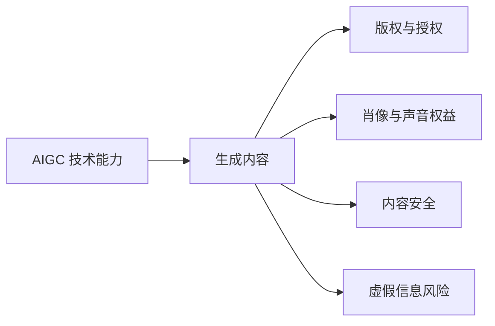
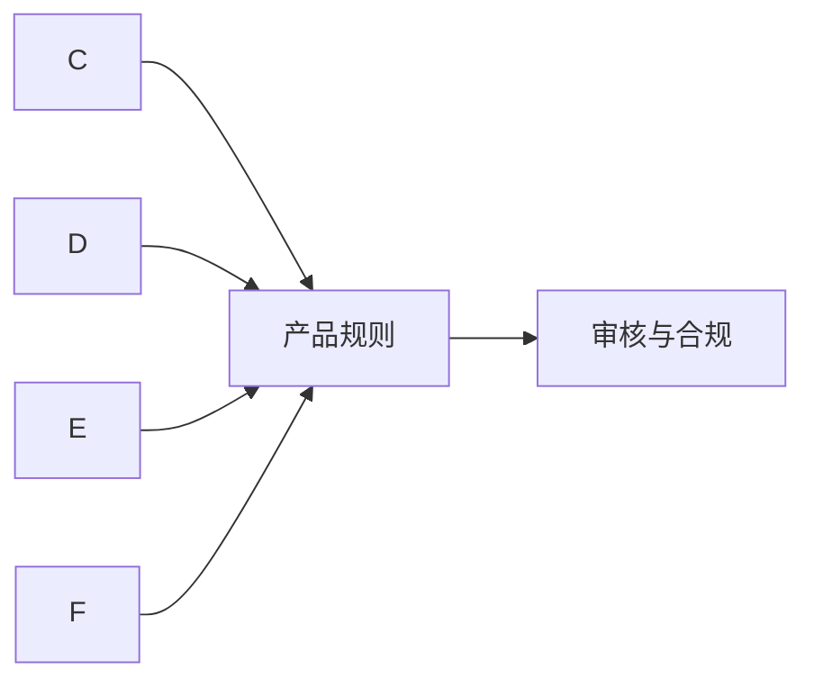
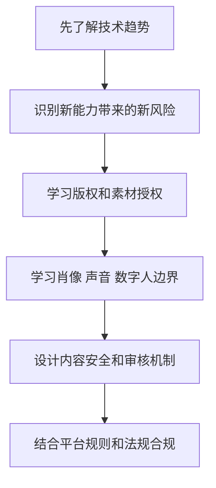
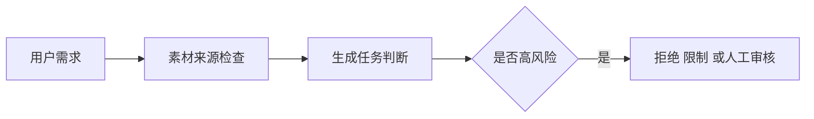
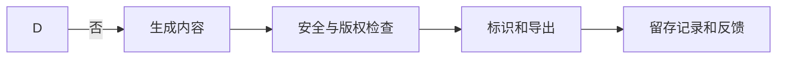

# 学前导读：前沿趋势与伦理这一章到底在学什么

这一章解决的是：AIGC 不只是技术路线问题，还会碰到产品判断、伦理边界和合规要求。

生成式 AI 的能力越强，越不能只看效果。图像、声音、视频和数字人都可能涉及版权、肖像、声音授权、虚假内容、偏见、误导和监管要求。一个 AIGC 产品能不能长期运行，不只取决于生成质量，也取决于它是否有清晰边界和责任机制。

## 这一章在整个课程里的位置

你已经学过多模态基础、图像生成、视频语音生成和数字人相关内容。到前沿趋势与伦理这一章，课程开始从“能生成什么”转向“应该怎样负责任地生成”。

这一章不是要让你停止使用 AIGC，而是帮助你建立产品判断：哪些素材可以用，哪些人物不能随便生成，哪些内容需要标识，哪些输出需要审核，哪些场景必须加入人工确认和合规流程。

前半段先理解前沿技术、真实风险和治理边界；后半段再把这些判断落到产品设计、审核流程和发布规范里。

## 这一章真正要解决的问题

这一章要回答五个问题：AIGC 的前沿趋势正在往哪里发展；版权、训练数据、素材授权和输出作品之间有什么风险；肖像、声音克隆和数字人为什么需要更谨慎的授权边界；虚假内容、偏见和误导怎样影响产品安全；法规和平台规则如何影响 AIGC 应用设计。

新人最容易忽略的是：技术上能生成，不代表产品上应该生成。尤其是涉及真实人物、商标品牌、受版权保护风格、新闻事件、医疗金融法律建议和未成年人内容时，更需要边界意识。

## 新人推荐学习顺序

建议先看前沿趋势，理解模型能力在图像、视频、3D、实时生成和多模态交互上的演进。然后学习伦理与安全，重点关注版权、肖像、声音、偏见、伪造和内容审核。最后看法规与合规，把技术能力放回真实产品环境，理解为什么需要用户协议、授权证明、内容标识、审核机制和风控策略。

## 学这一章时要抓住的主线

这一章的主线可以概括为：AIGC 产品要把生成能力、素材来源、用户意图、审核流程和交付责任放在同一条链路里。

前半段先理解前沿技术、真实风险和治理边界；后半段再把这些判断落到产品设计、审核流程和发布规范里。

看懂这条线后，你会知道伦理与合规不是写在文档最后的免责声明，而是要进入产品流程：输入前检查、生成中限制、输出后审核、交付时标识、上线后追踪。

## 这一章和后面章节的关系

前沿趋势与伦理会直接影响最终 AIGC 综合项目。创意内容平台不仅要能生成文案、图片、语音和视频脚本，还要能记录素材来源、限制高风险生成、加入内容审核、提示版权和肖像风险，并为用户提供可解释的导出结果。

如果这一章没学稳，后面常见的问题是：只展示生成效果，没有任何风险边界；使用来源不明素材；生成真实人物或声音却没有授权假设；没有内容审核和标识；项目看起来炫，但不适合真实产品场景。

## 新人和进阶学习者怎么读

新人第一次学这一章时，先抓住主线和最小可运行例子。你不需要一次理解所有细节，只要能说清楚这一章解决什么问题、输入输出是什么、最小项目怎么跑起来，就可以继续往后走。

有经验的学习者可以把这一章当成查漏补缺和工程化练习：关注边界条件、失败案例、评估方式、代码可复现性，以及它和前后阶段的连接。读完后最好能把本章内容沉淀到自己的作品 README 或实验记录里。

## 学习时间与难度建议

| 学习方式 | 建议投入 | 目标 |
|---|---|---|
| 快速浏览 | 20～30 分钟 | 看懂本章解决什么问题，知道后面会用到哪里 |
| 最小通关 | 1～2 小时 | 跑通一个最小例子，完成本章小项目出口 |
| 深入练习 | 半天～1 天 | 补充错误分析、对比实验或项目 README 记录 |

## 本章自测问题

| 自测问题 | 通过标准 |
|---|---|
| 这一章解决什么问题？ | 能用一句话说明它在整门课里的位置 |
| 最小输入输出是什么？ | 能说清楚例子需要什么输入，会产生什么结果 |
| 常见失败点在哪里？ | 能列出至少一个报错、效果差或理解偏差的原因 |
| 学完后能沉淀什么？ | 能把本章产出写进项目 README、实验记录或作品集 |

## 本章小项目出口

学完这一章后，建议为前面的图像或视频生成项目补一份“AIGC 风险检查清单”。清单至少包括素材来源、版权授权、人物肖像、声音克隆、敏感内容、虚假信息、输出标识、人工审核和用户责任说明。

如果做成产品原型，可以在生成前加入风险提示，在导出前加入审核步骤，并记录每次生成使用的输入、素材、模型和审核结论。

## 过关标准

这一章结束时，你应该能说清楚 AIGC 在版权、肖像、声音、虚假内容、偏见和合规上的主要风险，能为一个生成式功能设计基本审核流程，能判断哪些场景需要拒绝、限制或人工确认。

如果你能把一个 AIGC Demo 改造成带素材来源记录、风险提示、内容审核和导出标识的产品流程，就说明你已经具备负责任 AIGC 应用的基础意识。
