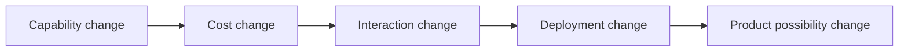
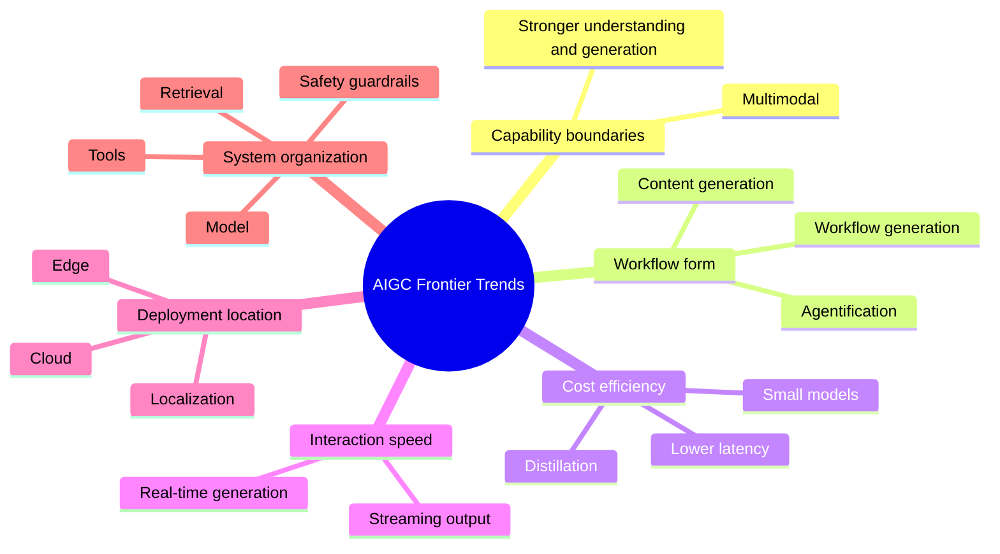

# 12.4.2 AIGC Frontier Trends


:::tip Reading guide
Frontier trends should be judged by looking at “model capability, cost efficiency, product form, compliance boundaries, and workflow integration” together. Looking only at leaderboards can easily make you anxious; understanding system changes makes it easier to know what to learn next.
:::

:::tip Section positioning
There are two things that are especially easy to get wrong when talking about “trends”:

- listing only buzzwords
- chasing only the hottest topics

What this section wants to do instead is this:

> **Give you a framework for reading trends.**

That way, even when you face a new model name or a new product form in the future, it will be easier to judge which main line it belongs to.
:::

## Learning objectives

- Understand several of the most important current evolution directions in AIGC
- Learn to view trends through dimensions such as “capability, cost, product form, and deployment method”
- Build the habit of not just chasing hot topics, but judging long-term main lines

---

## First, build a map

### Start with a scenario: why does the same model capability become different products?

Imagine three companies all got access to the same powerful multimodal model.

The first company turns it into a screenshot Q&A assistant, where users upload an interface screenshot and ask, “What does this button mean?” The second company turns it into a video editing tool, where users say one sentence and get a rough cut version. The third company puts it on a mobile device so users can process private photo albums offline.

The model base may be similar, but the product directions are completely different. The reason is not “whose model name is trendier,” but that they each capture different changes: the input entry changed, the workflow changed, the cost structure changed, and the deployment location changed too.

So when looking at AIGC trends, you cannot just follow model leaderboards. You have to ask: what layer did this change actually affect?

For beginners, the best order to understand frontier trends is not “memorize this year’s hottest names,” but first clearly see:



So what this section really wants to solve is:

- how to judge trends
- why frontier does not mean only looking at model leaderboards

### A more beginner-friendly overall analogy

You can think of “reading trends” as:

- looking at what roads a city is actually building, instead of only looking at which car is fastest today

A model leaderboard is more like:

- which car is a little faster today

Trend judgment is more like:

- whether this city is moving toward high-speed rail, subways, or more highways

This analogy is very useful for beginners because it helps you first grasp:

- what really matters about trends is the long-term main line
- not short-term buzzwords

## Why can’t AIGC trends be judged only by model leaderboards?

Because what really drives industry change is often not just:

- how much the model parameter count increased
- how much a leaderboard score improved

It is these deeper changes:

- whether the capability boundary changed
- whether the interaction form changed
- whether the cost structure changed
- whether the deployment method changed

So when you look at trends, the real question is:

> **What kind of application possibilities did this change create?**

---

## Putting six trends into one picture

Before going into specific trends, you can first place them in the same framework:



The purpose of this map is not to make you memorize terms, but to help you judge: which long-term main line does a new hot topic actually belong to?

---

## The first major trend: multimodality is becoming the default capability

In the past, many systems mainly handled:

- pure text

But now more and more systems handle:

- text
- images
- audio
- video

This is not a small change. It means the input world itself has been opened up.

### Why is this important?

Because the real world is naturally multimodal.
Once a model can take in more kinds of input, application forms expand dramatically:

- screenshot assistants
- image-based Q&A
- video summarization
- voice-driven assistants

So:

> Multimodality is not “icing on the cake”; it is redefining the interaction entry point.

### A very useful early rule for beginners

If a direction opens up a new input entry point,
then it is often not just “the model got a little better,” but rather it is changing:

- how users hand their problems to the system

---

## The second trend: from “generating content” to “generating workflows”

Early AIGC was more about:

- generating an image
- generating a piece of copy

But now more and more systems are doing:

- generation + retrieval
- generation + tool calling
- generation + evaluation
- generation + multi-turn interaction

This means:

> AIGC is moving from “single output” to “continuous workflow systems.”

This is also why Agent and AIGC are becoming increasingly tightly connected.

---

## The third trend: from model-size competition to cost-efficiency competition

### Simply stacking bigger models is no longer the only direction

While the industry continues to pursue stronger model capabilities, it is also paying more and more attention to:

- inference cost
- latency
- whether it can run on-device
- small-model capability

### Why has this become a trend?

Because when building real products, you must face:

- user scale
- budget
- deployment environment

A model that is stronger but ten times more expensive is not necessarily better for the business.

So an important future line is:

> **Stronger no longer means only bigger; it increasingly means more efficient.**

---

## The fourth trend: real-time generation is becoming more important

User expectations for AIGC are shifting from:

- “It can generate”

to:

- “Can it generate quickly enough?”

Especially in:

- dialogue
- voice
- video
- interactive creation

In these scenarios, real-time performance will become increasingly critical.

This will continue to push the field toward:

- faster sampling
- lighter inference
- more streaming generation

---

## The fifth trend: on-device and localized capabilities are becoming more important

In the past, a lot of generation and inference was assumed to happen in the cloud.
But now more and more people are paying attention to:

- local execution
- edge deployment
- privacy friendliness
- offline capability

This will be especially important in scenarios such as:

- internal enterprise systems
- privacy-sensitive data
- mobile assistants
- scenarios with low network dependence

So in the future, one very important question will be:

> **Which capabilities should stay in the cloud, and which should move to the edge?**

---

## The sixth trend: from single-model capability to system capability

Many years ago, the competition focus was more like:

- which single model is stronger

Now it is increasingly like:

- model + retrieval
- model + tools
- model + workflow
- model + safety guardrails

This means the real competition point is shifting from:

- the model itself

to:

- how the whole system is organized

So when you build AIGC projects in the future, you cannot focus only on the model.

---

## A very practical trend-judging framework

When looking at a new direction, you can first ask four questions:

1. Does it make capability stronger, or is it just a new package?
2. Does it reduce cost, or does it only make deployment more flexible?
3. Does it open a new interaction entry point?
4. Does it affect the product workflow?

A very simple illustration:

```python
trend_check = {
    "multimodal": {"ability": 9, "cost_impact": 6, "new_interaction": 9, "workflow_change": 8},
    "small_models": {"ability": 6, "cost_impact": 9, "new_interaction": 5, "workflow_change": 7},
    "real_time_generation": {"ability": 7, "cost_impact": 8, "new_interaction": 9, "workflow_change": 8}
}

for trend, scores in trend_check.items():
    total = sum(scores.values())
    strongest = max(scores, key=scores.get)
    print(f"{trend}: total={total}, strongest_change={strongest}")
```

Expected output:

```text
multimodal: total=32, strongest_change=ability
small_models: total=27, strongest_change=cost_impact
real_time_generation: total=32, strongest_change=new_interaction
```

Do not treat the totals as an objective leaderboard. Use them as a quick way to ask which layer a trend changes most.

This example is not calculating an objective ranking. It is training a way of thinking: every time you see a new trend, break it down into concrete dimensions.

If you want this little tool to be more practical, you can add:

```python
trend_check = {
    "multimodal": {"ability": 9, "cost_impact": 6, "new_interaction": 9, "workflow_change": 8},
    "small_models": {"ability": 6, "cost_impact": 9, "new_interaction": 5, "workflow_change": 7},
    "real_time_generation": {"ability": 7, "cost_impact": 8, "new_interaction": 9, "workflow_change": 8}
}

advice = {
    "ability": "First look at what new tasks it can do",
    "cost_impact": "First look at whether it lowers large-scale usage cost",
    "new_interaction": "First look at whether it changes the user entry point",
    "workflow_change": "First look at whether it reorganizes the product flow"
}

for trend, scores in trend_check.items():
    strongest = max(scores, key=scores.get)
    print(trend, "->", advice[strongest])
```

Expected output:

```text
multimodal -> First look at what new tasks it can do
small_models -> First look at whether it lowers large-scale usage cost
real_time_generation -> First look at whether it changes the user entry point
```

This version is self-contained: you can paste it into a new Python file and run it directly.

This example is not about scoring. It is a reminder:

> Don’t just look at whether something is “new”; look at which layer it changes.

### A trend-judging table that is easier for beginners to remember

| Dimension | What should you ask first? |
|---|---|
| Capability | What can it do now that it couldn’t do before? |
| Cost | What became cheaper, or did it become more expensive instead? |
| Interaction | Has the user-system interaction entry point changed? |
| Workflow | Does it make the product flow shorter, faster, or more complex? |

This table is great for beginners because it brings “trends” down from abstract judgment to a few practical questions.

---

## The safest order when looking at frontier trends for the first time

It is better to look at them in this order:

1. First see which capability it changes
2. Then see how much it changes the cost structure
3. Then see whether it opens up new interactions or workflows
4. Only then ask whether it is a short-term hot topic

This makes it easier to tell the difference between “the real main line” and “short-term noise.”

## If you turn this into notes or a project judgment, what is most worth showing?

What is most worth showing is usually not:

- a list of popular directions

But rather:

1. Which four dimensions you use to judge trends
2. Which layer a certain direction changes
3. How it will affect future product forms

Then others will more easily see:

- that you understand a trend-judging framework
- not just that you are following hot topics and memorizing terms

---

## Common mistakes beginners make

### Treating “trend” as “recent buzzwords”

This makes it easy to follow news around, instead of following the main line.

### Looking only at model capability, not cost and product form

This can distort your judgment.

### Thinking trends develop in a purely linear, one-way way

In reality, many trends exist in parallel:

- large models keep getting stronger
- small models keep getting cheaper
- the cloud keeps developing
- edge deployment is also gaining momentum

---

## Summary

What matters most in this section is not memorizing a few directions, but building a way to judge trends:

> **The truly meaningful part of AIGC frontier changes usually happens across four layers: capability boundaries, cost structure, interaction entry points, and system organization methods.**

Once you start looking at new trends through these dimensions, you will no longer just be chasing hot topics.

## What you should take away from this section

- The core of trend judgment is a framework, not chasing buzzwords
- The real question you should ask is “What possibility did it change?”
- Multimodality, systemization, efficiency, and edge deployment are more like long-term main lines

---

## Exercises

1. Pick a new AIGC direction you recently saw and analyze it using the four dimensions of “capability / cost / interaction / workflow.”
2. Think about why multimodality is said to be a change in the “interaction entry point,” not just a change in “model capability.”
3. In your own words, explain why future AIGC competition is increasingly like “system competition,” not just “model competition.”
4. If you want to judge whether a trend is worth following in the long term, what are the first two questions you would ask?
5. Find a specific product and judge whether it is mainly betting on multimodality, real-time generation, on-device deployment, or workflow-ization.
