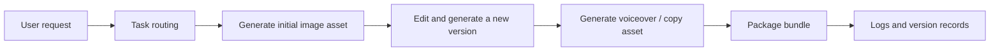

# 12.5.2 Project: AI Creative Content Platform


:::tip Section Focus
AI creative platforms are especially easy to turn into a “feature stack page”:

- one button for text-to-image
- one button for voice generation
- one button for image editing

But that still does not count as a platform.
The real challenge of a platform is:

> **Organizing multimodal capabilities into a continuous workflow and reliably managing intermediate assets.**

This section will push it one step further toward a “portfolio-level product project.”
:::

## Learning Objectives

- Learn how to organize multimodal generation capabilities into a real creative workflow
- Learn how to define the asset structure and versioning logic in a creative platform
- Learn how to turn this topic into a portfolio-level project with product sense
- Understand why a creative platform is more than just a collection of single-step generation features

---

## What Kind of Topic Really Feels Like a “Platform Project”?

A topic that feels more like a portfolio piece should be:

> **Build an event poster creation platform: users enter their requirements, the system generates a poster, supports one round of image editing, then generates promotional voiceover, and finally exports a complete asset package.**

### Why is this scope a good fit?

- The flow is complete
- The assets are clearly defined
- The result is very intuitive to demonstrate

### Why not start with a “full-featured creative platform”?

Because:

- Too many features will blur the main storyline
- Asset management and routing logic can quickly get out of control

---

## What Does the Minimum Portfolio-Level Creative Platform Loop Look Like?

1. The user submits a request
2. The request is routed to the right module
3. Initial assets are generated
4. Existing assets are modified
5. Supporting voiceover or copy is generated
6. A unified content package is exported

If you can make these 6 steps run smoothly, the project already feels very product-like.

### A More Realistic Asset Flow Diagram for a Platform



This diagram is important because it reminds you:

- A platform is not a feature list
- It is a process where assets continuously evolve

## Recommended Build Order

For beginners, a safer order is usually:

1. Build single-step poster generation first
2. Add one round of image editing
3. Add voice assets
4. Finally add bundle, logs, and version management

This way, you can build the “platform feel” step by step.

### A Better Analogy for Beginners

You can think of a creative platform as:

- A small studio with a materials cabinet, editing desk, and export area

If it is just many buttons, it is more like:

- Different tools piled onto one desk

Only when you start caring about:

- Which asset is the first draft
- Which asset is the revised version
- Which assets belong to the same project

does it really start to feel like a “platform.”

---

## Let’s First Run a Workflow Example That Feels More Like a Platform

```python
from dataclasses import dataclass, field


@dataclass
class AssetBundle:
    images: list = field(default_factory=list)
    voices: list = field(default_factory=list)
    logs: list = field(default_factory=list)
    metadata: dict = field(default_factory=dict)


def route_task(user_request):
    normalized = user_request.lower()
    if "voiceover" in normalized or "voice" in normalized:
        return "tts"
    if ("edit" in normalized and "image" in normalized) or "retouch" in normalized:
        return "image_editing"
    if "poster" in normalized or "image" in normalized:
        return "image_generation"
    return "general"


def generate_image(prompt, style):
    return f"image_asset[{style}]::{prompt}"


def edit_image(image_name, instruction):
    return f"edited::{image_name}::{instruction}"


def generate_voice(script, speaker="default"):
    return f"voice_asset[{speaker}]::{script}"


def run_creative_project(requests):
    bundle = AssetBundle(metadata={"style": "futuristic", "project_name": "tech_event_campaign"})

    for req in requests:
        task_type = route_task(req)
        bundle.logs.append({"request": req, "task_type": task_type})

        if task_type == "image_generation":
            asset = generate_image(req, style=bundle.metadata["style"])
            bundle.images.append(asset)

        elif task_type == "image_editing" and bundle.images:
            asset = edit_image(bundle.images[-1], req)
            bundle.images.append(asset)

        elif task_type == "tts":
            asset = generate_voice(req, speaker="brand_voice")
            bundle.voices.append(asset)

    return bundle


requests = [
    "Create a tech conference poster",
    "Edit the image: change the background to deep blue and add a subtle glow effect",
    "Generate a promotional voiceover for this poster",
]

bundle = run_creative_project(requests)
print("image_count:", len(bundle.images))
print("voice_count:", len(bundle.voices))
print("log_count:", len(bundle.logs))
print("tasks:", [item["task_type"] for item in bundle.logs])
print("latest_image_is_edit:", bundle.images[-1].startswith("edited::"))
```

Expected output:

```text
image_count: 2
voice_count: 1
log_count: 3
tasks: ['image_generation', 'image_editing', 'tts']
latest_image_is_edit: True
```


The important check is the `tasks` line. The same project now contains one first image, one edited image version, and one voice asset, instead of three unrelated generation calls.

### What Makes This Version Stronger Than the Previous One?

This time, in addition to:

- images
- voices

we also added:

- `logs`
- more explicit `metadata`

That makes it closer to the real-world logic of a platform:

- asset flow
- operation flow

### Why Is `logs` So Worth Showing?

Because platform projects are most vulnerable when users can only see the final result
but cannot see the intermediate process.

In a portfolio presentation, the intermediate process is often the highlight.

### Let’s Look at a Minimal Version Management Example

```python
assets = [
    {"id": "img_v1", "type": "image", "parent": None},
    {"id": "img_v2", "type": "image", "parent": "img_v1"},
    {"id": "voice_v1", "type": "voice", "parent": None},
]

for asset in assets:
    print(asset)
```

Expected output:

```text
{'id': 'img_v1', 'type': 'image', 'parent': None}
{'id': 'img_v2', 'type': 'image', 'parent': 'img_v1'}
{'id': 'voice_v1', 'type': 'voice', 'parent': None}
```


`parent` is the minimum versioning field. It tells you whether an asset starts a new branch or was derived from an earlier asset.

This example is great for beginners because it helps you build a platform mindset first:

- Assets are not isolated files
- They often have version relationships and parent-child relationships

---

## Where Creative Platforms Are Most Likely to Go Off Track

### Confusing Asset Versions

For example:

- initial image
- image revision 1
- image revision 2

If naming and archiving are unclear, the system will quickly become messy.

### Unclear Routing Logic

For example:

- A single request sounds like both an image request and a voice request

This makes the output hard to predict.

### Inconsistent Multimodal Style

For example:

- The poster style feels futuristic
- But the voiceover copy sounds like an official news broadcast

This kind of mismatch is great to analyze separately in the project.

---

## What Should a Portfolio-Level Creative Platform Showcase?

At minimum, it is recommended to show:

1. The user request
2. The routing result
3. The initial poster
4. The post-edit version
5. The voice asset
6. The final bundle structure

### Why Is This Stronger Than Just Posting a Single Poster?

Because it lets others see:

- This is a workflow system
- It is not just a single-generation demo

### If This Is Your First Time Building Such a Project, the Safest Default Order Is

A safer order is usually:

1. Start with a single-theme creative scenario
2. Make sure the image asset loop works end to end
3. Add one editing chain
4. Add voice or copy assets
5. Only then build the bundle and version management

This is much easier than trying to build a “big, everything-included platform” from the start.

---

## A Very Useful Error Analysis Layer to Add

For example, you can additionally record:

- Which types of requests are most likely to be routed incorrectly
- Which prompts are most likely to make image and voice styles inconsistent
- Which assets are most likely to lose metadata during export

This will make your project look much more mature.

---

## What You Should Include in the Project Delivery

- A workflow diagram
- A complete trace from request to bundle
- A set of style-consistent / style-inconsistent comparison cases
- An explanation of your asset management and version design

## What Is Most Worth Emphasizing in a Portfolio Version

What is usually most worth emphasizing is not:

- having many features

but rather:

1. How routing decides which generation chain to follow
2. How assets evolve step by step
3. How logs and versions are recorded
4. Why the final bundle feels like a real deliverable content package

This makes it easier for others to feel that:

- You built a creative platform
- Not just a pile of multimodal features

---

## Evidence to Keep

Keep this page's proof of learning as a small evidence card:

```text
brief: user goal, audience, assets, constraints, and export format
artifacts: source files, prompts, generated candidates, selected output, and rejected versions
review: factual check, copyright/portrait/sensitive-content check, and human decision
integration: RAG record, Agent trace, creative package, storyboard, or export preview
Expected_output: reproducible asset package with README, review checklist, and failure notes
```

## Summary

The key takeaway from this section is to develop a portfolio-level judgment:

> **What makes an AI creative content platform truly feel like a platform is not the number of features, but whether task routing, asset versions, and multi-step workflows are organized into a stable, demonstrable production pipeline.**

Once that pipeline is explained clearly, the project will feel very much like a multimodal portfolio piece with product sense.


## Suggested Version Roadmap

| Version | Goal | Delivery Focus |
|---|---|---|
| Basic | Complete the minimum loop | Can input, process, and output, while keeping a small set of examples |
| Standard | Become a showcaseable project | Add configuration, logs, error handling, README, and screenshots |
| Challenge | Approach portfolio quality | Add evaluation, comparison experiments, failure case analysis, and a next-step roadmap |

It is recommended to finish the basic version first. Do not chase a big, everything-included solution from the beginning. With each version upgrade, write into the README what was added, how it was verified, and what issues remain.

## Exercises

1. Add a `video_scripts` field to `AssetBundle`, and think about how it should be generated in the workflow.
2. Why does a creative platform rely more on asset management than a single-step generation feature?
3. If image and voice styles are always inconsistent, would you attribute the problem to routing, prompts, or the asset layer? Why?
4. If you put this project in your portfolio, which 5 modules are most worth showing on the homepage?

<details>
<summary>Project reference and review notes</summary>

1. `video_scripts` should be generated after the brief and asset plan are stable. It can contain scene id, narration, visual direction, duration, required assets, and review status so the video workflow stays connected to the same manifest.
2. A creative platform depends on asset management because generation creates many versions, rejected candidates, prompts, rights notes, and review decisions. Without asset records, the team cannot reproduce or safely reuse the work.
3. If image and voice styles are inconsistent, first check the asset layer because style definitions may not be shared. Then check routing and prompts to see whether the right generator and style instructions were applied.
4. The five strongest homepage modules are usually brief intake, asset manifest/versioning, generation workflow, safety/review dashboard, and final export or portfolio preview.

</details>
