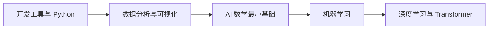
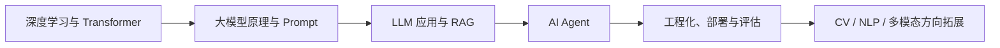

# AI 全栈学习教程

这套课程不是把 AI 名词按章节堆在一起，而是把一个学习者从“会一点编程”带到“能独立做 AI 应用、RAG 系统和 Agent 项目”的完整路线。

你会先补齐开发、Python 和数据基础，再理解机器学习、深度学习和 Transformer 的核心思想，随后进入大模型应用、RAG、智能体、部署与评估。计算机视觉、传统 NLP、多模态和 AIGC 会作为方向拓展放在主线之后，避免一开始路线过长、难度跳跃太大。

## 这套课适合谁

- 已经会一点 Python、JavaScript 或其他编程语言，但没有系统学过 AI 的学习者
- 想从普通开发转向 AI 应用、LLM 工程、RAG 或 Agent 开发的人
- 学过一些机器学习概念，但不知道如何把数据、模型、应用和工程串起来的人
- 想建立作品集，而不是只收藏教程、概念和工具名的人

如果你完全零基础，也可以从第一部分开始慢慢学；如果你已经有扎实的编程经验，可以快速浏览开发基础，把主要精力放在数据、模型、大模型应用和 Agent 主线上。

## 你不是在“看教程”，而是在一路做作品

这套课程最推荐的学习方式，是把自己当成一个正在升级的 AI 产品开发者。每个阶段都不是孤立知识点，而是在帮你完成下一个更像真实工作的作品：先能搭环境、写脚本，再能处理数据、训练模型，最后能做 RAG、Agent 和完整 AI 应用。

| 闯关段 | 你在解决的问题 | 阶段作品 |
|---|---|---|
| 打基础 | 我能不能独立搭环境、写 Python、处理真实数据？ | 命令行小工具、爬虫/API、小型数据分析报告 |
| 理解模型 | 我能不能解释模型为什么这样训练、怎样评估？ | 机器学习预测项目、深度学习训练实验 |
| 做应用 | 我能不能把大模型接进真实系统？ | Prompt 模板、RAG 知识库助手、工具调用应用 |
| 做系统 | 我能不能让 AI 连续完成任务并可追踪、可恢复？ | Agent 自动化助手、带日志和评估的完整应用 |
| 做方向作品 | 我能不能选一个方向做出可展示项目？ | CV、NLP、多模态或 AIGC 作品集项目 |

学习时可以一直问自己一个问题：这一章学完后，我的作品能多完成哪一步？这样读起来会比单纯背概念更有目标感。

## 课程主线

这条路线的核心逻辑是：先能写程序，再能处理数据；先知道模型如何学习，再知道大模型为什么有效；先能调用模型完成任务，再能把模型接入知识库、工具、记忆和工作流；最后再考虑部署、评估、安全和方向拓展。

## 全书结构一览

| 部分 | 主题 | 学完之后你应该能做什么 |
|---|---|---|
| 第一部分 | 编程与数据基础 | 能搭环境、写 Python、处理数据、做基础可视化 |
| 第二部分 | AI 模型基础 | 能理解机器学习、深度学习和 Transformer 的基本训练逻辑 |
| 第三部分 | 大模型应用主线 | 能开发 LLM 应用、RAG 知识库和 AI Agent 系统 |
| 第四部分 | 方向拓展与毕业项目 | 能按兴趣进入 CV、NLP、多模态、AIGC 或部署优化方向 |
| 选修模块 | 工程和算法补充 | 能根据目标补 C++ 部署、Python 进阶、经典算法等能力 |

## 推荐学习路线

### 路线一：应用型 AI 全栈主线

适合大多数“会点编程，想尽快做出 AI 项目”的学习者：

`开发工具 -> Python -> 数据分析 -> AI 数学最小基础 -> 机器学习 -> 深度学习与 Transformer -> 大模型原理 -> LLM 应用与 RAG -> AI Agent -> 工程化项目`

这条路线不要求你一开始把所有数学、CV、NLP 都学完，而是先建立一条可执行的主干。你会不断做小项目，逐步把能力叠起来。

### 路线二：模型理解加强路线

适合想更深入理解模型内部机制的人：

`Python -> 数据分析 -> AI 数学 -> 机器学习 -> 深度学习 -> CV / NLP -> Transformer -> LLM 原理与微调`

这条路线更重视模型演进过程，适合未来想做算法、模型训练、微调、评估或研究型工作的学习者。

### 路线三：项目作品集路线

适合想把学习过程转成作品集的人：

`Python 小工具 -> 数据分析报告 -> 机器学习预测模型 -> 图像/文本分类项目 -> LLM 聊天助手 -> RAG 知识库 -> Agent 自动化助手 -> 完整 AI 应用上线`

这条路线的重点不是“学完所有章节”，而是每隔一段时间产出一个可展示项目。

## 新人和有经验学习者怎么读

如果你是新人，第一遍不要追求所有细节都懂。你只需要按主线完成每个阶段的最小项目，遇到数学、模型结构或工程细节时，先知道它解决什么问题，再继续往后走。等你做 RAG 或 Agent 项目时，很多前面的概念会自然回来。

如果你已经有经验，可以把每章当成一次查漏补缺：重点看项目出口、常见误区、评估方式和工程化约束。比如你会写 Python，就快速通过前两站；你做过机器学习，就重点看大模型应用、RAG、Agent、部署和评估；你想做算法或模型工程，就在数学、深度学习、Transformer、微调和对齐部分多停留。

## 每个阶段都会逐步补齐什么

后续课程会按统一模板持续优化，每个阶段都会尽量包含：学习目标、前置知识、历史背景、知识地图、核心概念、图示讲解、动手实验、阶段项目、验收标准和常见误区。

历史脉络不是为了讲故事，而是为了让你知道技术为什么会这样发展。比如专家系统为什么被机器学习替代，RNN 为什么被 Transformer 超越，为什么 RAG 会成为企业知识库常见方案，为什么 Agent 需要工具、记忆、规划和评估。

图示和思维导图会优先使用 Mermaid，方便在网页中维护和持续迭代。复杂结构后续可以补充 SVG 或图片，比如 Transformer 架构图、RAG 流程图、Agent 系统架构图、AI 发展时间线等。

## 学习过程中最重要的原则

不要只看概念，要尽早跑代码。AI 学习真正卡住的地方，往往不是“听不懂定义”，而是数据格式、环境依赖、模型输入输出、接口错误、评估方式和项目边界。

不要一开始追求“大而全”。第一次学习最重要的是跑通主线：能处理数据，能训练或调用模型，能做一个可用的 AI 应用，能解释系统为什么这样设计。

不要把大模型应用和传统机器学习割裂。RAG、Agent、工具调用和多模态应用看起来很新，但底层仍然离不开数据、表示、检索、评估、工程化和安全意识。

## 建议从这里开始

第一次进入这套课程时，不建议一口气读完所有导览页。更好的方式是先读“必读 5 篇”，快速建立路线感；等你准备正式开项目、规划时间或选择方向时，再回来看“按需阅读”。

### 必读 5 篇

1. [AI 全栈能力地图](/intro/ai-fullstack-map)：先看清 AI 全栈到底包含哪些能力层。
2. [推荐学习路线](/intro/learning-path)：选择应用型、模型理解型或作品集型路线。
3. [项目路线与作品集](/intro/project-roadmap)：知道每个阶段最终能做出什么作品。
4. [常见概念别混表](/intro/concept-comparison)：先区分 API、SDK、模型、RAG、微调、Agent 等容易混淆的概念。
5. [环境准备](/intro/environment-setup)：把 Python、VS Code、Git、Jupyter、GPU/API 等基础环境准备好。

读完这 5 篇后，就可以进入第一部分的开发工具、Python 和数据基础。不要等“完全准备好”再开始，边学边补会更稳。

### 按需阅读 7 篇

如果你想了解技术背景，可以读 [AI 发展历史地图](/intro/ai-history-map) 和 [2025-2026 AI 应用技术地图](/intro/modern-ai-stack)。如果你想用一个项目贯穿全课，可以读 [贯穿项目：AI 学习助手成长路线](/intro/ai-learning-assistant-project) 和 [贯穿项目仓库模板：AI 学习助手](/intro/ai-learning-assistant-template)。如果你需要安排学习节奏或选择职业方向，可以读 [学习节奏规划](/intro/learning-schedule)、[角色路线选择](/intro/role-based-paths) 和 [AI 工程评估与上线清单](/intro/ai-engineering-checklist)。

如果你已经能熟练写 Python，可以快速浏览第一部分，把时间留给机器学习、大模型应用和 Agent；如果你是新人，就按主线从第 1 站开始，每一站至少完成一个最小可运行作品。