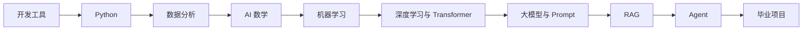

# AI 全栈学习教程

这套课程的目标很直接：把你从“会一点编程或准备开始编程”，带到“能独立做 AI 应用、RAG 系统、Agent 项目和作品集”。第一遍不用平均用力，先跑通主线，再按目标补深度。

## 先看图：整门课的主线

这条路线只记一句话：先会写程序和处理数据，再理解模型怎么学习，最后把大模型接入资料、工具、记忆、工作流和线上服务。

## 第一次进来，先看这 5 个入口

| 你现在想解决的问题 | 先看哪里 | 看完做什么 |
| --- | --- | --- |
| 先体验 AI 到底能做什么 | [快速体验](/intro/quick-experience) | 跑通图像识别、文本生成、图像生成 |
| 担心目录太长、容易卡住 | [新手轻松学习指南](/intro/beginner-friendly-guide) | 知道第一遍怎么小步推进 |
| 不知道 AI 全栈包含哪些能力 | [AI 全栈能力地图](/intro/ai-fullstack-map) | 看清工具、数据、模型、应用、工程的关系 |
| 准备安排学习顺序 | [推荐学习路线](/intro/learning-path) | 选应用型、模型理解型或作品集型路线 |
| 想减少路线选择压力 | [四条主线学习路线](/intro/main-learning-routes) | 在零基础、开发、模型、作品集之间选一条 |

只想马上开始的话，读完上面几页后直接进入 [开发者工具基础](/ch01-tools)。其他导览页可以按当前问题临时查，不需要一口气读完。

## 导览页怎么读才不乱

| 阅读时机 | 建议页面 | 目的 |
| --- | --- | --- |
| 第一天必读 | 快速体验、新手指南、能力地图、推荐路线 | 建立全貌和默认路线 |
| 想增加趣味 | 剧情任务线、Boss 战、技能徽章 | 把学习变成任务和成就 |
| 开始做项目 | 贯穿项目、版本路线图、项目矩阵、交付标准 | 知道每阶段给作品增加什么能力 |
| 准备验收 | 能力评估、实验日志、失败样本库 | 检查是否能复现、解释和复盘 |
| 遇到卡点 | Debug 任务、卡点诊断、排障索引、术语表、FAQ | 快速定位概念、环境和路径问题 |
| 准备作品集 | 毕业项目、作品集清单、职业指南 | 把产出整理成可展示项目 |

## 最小通关标准

| 学习段 | 重点能力 | 代表作品 |
| --- | --- | --- |
| 打基础 | 环境、Python、数据处理 | 命令行工具、API 小工具、数据分析报告 |
| 理解模型 | 机器学习、深度学习、Transformer | 预测模型、分类实验、训练曲线复盘 |
| 做应用 | Prompt、LLM API、RAG | 课程问答助手、知识库问答系统 |
| 做系统 | Agent、工具调用、记忆、评估 | 学习规划 Agent、自动化助手 |
| 做作品集 | 部署、日志、安全、复盘 | 可演示的 AI 全栈毕业项目 |

学习时一直问自己：这一章学完后，我的作品能多完成哪一步？这样你不是在“看教程”，而是在持续升级一个项目。

## 按目标加深

| 目标 | 学习重点 |
| --- | --- |
| 尽快做 AI 应用 | 开发工具、Python、数据分析、LLM 应用、RAG、Agent |
| 理解模型原理 | 数学、机器学习、深度学习、Transformer、预训练、微调与对齐 |
| 准备作品集 | 每阶段保留可运行作品，持续更新 README、截图、实验记录和失败样本 |

## 学习原则压缩版

| 原则 | 为什么重要 |
| --- | --- |
| 尽早跑代码 | 真正卡人的往往是环境依赖、数据格式、接口错误和输入输出 |
| 不追求一开始大而全 | 第一遍先跑通主线，之后再补数学、模型和工程细节 |
| 不割裂传统 ML 和大模型应用 | RAG、Agent 和多模态仍然依赖数据、表示、检索、评估和工程化 |

## 接下来怎么做

第一次学习，先读上面的入口页，再从 [开发者工具基础](/ch01-tools) 开始。已有 Python 或开发经验，可以快速浏览前几站，把重点放在 [LLM 应用开发与 RAG](/ch08-rag)、[AI Agent 与智能体系统](/ch09-agent) 和 [毕业项目设计指南](/intro/graduation-project-guide)。
