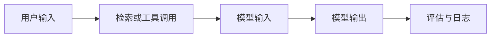

# AI 工程评估与上线清单

## 本节定位

这一页是一张“从 Demo 到可用系统”的检查清单。它不替代具体章节，而是帮你在完成 RAG、Agent、多模态或完整 AI 应用项目时，检查项目是否已经具备基本工程质量。

很多 AI 项目看起来能跑，但不能复现、不能评估、不能定位错误、不能控制成本，也不能安全上线。真正有作品集价值的项目，应该让别人看得懂、跑得起来、查得到失败原因。

## 一、问题和边界是否清楚

项目上线前，先确认它解决的问题是否足够具体。不要只写“做一个 AI 助手”，而要写清楚：它面向谁，处理什么输入，输出什么结果，不负责什么，什么时候应该拒绝或交给人工。

| 检查项 | 通过标准 |
|---|---|
| 目标用户 | 能说清楚谁会使用这个系统 |
| 输入输出 | 能列出输入类型和输出格式 |
| 任务边界 | 能说明哪些问题不处理 |
| 成功标准 | 能说明什么结果算好 |
| 失败处理 | 能说明失败时怎么提示或降级 |

## 二、评估集是否存在

没有评估集，就很难判断优化是否真的有效。Prompt 改了、检索策略改了、模型换了，如果没有固定测试问题，只能凭感觉判断。

RAG 项目至少准备一组固定问题，标注期望命中的文档和理想答案。Agent 项目至少准备一组固定任务，记录是否完成、用了几步、调用了哪些工具、有没有越权。多模态项目至少准备一组图片、截图、PDF 或生成任务，记录人工检查标准。

## 三、日志和 Trace 是否足够复盘

AI 应用的错误经常不是单点错误，而是链路错误。日志不要只记录最终答案，还要记录关键中间过程。

一个可复盘的日志至少应该包含：用户问题、检索片段、Prompt 版本、模型名称、工具调用参数、返回结果、错误信息、Token 或成本、耗时、最终输出。

## 四、成本和延迟是否可控

AI 系统的成本来自多处：模型输入输出 Token、Embedding、重排、图像或视频生成、工具调用、向量数据库、服务器和日志存储。项目早期可以先粗略估算，但不能完全忽略。

| 成本来源 | 应该记录什么 |
|---|---|
| LLM 调用 | 模型、输入输出 Token、调用次数 |
| RAG | 文档数量、切片数量、检索次数、重排次数 |
| Agent | 执行步数、工具调用次数、失败重试次数 |
| 多模态 | 图片、音频、视频生成次数和单次耗时 |
| 部署 | 服务器、数据库、存储和监控成本 |

## 五、权限和安全边界是否明确

工具调用和 Agent 项目尤其需要权限边界。模型可以建议动作，但不应该默认拥有所有执行权限。高风险操作需要人工确认，例如删除文件、发送消息、提交订单、修改数据库、调用付费 API 或发布内容。

安全检查至少包括：输入校验、输出格式校验、敏感信息处理、工具权限限制、人工确认、错误降级和审计日志。

## 六、RAGOps 检查清单

RAG 项目重点检查知识来源、检索质量和答案忠实度。

| 检查项 | 通过标准 |
|---|---|
| 文档来源 | 每个答案能追溯到文档、页面或片段 |
| 文档处理 | 能说明解析、清洗、切分和索引方式 |
| 检索质量 | 能看到召回片段和相关性排序 |
| 引用可信 | 答案中的关键事实能对应来源 |
| 无答案处理 | 文档没有答案时不会硬编 |
| 更新机制 | 文档变化后能重新索引或标记过期 |

## 七、AgentOps 检查清单

Agent 项目重点检查执行轨迹、工具边界和失败恢复。

| 检查项 | 通过标准 |
|---|---|
| 目标边界 | Agent 知道什么时候停止 |
| 工具 schema | 参数、返回值和错误信息清楚 |
| 执行轨迹 | 能看到每一步计划、动作、观察和结果 |
| 权限控制 | 高风险动作需要人工确认 |
| 失败恢复 | 工具失败时能重试、降级或停止 |
| 成本记录 | 能看到执行步数、调用次数和大致成本 |

## 八、多模态项目检查清单

多模态和 AIGC 项目重点检查素材、生成质量、人工编辑和合规。

| 检查项 | 通过标准 |
|---|---|
| 输入质量 | 图片、音频、视频、PDF 是否清晰可解析 |
| 输出可控 | 风格、尺寸、格式、用途有约束 |
| 版本记录 | 多次生成结果能比较和回退 |
| 人工编辑 | 用户能修改关键内容而不是完全依赖一次生成 |
| 内容审核 | 有版权、肖像、敏感内容和事实性检查 |
| 导出交付 | 最终结果能导出为可使用格式 |

## 九、作品集展示清单

如果项目要用于求职或展示，README 至少应该包含：项目目标、技术路线、运行方式、示例输入输出、截图或 GIF、评估方式、失败案例、改进计划和部署说明。

不要只展示“成功截图”。一个好的 AI 工程作品，应该展示你如何定位问题、如何评估效果、如何控制风险、如何做取舍。

## 十、上线前最后一问

上线前问自己一句话：如果这个系统明天回答错了、检索错了、工具调错了、成本突然升高了，我能不能知道是哪一层出了问题？

如果答案是否定的，就先补评估、日志和边界。AI 工程的成熟度，不在于 Demo 多酷，而在于出错时能不能复盘和改进。
