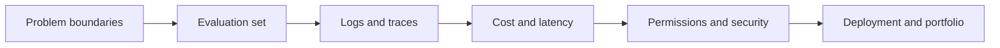
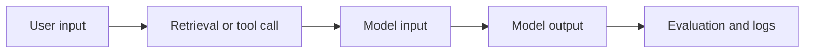

# AI Engineering Evaluation and Launch Checklist

## Where This Section Fits

This page is a checklist for going “from a Demo to a usable system.” It does not replace the individual chapters. Instead, it helps you check whether your project has reached a basic level of engineering quality when you finish a RAG, Agent, multimodal, or full AI application project.

Many AI projects look like they work, but they cannot be reproduced, evaluated, debugged, cost-controlled, or safely deployed. A truly portfolio-worthy project should be understandable, runnable, and debuggable by others.

## One-Glance View: From Demo to a Usable System

| If you can only add one layer first | What to prioritize |
|---|---|
| RAG project | Retrieval logs, citation checks, evaluation questions |
| Agent project | trace, tool schema, stop conditions, permissions |
| Multimodal project | Source materials, human review, export restrictions |
| Deployment project | `.env.example`, startup commands, error logs |

## 1. Are the Problem and Boundaries Clear?

Before launch, first confirm that the problem your project solves is specific enough. Do not just write “build an AI assistant.” Instead, make it clear: who it is for, what input it handles, what output it produces, what it is not responsible for, and when it should refuse or hand off to a human.

| Check item | Pass criteria |
|---|---|
| Target user | Can clearly say who will use this system |
| Input/output | Can list input types and output format |
| Task boundaries | Can explain which problems are not handled |
| Success criteria | Can explain what counts as a good result |
| Failure handling | Can explain how failures are surfaced or degraded gracefully |

## 2. Does an Evaluation Set Exist?

Without an evaluation set, it is hard to tell whether an optimization actually works. If you change the Prompt, change the retrieval strategy, or switch models, then without fixed test questions, you can only judge by intuition.

A RAG project should at least prepare a fixed set of questions, with the expected supporting documents and ideal answers annotated. An Agent project should at least prepare a fixed set of tasks, recording whether they were completed, how many steps were used, which tools were called, and whether any permission boundaries were crossed. A multimodal project should at least prepare a fixed set of images, screenshots, PDFs, or generation tasks, with human review criteria recorded.

## 3. Are Logs and Traces Detailed Enough for Debugging?

Errors in AI applications are often not single-point failures, but chain failures. Logs should not only record the final answer; they should also record the key intermediate steps.

A debuggable log should at least include: the user question, retrieved passages, Prompt version, model name, tool call parameters, return values, error messages, token count or cost, latency, and final output.

## 4. Are Cost and Latency Under Control?

The cost of an AI system comes from many places: model input/output tokens, Embedding, reranking, image or video generation, tool calls, vector databases, servers, and log storage. In the early stages of a project, you can estimate roughly, but you should not ignore it completely.

| Cost source | What should be recorded |
|---|---|
| LLM calls | Model, input/output tokens, number of calls |
| RAG | Number of documents, number of chunks, number of retrievals, number of reranks |
| Agent | Number of execution steps, number of tool calls, number of failed retries |
| Multimodal | Number of image, audio, and video generations, and time per generation |
| Deployment | Server, database, storage, and monitoring costs |

## 5. Are Permission and Security Boundaries Clear?

Tool-calling and Agent projects especially need clear permission boundaries. The model may suggest actions, but it should not automatically have permission to execute everything. High-risk actions require human confirmation, such as deleting files, sending messages, placing orders, modifying databases, calling paid APIs, or publishing content.

Security checks should at least include: input validation, output format validation, sensitive information handling, tool permission restrictions, human confirmation, graceful failure degradation, and audit logs.

## 6. RAGOps Checklist

RAG projects should focus on knowledge sources, retrieval quality, and answer faithfulness.

| Check item | Pass criteria |
|---|---|
| Document sources | Every answer can be traced back to a document, page, or passage |
| Document processing | Can explain parsing, cleaning, chunking, and indexing methods |
| Retrieval quality | Can see retrieved passages and relevance ranking |
| Citation trustworthiness | Key facts in the answer match the sources |
| No-answer handling | Does not invent answers when the documents do not contain them |
| Update mechanism | Can re-index or mark documents as stale after changes |

## 7. AgentOps Checklist

Agent projects should focus on execution traces, tool boundaries, and failure recovery.

| Check item | Pass criteria |
|---|---|
| Goal boundary | The Agent knows when to stop |
| Tool schema | Parameters, return values, and error messages are clear |
| Execution trace | Can see each step of planning, action, observation, and result |
| Permission control | High-risk actions require human confirmation |
| Failure recovery | Can retry, degrade gracefully, or stop when a tool fails |
| Cost tracking | Can see execution steps, number of calls, and approximate cost |

## 8. Multimodal Project Checklist

Multimodal and AIGC projects should focus on source materials, generation quality, human editing, and compliance.

| Check item | Pass criteria |
|---|---|
| Input quality | Images, audio, video, and PDFs are clear and parseable |
| Output controllability | Style, size, format, and usage are constrained |
| Version tracking | Multiple generation results can be compared and rolled back |
| Human editing | Users can modify key content instead of relying entirely on one generation |
| Content review | Includes checks for copyright, portrait rights, sensitive content, and factual accuracy |
| Export delivery | Final results can be exported in a usable format |

## 9. Portfolio Presentation Checklist

If the project is meant for job hunting or presentation, the README should at least include: project goals, technical approach, how to run it, sample input/output, screenshots or GIFs, evaluation method, failure cases, improvement plan, and deployment instructions.

Do not only show “success screenshots.” A good AI engineering project should show how you debugged problems, how you evaluated results, how you controlled risks, and how you made trade-offs.

## 10. Deployment and Productionization Checklist

Before launching an AI application, you should at least check it across four levels: local Demo, reproducible deployment, online operation, and continuous iteration. Deployment is not about adding one last command at the end. It is about making configuration, logs, permissions, costs, and failure handling all work in a new environment.

| Level | Check item | Pass criteria |
|---|---|---|
| Local Demo | Dependencies, environment variables, startup command | On a new machine, the minimal end-to-end flow runs according to the README |
| Reproducible deployment | `.env.example`, config files, data paths | Does not depend on hidden personal paths or manually copied files |
| Online operation | Logs, rate limiting, timeouts, degradation, error pages | When a request fails, the cause can be located and the user gets clear feedback |
| Continuous iteration | Evaluation set, feedback entry, version records | Prompt, retrieval, and model changes can be regression-tested |

Productionization also requires special attention to secret safety. API keys should not be written into the frontend, logs, screenshots, or public repositories. If the project needs to be shown publicly, use `.env.example` to explain variable names, and use a demo key or mock mode to get the flow working.

## 11. Launch Materials from Demo to Portfolio

If you do not yet have a real server, you can still prepare “pre-launch materials.” In a portfolio, the most important thing is to show that the project has deployment awareness, not necessarily to promise that it is already serving real users.

| Material | Description |
|---|---|
| Deployment architecture diagram | The relationships between frontend, backend, model API, vector store, and log storage |
| Environment variable notes | Model key, database address, vector store path, ports, and feature flags |
| Startup and rollback commands | How to start, stop, clear cache, and return to the previous version |
| Online incident plan | What to do when timeout, rate limit, key expiration, or vector store unavailability happens |
| Cost estimate | Tokens per request, average latency, daily request volume, and budget ceiling |

These materials help upgrade the project from “a runnable Demo” to “an AI application close to real engineering.”

## 12. The Final Question Before Launch

Before going live, ask yourself one question: if this system answers incorrectly tomorrow, retrieves the wrong content, calls the wrong tool, or suddenly becomes much more expensive, can I tell which layer went wrong?

If the answer is no, then add evaluation, logs, and boundaries first. The maturity of AI engineering is not about how cool the Demo looks, but whether you can debug and improve it when something goes wrong.
