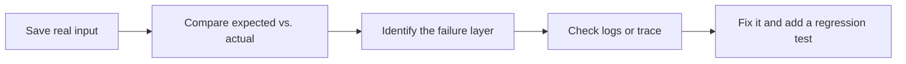

# Failure Samples Library for AI Applications

The most common problem in AI application projects is not “it cannot run at all,” but that it seems to work and is still unstable for certain inputs. The purpose of a failure samples library is to record these issues by layer, so you know which layer to go back to for debugging.

This page is not a replacement for the individual chapters, but rather an index. When you run into a problem, first determine whether the failure belongs to the LLM API, Prompt, RAG, Agent, tool, safety, or deployment layer, then return to the corresponding chapter for a deeper check.

## Understand the debugging flow at a glance



| Failure layer | What to look at first |
|---|---|
| LLM API | request_id, error code, token usage, latency |
| Prompt | raw output, schema, fixed test samples |
| RAG | top-k retrieval results, chunk, metadata, citations |
| Agent | tool call, observation, max_steps, permissions |
| Deployment | environment variables, dependency versions, logs, and rate limiting |

## How to record a failure sample

It is recommended that each failure sample include at least these fields:

| Field | Description |
|---|---|
| User input | The real question or task that triggered the failure |
| Expected result | What the system should have output or done |
| Actual result | How the system actually responded or acted |
| Failure layer | LLM API / Prompt / RAG / Agent / Tool / Safety / Deploy |
| Related logs | request_id, trace, retrieved_docs, tool_call, etc. |
| Initial cause | The issue you think is most likely |
| Fix action | What you plan to change |
| Regression test | How to make sure it does not happen again |

If a failure sample has no logs, it is hard to review afterward. If it has no regression test, it is very likely to come back later.

## LLM API layer failures

| Symptom | First priority to check | Fix direction |
|---|---|---|
| Requests fail occasionally | timeout, rate limit, network errors, server-side errors | Increase timeout, add limited retries, error classification, and fallback |
| Cost suddenly increases | prompt_tokens, completion_tokens, context length | Compress context, reduce repeated history, record usage |
| Latency becomes noticeably slower | model choice, top-k, retry count, network status | Limit retries, cache results, split synchronous and asynchronous tasks |
| Output is empty or the format is abnormal | raw output, error code, response parsing logic | Keep the raw response and unify the response structure |
| You do not know which call went wrong | request_id and log fields are missing | Log model, prompt_version, latency, and error consistently |

For API layer failures, start with the logs instead of changing the Prompt first. If you do not even know whether the request succeeded, how many tokens were used, or how long it took, it will be very hard to locate the issue later.

## Prompt / structured output failures

| Symptom | First priority to check | Fix direction |
|---|---|---|
| JSON parsing fails | whether there is extra explanatory text, whether brackets are balanced | Require JSON-only output and add retry on parse failure |
| Missing fields | whether required schema items are clear | List required fields in the Prompt |
| Unstable field types | whether numbers, booleans, or arrays are written as text | Make types and examples explicit, and add a validator |
| Classification labels drift | whether enum values are fixed | Provide allowed values and forbid invented categories |
| Old samples get worse after Prompt changes | no fixed test set | Create Prompt versions and regression test samples |

Do not solve Prompt problems only by “writing it more clearly.” A more stable approach is to work on the schema, examples, validation, failure samples, and regression tests together.

## RAG layer failures

| Symptom | First priority to check | Fix direction |
|---|---|---|
| The knowledge base has the answer, but it is not retrieved | chunk, query, embedding, keyword matching | Adjust chunking, add hybrid retrieval, or use query rewrite |
| Correct documents are ranked too low | top-k raw results, scores, comparison before and after reranking | Add reranking and adjust hybrid retrieval weights |
| The right document is retrieved, but the answer misses conditions | context packing, prompt, answer format | Keep key conditions and require line-by-line citation |
| Citations do not match the answer | source_refs, citation snippets, claims | Perform citation checks and forbid evidence-free conclusions |
| Wrong version or source | metadata filter, source_origin, date fields | Add filtering conditions and source priority |

The key to RAG failures is to distinguish between “did not retrieve the right thing” and “retrieved the right thing but did not use it well.” For the first case, check retrieval logs. For the second case, check the context and generation constraints.

## Agent / tool layer failures

| Symptom | First priority to check | Fix direction |
|---|---|---|
| The Agent chooses the wrong tool | tool name, description, number of candidate tools | Change the schema, reduce irrelevant tools, and add tool-selection logs |
| Wrong tool parameters | arguments, parameter validation, error return | Add a validator and structured errors |
| The Agent keeps looping | max_steps, stopping conditions, whether the observation repeats | Set a maximum number of steps and stop when there is no new information |
| The tool failure causes an immediate crash | safe_dispatch, retryable, fallback | Distinguish between retryable and non-retryable errors |
| The final result is hard to explain | trace is missing | Record goal, step, action, arguments, observation, and next_decision |

For Agent failures, do not look only at the final answer. What really matters is why each step was taken and how the observation affected the next step.

## Safety and permission failures

| Symptom | First priority to check | Fix direction |
|---|---|---|
| The Agent performed an action it should not have performed | tool permissions, risk levels, human confirmation | Require confirmation by default or disable high-risk tools |
| External documents induced privilege escalation | whether external content is treated as instructions | Mark external content as untrusted and apply permission limits at the tool layer |
| Logs leak sensitive information | log fields, masking strategy | Mask API keys, private data, and internal materials |
| The user did not truly confirm the risk | whether the confirmation text is clear | Show the action, target, parameters, risk, and rollback method |
| It is impossible to assign responsibility after an issue | audit_log is missing | Record request_id, tool name, parameters, confirmer, and result |

Safety issues cannot rely on the model’s self-discipline alone. The system should use permissions, allowlists, confirmation, auditing, and rollback to enforce boundaries.

## Deployment and production runtime failures

| Symptom | First priority to check | Fix direction |
|---|---|---|
| It runs locally but fails in production | environment variables, dependency versions, paths, permissions | Document deployment configuration clearly and use `.env.example` |
| API key becomes invalid or leaks | secret management, logs, frontend exposure | Call through a backend proxy, mask logs, and rotate keys |
| Instability under high concurrency | rate limiting, queues, timeouts, retries | Add rate limiting, asynchronous tasks, and fallback strategies |
| Production costs are uncontrollable | token statistics, caching, user quotas | Add cost monitoring, request limits, and model tiers |
| User feedback cannot be used for improvement | no feedback field or sample collection | Save thumbs, correction text, and failure samples |

Deployment failures are often not just code problems. They are usually determined together by configuration, permissions, runtime behavior, and monitoring.

## Failure sample review template

```md
## Failure Sample Title

### User Input

### Expected Result

### Actual Result

### Failure Layer

### Related Logs

### Initial Cause

### Fix Action

### Regression Test

### Resolved?
```

It is recommended to keep at least 3 failure samples for each project stage. For a portfolio-level project, it is best to show what things looked like before the fix, how the metrics or examples changed after the fix, and which failures still remain unresolved.
