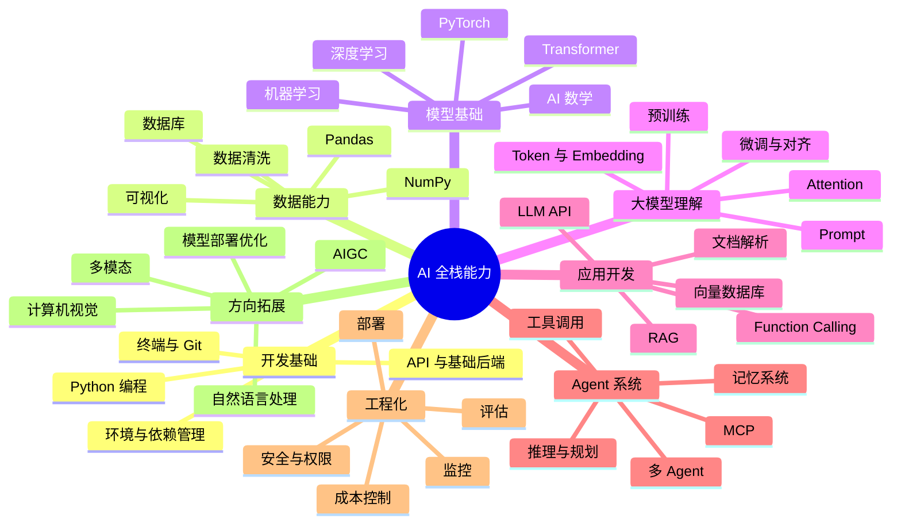

# AI 全栈能力地图

学习 AI 最容易迷路的原因，是你会同时看到 Python、数学、机器学习、深度学习、Transformer、Prompt、RAG、Agent、MCP、向量数据库、微调、部署、安全等大量名词。它们不是平铺关系，而是一层一层叠起来的能力。

这门课把 AI 全栈能力分成七层：开发基础、数据能力、模型基础、大模型理解、应用开发、Agent 系统、工程化与拓展方向。

## 先记这个表

| 层级 | 它解决的问题 | 你最终会做出的东西 |
| --- | --- | --- |
| 开发基础 | 代码在哪里写、怎么运行、怎么保存 | 可运行、可复盘的小项目 |
| 数据能力 | 资料怎么清洗、整理、观察 | 数据报告、可视化图表、可检索资料 |
| 模型基础 | 模型为什么能从数据中学规律 | 分类、预测、聚类、推荐等基础模型 |
| 大模型理解 | LLM 为什么能理解和生成文本 | Prompt、Embedding、Transformer 直觉 |
| 应用开发 | 怎么把模型变成用户能用的功能 | 聊天助手、知识库问答、文档处理工具 |
| Agent 系统 | 怎么让 AI 拆任务、调工具、保留记忆 | 自动化助手、学习规划 Agent |
| 工程化与拓展 | 怎么让应用稳定上线并深入方向 | 部署项目、评估体系、CV/NLP/AIGC 作品 |

## 总体能力地图

## 七层怎么连起来

| 从哪一层到哪一层 | 连接关系 |
| --- | --- |
| 开发基础 -> 数据能力 | 先会写脚本，才能自动清洗、统计和保存数据 |
| 数据能力 -> 模型基础 | 模型学到的规律来自数据质量、特征和标签 |
| 模型基础 -> 大模型理解 | Transformer、Embedding、损失函数等概念会反复出现 |
| 大模型理解 -> 应用开发 | 理解上下文、幻觉和边界，才能设计可靠 Prompt 与 RAG |
| 应用开发 -> Agent 系统 | RAG 负责查资料，Agent 进一步负责拆任务和调用工具 |
| Agent 系统 -> 工程化 | 真正上线时要处理权限、日志、评估、成本和错误恢复 |

## 最小记忆版

把七层合成一句话：先把代码跑起来，再把数据整理好，然后理解模型怎么学，接着用大模型做应用，最后把项目部署、展示、复盘。

第一遍学习不需要背完整地图。只要记住“工具 -> 数据 -> 模型 -> 大模型 -> 应用 -> Agent -> 工程化”这条主线，就不会在术语里迷路。
