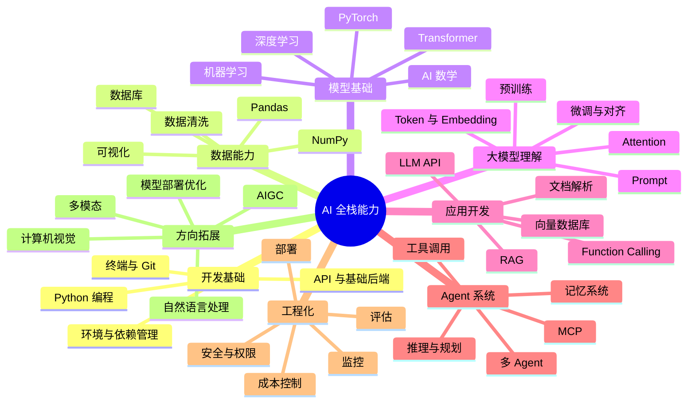

# AI 全栈能力地图

学习 AI 最容易迷路的原因，是你会同时看到 Python、数学、机器学习、深度学习、Transformer、Prompt、RAG、Agent、MCP、向量数据库、微调、部署、安全等大量名词。它们不是平铺关系，而是一层一层叠起来的能力。

这门课把 AI 全栈能力分成七层：开发基础、数据能力、模型基础、大模型理解、应用开发、Agent 系统、工程化与拓展方向。

## 总体能力地图

## 第一层：开发基础

开发基础解决的是“你能不能把想法变成能运行的程序”。如果你不会搭环境、不会读报错、不会管理依赖、不会用 Git 保存代码，后面学 AI 会非常痛苦。

这一层不要求你成为后端专家，但至少要能写 Python 脚本，能用命令行运行程序，能看懂项目结构，能调用 HTTP API，能把一个小工具整理成可复用代码。

## 第二层：数据能力

AI 系统不是凭空产生智能，它依赖数据。数据能力解决的是“模型吃什么、输入长什么样、结果如何分析”。

你需要知道表格数据、文本数据、图像数据、时间序列数据有什么区别，也需要掌握清洗、转换、统计、可视化这些基本动作。即使未来主要做 LLM 应用，RAG 文档清洗、评估数据构造、日志分析也都离不开数据能力。

## 第三层：模型基础

模型基础解决的是“机器为什么能从数据中学规律”。这一层包括 AI 数学、机器学习、深度学习和 Transformer。

学习目标不是推导所有公式，而是理解几个核心问题：模型如何表示输入，如何产生预测，什么是损失函数，梯度如何更新参数，为什么要训练集和测试集，为什么会过拟合，为什么 Transformer 能处理上下文。

## 第四层：大模型理解

大模型理解解决的是“LLM 为什么和传统模型不一样”。这里会学习 Token、Embedding、Attention、上下文窗口、预训练、指令微调、RLHF、Prompt Engineering 和微调。

这一层的重点是建立直觉：大模型不是数据库，也不是普通搜索引擎；它更像一个基于上下文生成下一个 token 的通用语言接口。你越理解它的能力边界，越能设计可靠应用。

## 第五层：应用开发

应用开发解决的是“如何把模型接入真实任务”。这一层包括 LLM API、Prompt 模板、结构化输出、函数调用、RAG、文档解析、向量数据库和对话系统。

很多学习者会直接从这里开始，但如果完全不理解前面的数据、模型和工程基础，很容易只会复制 Demo。课程会让你从一个最小聊天助手开始，逐步升级到知识库问答、文档处理、企业资料查询和自动化工作流。

## 第六层：Agent 系统

Agent 系统解决的是“如何让 AI 不只是回答问题，而是能拆解任务、使用工具、保存记忆、持续执行”。

Agent 不是简单地给大模型加几个工具。一个可用 Agent 至少要考虑目标、上下文、工具描述、执行步骤、错误恢复、记忆、权限、安全、评估和成本。课程会从 ReAct、工具调用、记忆系统和 MCP 开始，再进入多 Agent 和生产化。

## 第七层：工程化与方向拓展

工程化解决的是“怎么让 AI 应用稳定、安全、可维护地运行”。方向拓展解决的是“你想往哪个领域深入”。

当你跑通主线后，可以选择进入 CV、NLP、多模态、AIGC、模型部署、企业知识库、智能体平台等方向。这个阶段不再追求所有内容都学，而是根据目标选择模块。