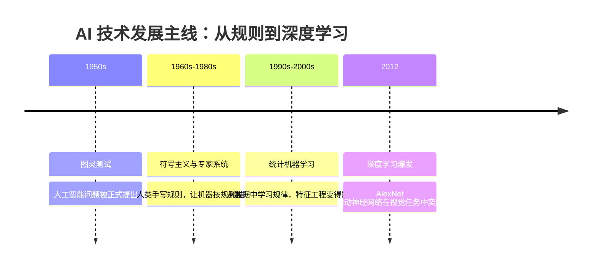
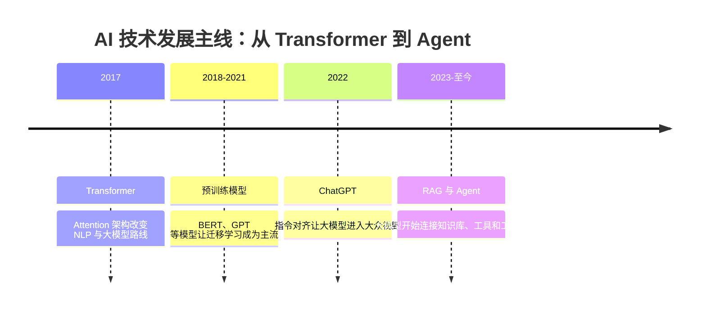

# AI 发展历史地图

学习 AI 不应该只记住技术名词，还要理解这些技术为什么出现。每一次技术浪潮，基本都在回答上一代方法解决不了的问题。

这篇不是完整的学术史，而是一张学习地图：帮助你知道专家系统、机器学习、深度学习、Transformer、大模型、RAG 和 Agent 之间的关系。

## 一张图看懂 AI 演进

前半段的主线是：AI 先尝试让人手写规则，后来逐渐转向让机器从数据中学习规律。到了 2012 年左右，数据、GPU 和训练技巧一起成熟，深度学习开始成为主流。

## 第一阶段：符号主义与专家系统

早期 AI 的核心想法是：如果人类专家能把知识写成规则，机器就可以按照规则推理。比如医学诊断系统可以写成“如果出现症状 A 和指标 B，就考虑疾病 C”。

这种方法在规则清晰、范围有限的场景里有价值，但它很难处理真实世界的复杂性。规则越写越多，维护成本越来越高，而且系统很难从新数据中自动改进。

## 第二阶段：统计机器学习

机器学习的思路发生了变化：与其让人类手写所有规则，不如让机器从数据中学习规律。

这一阶段的典型方法包括线性回归、逻辑回归、决策树、随机森林、SVM、朴素贝叶斯、聚类和降维。学习重点从“写规则”变成“准备数据、设计特征、训练模型、评估效果”。

这也是为什么本课程在进入大模型前，仍然保留机器学习和数据分析。因为模型训练、评估、过拟合、特征、数据分布这些概念，在今天的 AI 应用中仍然非常重要。

## 第三阶段：深度学习

深度学习让模型可以自动学习更复杂的表示。图像识别、语音识别、机器翻译等任务都因此取得巨大进展。

这一阶段的重要背景是数据变多、GPU 算力提升、神经网络训练技巧成熟。你会在课程中学习神经网络、反向传播、优化器、CNN、RNN 和 Transformer 的基础。

深度学习不是替代所有传统机器学习，而是在高维复杂数据上表现更强，尤其适合图像、文本、语音、多模态等任务。

## 第四阶段：Transformer 与预训练模型

Transformer 的关键变化是用 Attention 机制处理序列关系。相比 RNN，Transformer 更适合并行训练，也更容易扩展到大规模数据和大模型。

BERT、GPT、T5 等预训练模型推动了 NLP 的范式变化：先在海量数据上预训练，再在具体任务上微调或提示。后来，大语言模型进一步把“语言接口”变成通用能力入口。

## 第五阶段：大模型、RAG 与 Agent

ChatGPT 之后，大模型从研究工具进入大众应用。新的问题也随之出现：模型会幻觉，知识可能过期，不能直接访问企业内部资料，也不能天然执行外部动作。

RAG 用检索增强生成，把外部知识库接入模型上下文。Agent 则进一步让模型能够规划步骤、调用工具、保存记忆、连接系统，完成更复杂的任务。

这就是本课程后半部分的主线：不是只学会“问大模型问题”，而是学会设计一个可靠的 AI 应用系统。

## 学习时怎么使用这张历史地图

当你学到一个新概念时，可以问自己三个问题：它解决了上一代方法的什么问题，它带来了什么新的能力，它又引入了什么新的风险或限制。

比如 RAG 解决了大模型知识不足和知识更新问题，但引入了文档切分、检索质量、引用可信度和评估问题。Agent 解决了任务执行问题，但引入了工具安全、权限控制、成本和稳定性问题。

理解这种演进逻辑，会比孤立记忆每个技术名词更有用。