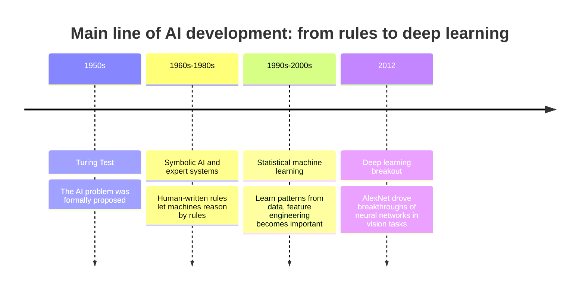
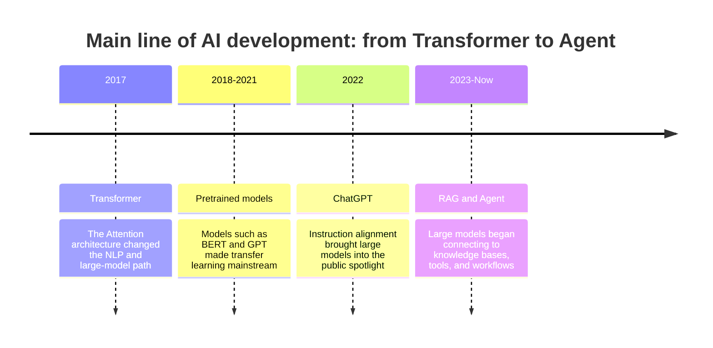

# AI History Map

When learning AI, you should not just memorize technical terms; you should also understand why these technologies emerged. Each wave of innovation is basically answering problems that the previous generation could not solve.

This is not a complete academic history. It is a learning map: it helps you understand the relationships among expert systems, machine learning, deep learning, Transformer, large models, RAG, and Agent.

## First, look at the evolution logic

| Stage | What it mainly solves | What new problems it brings |
|---|---|---|
| Symbolic AI | Encode expert rules into machines | Too many rules, hard to maintain, hard to generalize |
| Statistical machine learning | Learn patterns from data | Depends on feature engineering and data quality |
| Deep learning | Automatically learn complex representations | Needs more data, compute, and training skills |
| Transformer | Better handles long sequences and context | Model scale, training cost, and interpretability issues |
| Large models + RAG + Agent | Connect knowledge bases, tools, and workflows | Hallucination, permissions, evaluation, cost, and safety |

## See the AI evolution in one chart

The main line in the first half is: AI first tried to let humans write rules, and later gradually shifted toward letting machines learn patterns from data. Around 2012, data, GPUs, and training techniques matured together, and deep learning began to become mainstream.

## Phase 1: Symbolic AI and expert systems

The core idea of early AI was: if human experts can write knowledge as rules, then machines can reason according to those rules. For example, a medical diagnosis system could be written as: “If symptom A and indicator B appear, then consider disease C.”

This approach is valuable in scenarios where the rules are clear and the scope is limited, but it struggles with the complexity of the real world. The more rules you write, the higher the maintenance cost, and the harder it is for the system to improve automatically from new data.

## Phase 2: Statistical machine learning

The idea of machine learning changed: instead of having humans handwrite all the rules, let the machine learn patterns from data.

Typical methods in this stage include linear regression, logistic regression, decision trees, random forests, SVM, naive Bayes, clustering, and dimensionality reduction. The focus of learning shifted from “writing rules” to “preparing data, designing features, training models, and evaluating results.”

This is also why this course still keeps machine learning and data analysis before moving into large models. Concepts such as model training, evaluation, overfitting, features, and data distribution are still very important in today’s AI applications.

## Phase 3: Deep learning

Deep learning allows models to automatically learn more complex representations. Tasks such as image recognition, speech recognition, and machine translation made huge progress because of it.

The important background of this stage is more data, improved GPU compute, and mature neural network training techniques. In this course, you will learn the basics of neural networks, backpropagation, optimizers, CNN, RNN, and Transformer.

Deep learning does not replace all traditional machine learning. Instead, it performs better on high-dimensional and complex data, and is especially suitable for image, text, speech, and multimodal tasks.

## Phase 4: Transformer and pretrained models

The key change brought by Transformer is using the Attention mechanism to handle sequence relationships. Compared with RNNs, Transformer is more suitable for parallel training and easier to scale to large datasets and large models.

Pretrained models such as BERT, GPT, and T5 drove a paradigm shift in NLP: first pretrain on massive amounts of data, then fine-tune or prompt on specific tasks. Later, large language models further turned the “language interface” into a universal entry point for capabilities.

## Phase 5: Large models, RAG, and Agent

After ChatGPT, large models moved from research tools into public applications. New problems also emerged: models can hallucinate, knowledge may become outdated, they cannot directly access internal enterprise documents, and they cannot naturally execute external actions.

RAG uses retrieval-augmented generation to connect an external knowledge base to the model context. Agent goes one step further, enabling the model to plan steps, call tools, save memory, connect systems, and complete more complex tasks.

This is the main line of the second half of this course: not just learning how to “ask questions to a large model,” but learning how to design a reliable AI application system.

## How to use this history map while learning

When you learn a new concept, you can ask yourself three questions: what problem does it solve from the previous generation, what new capability does it bring, and what new risks or limitations does it introduce?

For example, RAG solves the problem of insufficient knowledge and outdated knowledge in large models, but it introduces document chunking, retrieval quality, citation trustworthiness, and evaluation issues. Agent solves task execution problems, but it introduces tool safety, permission control, cost, and stability issues.

Understanding this evolution logic is much more useful than memorizing each technical term in isolation.
