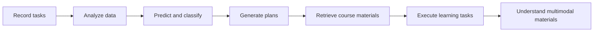
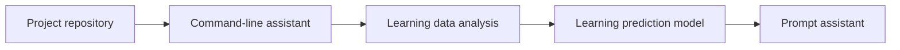
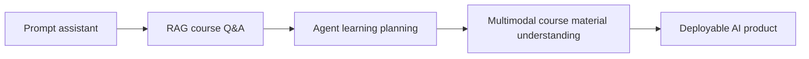

# End-to-End Project: The Growth Path of an AI Learning Assistant

## Where This Section Fits

This page ties the whole course together into one continuously upgraded product project: an AI learning assistant. You can think of the small projects in each stage as one iteration of this product. In the end, you will have a complete portfolio that grows step by step from a command-line tool into a RAG, Agent, and multimodal assistant.

If you feel that starting from scratch in every stage is too fragmented, you can follow this main project line. It will make the course feel more like “building a product” rather than “reading a stack of chapters.” If you are ready to actually create the repository for this project, you can directly refer to [End-to-End Project Repository Template: AI Learning Assistant](/intro/ai-learning-assistant-template).

## First, See the Big Picture: One Project Across the Whole Course



| Where You Are in the Course | What to Add to the Assistant | What Evidence to Keep |
|---|---|---|
| Stages 1–3 | Record, save, and analyze learning data | JSON, charts, README |
| Stages 4–6 | Use models to help judge learning risk | baseline, metrics, failure samples |
| Stages 7–9 | Prompt, RAG, Agent capabilities | Prompt versions, citations, trace |
| Stages 10–12 | Vision, text, multimodal extensions | input materials, outputs, review records |

## The Product Story

Imagine you are building an assistant that helps you learn AI. At first, it is only a Python project that can run; later, it can record learning tasks, analyze learning data, predict study progress, answer course questions, call tools to organize materials, and finally understand screenshots, slide decks, and multimodal content.

The goal of this path is not to build a huge system from the start, but to add one capability to the same product after each stage you finish.





## Stages 1–3: First Build a Tool That Can Record Learning

Stage 1 sets up the development environment, Git repository, and project structure. Stage 2 uses Python to build a command-line learning assistant that supports adding tasks, viewing tasks, marking them done, and saving them to JSON. Stage 3 starts analyzing learning records, such as daily study time, completion rate, the most procrastinated topics, and then visualizes them with charts.

The key point in this part is: “it runs, it saves, it analyzes.” You do not need an AI model yet, but you should start building project habits: write a README, save data, record errors, and take screenshots to show results.

## Stages 4–6: Let the Assistant Start Understanding Data and Models

Stage 4 connects mathematical concepts to the project, such as using vectors to represent learning topics, using probability to understand completion rates, and using gradient intuition to understand model training. Stage 5 can build a learning progress prediction or task classification model: based on historical records, predict whether a certain type of task is likely to be delayed, or classify learning questions into categories such as environment, syntax, data, model, RAG, and Agent. Stage 6 can include a simple text or image classification experiment to understand deep learning training curves and failure samples.

The key point in this part is: “it can be evaluated.” Model scores are not decoration. You need to explain the training set, test set, baseline, metrics, and error samples.

## Stage 7: Upgrade into a Prompt Learning Assistant

After entering the large-model stage, the learning assistant can begin connecting to an LLM API. It can generate study plans based on learning goals, help rewrite vague questions into clear Prompts, organize study notes into structured summaries, or generate review cards in a fixed format.

The focus of this stage is not flashy tricks, but comparing the stability of different Prompts. You need to record inputs, outputs, failure samples, and the improvement process.

## Stage 8: Upgrade into a RAG Course Q&A Assistant

Stage 8 is a key upgrade for the project: let the assistant read course documents, notes, and project READMEs, and answer questions based on those materials. The minimum version only needs to support reading Markdown documents, chunking, vectorization, retrieval, answering, and source citations.

The standard version can further add Hybrid Search, Reranking, Query Rewrite, an evaluation question set, citation checks, and logging. The challenge version can try GraphRAG, Agentic RAG, or Multimodal RAG, so the system can handle cross-document relationships, proactively look up additional materials, or read screenshots and PDFs.

## Stage 9: Upgrade into an Agent Learning Planning Assistant

Stage 9 upgrades the assistant from “answering questions” to “executing learning tasks.” For example, when the user says “help me prepare for the RAG stage review,” the Agent can break down the task, find related course documents, generate a review plan, list practice questions, check completion, and record the execution trace.

The most important thing in this stage is boundaries: which steps can be automated, and which require human confirmation; how to degrade gracefully when tool calls fail; and how to record every plan, tool, result, cost, and error.

## Stage 12: Upgrade into a Multimodal Learning Assistant

After moving into multimodal, the learning assistant can process screenshots, slide images, PDF pages, charts, and voice notes. It can explain a model architecture diagram, extract key concepts from a slide screenshot, generate an outline for a study video, or turn learning content into a text-and-image review card.

The focus of this stage is not just producing nice-looking content, but connecting multimodal understanding, generation, editing, review, and export into a workflow.

## Version Iteration Roadmap

If you want this end-to-end project to truly become a portfolio, it is recommended that you treat each version as a “small release” rather than a casual exercise. Each version should keep a README, run commands, sample inputs and outputs, change notes, and one failure sample. In this way, when you reach the capstone project stage, you can clearly show how the project grew from a script into an AI product.

| Version | Core Question | Minimum Features | Standard Features | Acceptance Evidence |
|---|---|---|---|---|
| v0.1 Project skeleton | Can the project run stably and save versions? | Create repository, README, Python entry point, dependency files | Add command-line arguments, log directory, and learning record directory | Git commit, run screenshots, README |
| v0.2 Command-line learning assistant | Can it record learning tasks? | Add, view, complete tasks, save to JSON | Support categories, due dates, simple search, and error handling | Example JSON, command output, error handling records |
| v0.3 Learning data analysis | Can it find problems from records? | Count study time, completion rate, high-frequency topics | Generate charts, weekly reports, and learning suggestions | EDA Notebook, charts, analysis conclusions |
| v0.4 Learning topic classification | Can rules or ML help recommend chapters? | Classify learning questions using keywords or a baseline | Train a simple model, compare rules vs. model performance | Test set, metric table, failure samples |
| v0.5 Representation learning experiment | Can it understand text vectors and similarity? | Compare simple text representation methods | Run a text similarity or classification experiment, record training curves | Experiment logs, training results, review |
| v0.7 Prompt learning assistant | Can it reliably generate study plans and reviews? | Call an LLM API, output structured plans | Maintain Prompt versions, compare different template effects | Prompt records, input/output examples, failure samples |
| v0.8 RAG course Q&A | Can it answer based on course materials and cite sources? | Read Markdown, chunk, retrieve, answer, cite | Add evaluation sets, Hybrid Search, Rerank, logging | Question set, citation checks, retrieval logs |
| v0.9 Agent learning planning | Can it break down tasks and call tools? | Generate study plans, call course retrieval tools | Add trace, human confirmation, failure recovery, and cost records | Execution traces, tool call logs, safety boundary notes |
| v1.0 Capstone project | Can it be presented as a complete AI product? | Runnable demo, README, examples, and evaluation | Deployment, permissions, monitoring, review, and future roadmap | Demo video/screenshots, deployment notes, evaluation report |

You can adjust the version numbers based on your actual progress, but do not skip the acceptance evidence. The most persuasive part of a portfolio project is often not the final UI, but the run records, failure samples, and improvement process left behind at each stage.

## Fixed Delivery Format for Each Version

It is recommended that after finishing each version, you keep a version record in the repository. The format can be very simple: what this version aimed to do, what features were added, how to run it, what the sample input/output is, what situations failed in this version, and what the next version plans to change.

````md
## v0.8 RAG Course Q&A Assistant

### Goal of this version
Let the learning assistant answer questions based on course Markdown and provide source citations.

### How to run
```bash
python -m src.rag_qa --question "What is the difference between RAG and fine-tuning?"
```

### Sample output
Question: What is the difference between RAG and fine-tuning?
Answer: RAG mainly supplements context by retrieving external knowledge, while fine-tuning mainly changes model parameters through training...
Source: docs/ch08-rag/ch01-rag/01-rag-basics.md

### Failure sample
Question: How should I choose an Agent framework?
Reason for failure: The current index only imports the RAG chapters and does not import the Agent chapters.
Next step: Expand the document import scope and save stage information in metadata.
````

This fixed format can help you avoid “I built the project but can’t explain it clearly.” When you later prepare your resume, interview materials, or portfolio, each version will already have reusable material.

## Stage Implementation Checklist

If you really follow this end-to-end project path, you can treat each learning stage as one version iteration. The table below is not extra homework; it helps you consolidate scattered chapters into one project.

| Learning Stage | Project Version | Suggested Output | Corresponding Course Entry |
|---|---|---|---|
| 1 Developer tools basics | v0.1 Project skeleton | Build a Git repository, write a README, configure the Python environment, record run screenshots | [Developer Tools Basics](/ch01-tools) |
| 2 Python programming basics | v0.2 Command-line learning assistant | Save tasks with JSON; support adding, viewing, completing, and deleting learning tasks | [Python Programming Basics](/ch02-python) |
| 3 Data analysis and visualization | v0.3 Learning data analysis | Count study time, completion rate, procrastinated topics, and display results with charts | [Data Analysis and Visualization](/ch03-data-analysis) |
| 4 AI math fundamentals | v0.4 Learning metric explanation | Use concepts such as vectors, probability, and gradients to explain learning data and model intuition | [Minimal Necessary Foundations of AI Math](/ch04-ai-math) |
| 5 Machine learning | v0.5 Learning prediction model | Predict task delay risk or classify learning questions, and clearly document the baseline and metrics | [Machine Learning: From Basics to Practice](/ch05-machine-learning) |
| 6 Deep learning and Transformer | v0.6 Simple deep learning experiment | Run a small text or image classification experiment and record training curves and failure samples | [Deep Learning and Transformer Basics](/ch06-deep-learning) |
| 7 LLM principles and Prompt | v0.7 Prompt learning assistant | Generate study plans, review cards, question rewrite templates, and record Prompt versions | [LLM Principles, Prompt, and Fine-Tuning](/ch07-llm-principles) |
| 8 LLM applications and RAG | v0.8 Course Q&A assistant | Read course Markdown, support retrieval, answering, source citations, and evaluation question sets | [LLM Application Development and RAG](/ch08-rag) |
| 9 AI Agent | v0.9 Learning planning Agent | Break down review tasks, call tools to look up materials, generate plans, and record execution traces | [AI Agent and Intelligent Agent Systems](/ch09-agent) |
| 10–12 Direction expansion | v1.0 Multimodal learning assistant | Process screenshots, slide charts, or voice notes to form a showcase-ready capstone project | [AIGC and Multimodal](/ch12-multimodal) |

After completing each version, keep at least three things in the README: how to run it, one sample input/output, and what problems you encountered in this iteration plus what you plan to do next. In this way, when you finish the whole course, you will not just have a pile of scattered notes, but a portfolio project that clearly explains its own growth.

## Final Project Standard

The final AI learning assistant does not need to have many features, but it should have a clear closed loop: the user inputs a learning goal or materials, the system can read the context, retrieve course content when needed, call tools or models to generate results, and provide sources, logs, evaluation examples, and improvement records.

You can use this project as your capstone work. It can demonstrate your full capabilities from programming, data, models, large-model applications, RAG, Agent, multimodal, to engineering.

## How the README Should Be Written

The README for this end-to-end project should be updated continuously. Each time you finish a stage, add a new version record: what new capability this stage added, how to run it, what the sample input/output is, what problems you encountered, and what you plan to improve next.

In this way, after finishing the whole course, you will not just have a bunch of scattered notes. You will have a portfolio project that clearly tells the story of your growth.
