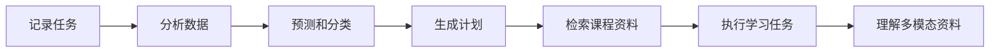
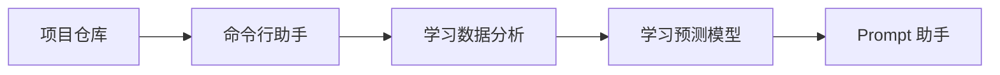
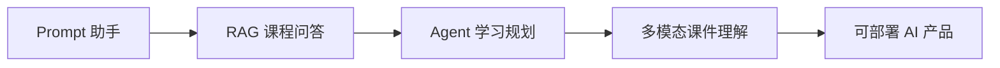

# 贯穿项目：AI 学习助手成长路线

## 本节定位

这一页把整门课串成一个持续升级的产品项目：AI 学习助手。你可以把每个阶段的小项目都看成这个产品的一次迭代，最后得到一个从命令行工具逐步成长为 RAG、Agent 和多模态助手的完整作品集。

如果你觉得每个阶段都从零开始很割裂，可以按这条主线学习。它会让课程更像“做一个产品”，而不是“看一堆章节”。如果你准备真正开仓库做这个项目，可以直接参考 [贯穿项目仓库模板：AI 学习助手](/intro/ai-learning-assistant-template)。

## 先看图：一个项目贯穿全课



| 学到哪里 | 给助手新增什么 | 留下什么证据 |
|---|---|---|
| 1～3 站 | 记录、保存、分析学习数据 | JSON、图表、README |
| 4～6 站 | 用模型辅助判断学习风险 | baseline、指标、失败样本 |
| 7～9 站 | Prompt、RAG、Agent 能力 | Prompt 版本、引用、trace |
| 10～12 站 | 视觉、文本、多模态扩展 | 输入素材、输出结果、审核记录 |

## 产品故事

想象你正在做一个陪自己学习 AI 的助手。最开始，它只是一个能运行的 Python 项目；后来它能记录学习任务、分析学习数据、预测学习进度、回答课程问题、调用工具整理资料，最后还能理解截图、课件和多模态内容。

这条路线的目标不是一开始做大系统，而是每学完一站，就给同一个产品补一个能力。





## 1～3 站：先做一个能记录学习的工具

第 1 站负责搭好开发环境、Git 仓库和项目目录。第 2 站用 Python 做一个命令行学习助手，支持添加任务、查看任务、标记完成、保存到 JSON。第 3 站开始分析学习记录，例如每天学习时长、完成率、最容易拖延的主题，并用图表展示。

这一段的作品重点是“能运行、能保存、能分析”。你不需要 AI 模型，但要开始形成项目习惯：写 README、保存数据、记录错误、截图展示结果。

## 4～6 站：让助手开始理解数据和模型

第 4 站把数学概念接入项目，例如用向量表示学习主题，用概率理解完成率，用梯度直觉理解模型训练。第 5 站可以做一个学习进度预测或任务分类模型：根据历史记录预测某类任务是否容易延期，或者把学习问题分成环境、语法、数据、模型、RAG、Agent 等类别。第 6 站可以做一个简单文本或图像分类实验，理解深度学习训练曲线和失败样本。

这一段的作品重点是“能评估”。模型分数不是装饰，你要能解释训练集、测试集、baseline、指标和错误样本。

## 第 7 站：升级成 Prompt 学习助手

进入大模型阶段后，学习助手可以开始接入 LLM API。它可以根据学习目标生成学习计划，帮你把模糊问题改写成清晰 Prompt，把学习笔记整理成结构化摘要，或者根据固定格式生成复盘卡。

这一站的重点不是炫技，而是比较不同 Prompt 的稳定性。你需要记录输入、输出、失败样本和改进过程。

## 第 8 站：升级成 RAG 课程问答助手

第 8 站是项目的一次关键升级：让助手能读取课程文档、笔记和项目 README，并基于资料回答问题。最小版本只需要支持 Markdown 文档读取、切分、向量化、检索、回答和来源引用。

标准版本继续加入 Hybrid Search、Reranking、Query Rewrite、评估问题集、引用检查和日志。挑战版本可以尝试 GraphRAG、Agentic RAG 或 Multimodal RAG，让系统能处理跨文档关系、主动补查资料或读取截图和 PDF。

## 第 9 站：升级成 Agent 学习规划助手

第 9 站让助手从“回答问题”升级成“执行学习任务”。例如用户说“帮我准备 RAG 阶段复习”，Agent 可以拆解任务、查找相关课程文档、生成复习计划、列出练习题、检查完成情况，并记录执行轨迹。

这一站最重要的是边界：哪些步骤可以自动执行，哪些需要人工确认；工具调用失败时如何降级；如何记录每一步计划、工具、结果、成本和错误。

## 第 12 站：升级成多模态学习助手

进入多模态后，学习助手可以处理截图、课件图片、PDF 页面、图表和语音笔记。它可以解释一张模型结构图，提取课件截图里的关键概念，给学习视频生成提纲，或者把学习内容整理成图文复盘卡。

这一站的重点不是只生成漂亮内容，而是把多模态理解、生成、编辑、审核和导出接成工作流。

## 版本迭代路线图

如果你希望这个贯穿项目真正形成作品集，建议把每个版本都当成一次“小发布”，而不是一次随手练习。每个版本都应该保留 README、运行命令、示例输入输出、变更记录和一个失败样本。这样到毕业项目阶段，你可以清楚展示项目是如何从脚本逐步成长为 AI 产品的。

| 版本 | 核心问题 | 最小功能 | 标准功能 | 验收证据 |
|---|---|---|---|---|
| v0.1 项目骨架 | 项目能否稳定运行和保存版本 | 创建仓库、README、Python 入口、依赖文件 | 加入命令行参数、日志目录和学习记录目录 | Git commit、运行截图、README |
| v0.2 命令行学习助手 | 能否记录学习任务 | 新增、查看、完成任务，保存到 JSON | 支持分类、截止时间、简单搜索和错误处理 | 示例 JSON、命令输出、错误处理记录 |
| v0.3 学习数据分析 | 能否从记录中发现问题 | 统计学习时长、完成率、高频主题 | 生成图表、周报和学习建议 | EDA Notebook、图表、分析结论 |
| v0.4 学习主题分类 | 能否用规则或 ML 辅助推荐章节 | 用关键词或 baseline 分类学习问题 | 训练简单模型，比较规则与模型效果 | 测试集、指标表、失败样本 |
| v0.5 表示学习实验 | 能否理解文本向量和相似度 | 比较简单文本表示方法 | 做文本相似度或分类实验，记录训练曲线 | 实验日志、训练结果、复盘 |
| v0.7 Prompt 学习助手 | 能否稳定生成学习计划和复盘 | 调用 LLM API，输出结构化计划 | 维护 Prompt 版本，比较不同模板效果 | Prompt 记录、输入输出样例、失败样本 |
| v0.8 RAG 课程问答 | 能否基于课程资料回答并引用来源 | 读取 Markdown、切分、检索、回答、引用 | 加入评估集、Hybrid Search、Rerank、日志 | 问题集、引用检查、检索日志 |
| v0.9 Agent 学习规划 | 能否拆解任务并调用工具 | 生成学习计划，调用课程检索工具 | 加入 trace、人工确认、失败恢复和成本记录 | 执行轨迹、工具调用日志、安全边界说明 |
| v1.0 毕业作品 | 能否作为完整 AI 产品展示 | 可运行 Demo、README、示例和评估 | 部署、权限、监控、复盘和未来路线 | 演示视频/截图、部署说明、评估报告 |

版本号可以按你的实际进度调整，但不要跳过验收证据。作品集项目最有说服力的部分，往往不是最终界面，而是每个阶段留下的运行记录、失败样本和改进过程。

## 每个版本的固定交付格式

建议每完成一个版本，都在仓库里保留一段版本记录。格式可以很简单：本版本目标是什么，新增了哪些功能，如何运行，示例输入输出是什么，本版本失败过哪些情况，下一版准备改什么。

````md
## v0.8 RAG 课程问答助手

### 本版本目标
让学习助手能够基于课程 Markdown 回答问题，并给出来源引用。

### 运行方式
```bash
python -m src.rag_qa --question "RAG 和微调有什么区别？"
```

### 示例输出
问题：RAG 和微调有什么区别？
回答：RAG 主要通过检索外部知识补充上下文，微调主要通过训练改变模型参数……
来源：docs/ch08-rag/ch01-rag/01-rag-basics.md

### 失败样本
问题：如何选择 Agent 框架？
失败原因：当前索引只导入了 RAG 章节，没有导入 Agent 章节。
下一步：扩展文档导入范围，并在 metadata 中保存阶段信息。
````

这个固定格式能帮助你避免“项目做了但讲不清”。当你回头准备简历、面试或作品集时，每个版本都已经有可复用材料。

## 阶段落地清单

如果你真的按这条贯穿项目路线走，可以把每个学习站都当成一次版本迭代。下面这张表不是额外作业，而是帮助你把分散章节收束到同一个作品里。

| 学习站 | 项目版本 | 建议产出 | 对应课程入口 |
|---|---|---|---|
| 1 开发者工具基础 | v0.1 项目骨架 | 建 Git 仓库、写 README、配置 Python 环境、记录运行截图 | [开发者工具基础](/ch01-tools) |
| 2 Python 编程基础 | v0.2 命令行学习助手 | 用 JSON 保存任务，支持新增、查看、完成、删除学习任务 | [Python 编程基础](/ch02-python) |
| 3 数据分析与可视化 | v0.3 学习数据分析 | 统计学习时长、完成率、拖延主题，用图表展示结果 | [数据分析与可视化](/ch03-data-analysis) |
| 4 AI 数学基础 | v0.4 学习指标解释 | 用向量、概率、梯度等概念解释学习数据和模型直觉 | [AI 数学最小必要基础](/ch04-ai-math) |
| 5 机器学习 | v0.5 学习预测模型 | 预测任务延期风险或对学习问题做分类，并写明 baseline 和指标 | [机器学习入门到实战](/ch05-machine-learning) |
| 6 深度学习与 Transformer | v0.6 简单深度学习实验 | 做文本或图像分类小实验，记录训练曲线和失败样本 | [深度学习与 Transformer 基础](/ch06-deep-learning) |
| 7 大模型原理与 Prompt | v0.7 Prompt 学习助手 | 生成学习计划、复盘卡、问题改写模板，并记录 Prompt 版本 | [大模型原理、Prompt 与微调](/ch07-llm-principles) |
| 8 LLM 应用与 RAG | v0.8 课程问答助手 | 读取课程 Markdown，支持检索、回答、来源引用和评估问题集 | [LLM 应用开发与 RAG](/ch08-rag) |
| 9 AI Agent | v0.9 学习规划 Agent | 拆解复习任务、调用工具查资料、生成计划并记录执行轨迹 | [AI Agent 与智能体系统](/ch09-agent) |
| 10～12 方向拓展 | v1.0 多模态学习助手 | 处理截图、课件图表或语音笔记，形成可展示毕业作品 | [AIGC 与多模态](/ch12-multimodal) |

每完成一个版本，至少在 README 里留下三样东西：怎么运行、一次示例输入输出、这次迭代遇到的问题和下一步计划。这样你最后得到的不是“我看过很多教程”，而是一个能讲清楚成长过程的 AI 项目。

## 最终作品标准

最终的 AI 学习助手不一定要功能很多，但应该有清晰闭环：用户输入学习目标或资料，系统能读取上下文，必要时检索课程内容，调用工具或模型生成结果，给出来源、日志、评估样例和改进记录。

你可以把这个项目作为毕业作品。它能展示你从编程、数据、模型、大模型应用、RAG、Agent、多模态到工程化的完整能力。

## README 应该怎么写

这个贯穿项目的 README 建议持续更新。每完成一个阶段，就新增一个版本记录：本阶段新增了什么能力，怎么运行，示例输入输出是什么，遇到什么问题，下一步准备怎么改。

这样学完整门课后，你不会只拥有一堆零散笔记，而会拥有一个能讲清楚成长过程的作品集项目。
