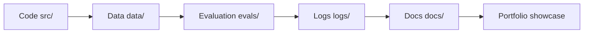

# Project Repository Template Throughout the Course: AI Learning Assistant

## What this section is for

This page gives the “AI Learning Assistant” capstone project a repository template you can follow directly. It does not mean you must fill in every directory from the start. Instead, it helps you save code, data, experiments, logs, evaluations, and documentation in a real-project way from Station 1 onward.

A strong portfolio project is not just a screenshot of features. It should also let other people understand how you iterated, how you evaluated, how you diagnosed failures, and how you made trade-offs.

## Read it in one picture: the repository is your evidence cabinet



| Directory | Question it answers |
|---|---|
| `src/` | How does the system run? |
| `data/` | Where does the input material come from? |
| `evals/` | How do we judge the results? |
| `logs/` | How do we review failures and execution flow? |
| `docs/` | How can others understand your project? |

## Recommended directory structure

```text
ai-learning-assistant/
  README.md
  requirements.txt
  .env.example
  data/
    raw/
    processed/
    samples/
  src/
    app/
    rag/
    agent/
    multimodal/
    utils/
  notebooks/
  evals/
    questions.jsonl
    expected_sources.jsonl
    results/
  logs/
    traces/
    failures/
  docs/
    screenshots/
    decisions.md
    changelog.md
  tests/
```

You can start with a very small version of this structure. Stations 1–3 only need `README.md`, `src/`, `data/`, and `docs/screenshots/`; Stations 5–6 add `notebooks/` and `evals/`; Stations 8–9 add `rag/`, `agent/`, and `logs/traces/`; Station 12 adds `multimodal/`.

## What to put in each directory

| Directory | Purpose | Common contents |
|---|---|---|
| `data/raw/` | Raw data | Learning records, course documents, sample text |
| `data/processed/` | Cleaned data | Split documents, feature tables, index inputs |
| `src/app/` | Application entry point | CLI, API, simple web pages |
| `src/rag/` | RAG capabilities | Document parsing, chunking, retrieval, citations, evaluation |
| `src/agent/` | Agent capabilities | Tool definitions, task planning, execution traces, permission control |
| `src/multimodal/` | Multimodal capabilities | OCR, screenshot parsing, PDF page processing, text-image output |
| `evals/` | Evaluation set | Fixed questions, expected sources, evaluation results |
| `logs/` | Review materials | Traces, failure samples, cost and latency records |
| `docs/` | Portfolio materials | Screenshots, architecture diagrams, technical decisions, version history |
| `tests/` | Automated checks | Data processing, retrieval, tool calls, and format tests |

## Upgrade step by step from Stations 1 to 12

| Learning station | Project version | New capability | Evidence to keep |
|---|---|---|---|
| 1 | v0.1 Project skeleton | Git, README, directory structure | Repository screenshot, run instructions |
| 2 | v0.2 CLI assistant | Add tasks, view tasks, save JSON | CLI example inputs and outputs |
| 3 | v0.3 Learning data analysis | Completion rate, study time, topic statistics | Charts and conclusions |
| 4 | v0.4 Math intuition cards | Vector, probability, gradient explanation cards | Concept diagrams and small experiments |
| 5 | v0.5 Prediction model | Learning task classification or delay prediction | baseline, metrics, error samples |
| 6 | v0.6 Deep learning experiment | Text or image classification training | loss curves, test results |
| 7 | v0.7 Prompt assistant | Study plans, note summaries, review cards | Prompt versions and failure samples |
| 8 | v0.8 RAG Q&A assistant | Document retrieval, citations, evaluation set | Retrieved chunks, source citations, evaluation results |
| 9 | v0.9 Agent planning assistant | Tool calling, task decomposition, Trace | Execution traces, permission boundaries, failure recovery |
| 10–11 | v1.0 Directional extension | CV or NLP sub-capabilities | Independent direction experiment report |
| 12 | v1.1 Multimodal assistant | Screenshots, PDFs, text-image review cards | Multimodal inputs and outputs, review checklist |

## Minimum README template

````md
# AI Learning Assistant

## Project goal

This project helps learners record study tasks, analyze their learning status, and gradually evolve into an AI assistant that can answer course questions, plan study tasks, and understand screenshots and course materials.

## Current version

Current version: v0.8 RAG course Q&A assistant

This version adds: course document reading, text chunking, retrieval, source-grounded answers, and a fixed evaluation question set.

## How to run

```bash
pip install -r requirements.txt
python -m src.app.cli
```

## Example input and output

Input: Why does a RAG project need an evaluation set?

Output: The system answer, source citations, retrieved chunks, and the log file path.

## Evaluation method

Use the fixed questions in `evals/questions.jsonl` to check whether the expected sources are hit, whether the answer is faithful, and whether the system refuses to make things up when there is no answer.

## Failure samples

Record at least 3 failure samples: retrieval misses, inaccurate citations, and overly generalized answers, and explain how you will fix them next.

## Next steps

Add Reranking, Query Rewrite, Agent study planning, and multimodal PDF understanding.
````

## Example evaluation file

```json
{"id":"q001","question":"Why does a RAG project need an evaluation set?","expected_sources":["ai-engineering-checklist.md"],"ideal_points":["compare optimization results","avoid judging by feel","record failure samples"]}
{"id":"q002","question":"Why should high-risk Agent actions require human confirmation?","expected_sources":["ai-engineering-checklist.md","ch09-agent/index.md"],"ideal_points":["permission boundaries","audit logs","avoid automatically executing dangerous actions"]}
```

## Example Trace log

```json
{
  "run_id": "2026-04-25-rag-001",
  "user_input": "Help me prepare for the RAG stage review",
  "steps": [
    {"action": "rewrite_query", "output": "RAGOps evaluation log retrieval quality"},
    {"action": "retrieve", "sources": ["modern-ai-stack.md", "ai-engineering-checklist.md"]},
    {"action": "generate_plan", "cost_estimate": "low"}
  ],
  "final_output": "Generated a RAG review plan",
  "failure": null
}
```

## Portfolio presentation tips

When presenting this project, do not only show the final screenshots. A better order is: first explain the learner’s problem, then show how the product evolved step by step from a CLI tool, then show the RAG retrieved chunks, the Agent execution trace, and the multimodal inputs and outputs, and finally show the evaluation results, failure samples, and next-step plan.

If the interviewer asks, “What was the hardest part of this project?”, you can answer: the hard part was not calling the model, but making the system reproducible, evaluable, traceable, controllable in cost, and able to pinpoint the cause when answers are wrong, retrieval fails, or tools are called incorrectly.
