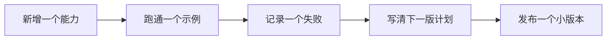
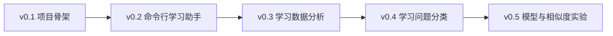
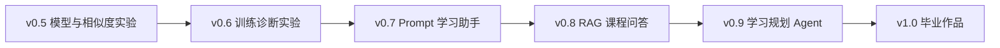

# AI 学习助手版本路线图


AI 学习助手是这门课最推荐的贯穿项目。它的价值不在于一开始做成大而全的产品，而是把每个阶段学到的能力都变成一次小版本发布：先能运行，再能保存数据，再能分析，再能接入 LLM、RAG、Agent 和多模态。

这页专门回答一个问题：每个阶段到底应该给 AI 学习助手增加什么能力，留下什么证据，什么时候可以进入下一版。

## 先看发布规则



| 每个版本都要有 | 用来证明什么 |
|---|---|
| 运行方式 | 不是只在编辑器里偶然跑通 |
| 示例输入输出 | 用户能看懂功能长什么样 |
| 失败样本 | 你知道系统边界在哪里 |
| 下一版计划 | 项目是持续迭代，不是一次练习 |

## 总体版本线





版本号不是强制格式。如果你的项目实际进展不同，可以合并或拆分版本，但不要跳过“运行方式、示例输入输出、失败样本、评估方式”这四类证据。

## v0.1 项目骨架：先让项目稳定存在

v0.1 的目标不是实现 AI，而是建立一个以后能持续迭代的仓库。很多作品集失败不是因为模型不强，而是项目从一开始就没有目录、README、依赖和运行命令。

| 项目项 | 最小版 | 标准版 | 验收证据 |
|---|---|---|---|
| 仓库 | 创建项目目录和 Git 仓库 | 增加 `src/`、`data/`、`reports/`、`evals/`、`logs/` | commit 记录、目录截图 |
| README | 写清项目目标和运行命令 | 增加版本记录、输入输出和限制 | README 可按步骤复现 |
| 环境 | 能运行一个 Python 入口文件 | 增加依赖文件和环境说明 | `python main.py` 输出截图 |
| 记录 | 保存一次学习日志 | 规范日志字段 | 示例 JSON 或 Markdown |

进入下一版前，你应该能在新终端按 README 跑通项目，而不是只在当前编辑器里跑通。

## v0.2 命令行学习助手：让它能记录任务

v0.2 对应 Python 编程基础。目标是做一个命令行学习助手，支持新增学习任务、查看任务、标记完成，并把数据保存到 JSON 文件。

| 功能 | 最小版 | 标准版 | 常见失败 |
|---|---|---|---|
| 新增任务 | 输入标题并保存 | 支持主题、截止时间、优先级 | JSON 写入失败、路径错误 |
| 查看任务 | 打印所有任务 | 支持按状态或主题过滤 | 空数据处理不好 |
| 完成任务 | 修改 `done` 字段 | 记录完成时间和备注 | ID 不稳定或越界 |
| 异常处理 | 文件不存在时返回空列表 | 文件损坏时给出友好提示 | 报错只显示 traceback |

这一版的核心能力是 Python 文件读写、列表字典、函数、异常处理和命令行输入输出。

## v0.3 学习数据分析：让它能发现学习模式

v0.3 对应数据分析与可视化。目标是把学习任务和学习日志变成可以分析的数据，例如学习时长、完成率、高频主题、拖延任务和每周趋势。

| 分析问题 | 最小输出 | 作品集输出 |
|---|---|---|
| 我把时间花在哪些主题上 | 按主题汇总分钟数 | 图表 + 结论 + 局限性 |
| 哪些任务最容易拖延 | 列出延期任务 | 延期原因分类和改进建议 |
| 学习是否稳定 | 每日或每周学习时长 | 趋势图和异常日期解释 |
| 数据是否可信 | 缺失值和重复值检查 | 数据字典、清洗日志、清洗前后对比 |

这一版不要只画漂亮图。每张图都应该回答一个学习问题，并说明数据有什么限制。

## v0.4 学习问题分类：让它能辅助定位卡点

v0.4 对应数学和机器学习的入门应用。目标是把学习中遇到的问题分成环境、Python、数据、模型、Prompt、RAG、Agent、部署等类别。最小版可以用规则，标准版再训练一个简单分类模型。

| 方案 | 适合阶段 | 评估方式 | 作品证据 |
|---|---|---|---|
| 关键词规则 | 刚开始做分类 | 人工检查 20 条样本 | 规则表、错误样本 |
| ML baseline | 学完机器学习后 | train/test 指标 | 指标表、混淆矩阵 |
| LLM 分类 | 学完 Prompt 后 | 固定输入输出对比 | Prompt 版本、schema 校验 |
| RAG 辅助定位 | 学完 RAG 后 | 能否引用相关课程页 | 检索日志、引用检查 |

这一版能把前面的排障索引和后面的 RAG、Agent 串起来：用户输入一个卡点，系统先判断它属于哪一类，再给出建议回看的章节。

## v0.5 模型与相似度实验：理解表示和检索的前置能力

v0.5 对应机器学习、向量和 Embedding 的前置理解。目标是让学习助手能比较学习问题、课程章节和笔记之间的相似度，为后面的 RAG 做准备。

| 实验 | 最小版 | 标准版 |
|---|---|---|
| 文本相似度 | 用简单词袋或关键词重合度 | 比较 TF-IDF、Embedding 或不同相似度 |
| 推荐章节 | 根据问题匹配章节标签 | 输出推荐理由和置信度 |
| 错误分析 | 记录匹配错的样本 | 分析是关键词、表达方式还是标签边界问题 |
| 指标说明 | 人工判断是否命中 | 统计 top-k 命中率或简单准确率 |

这一版的重点不是算法多高级，而是理解“表示方式会影响检索结果”。后面做 RAG 时，很多问题都能追溯到这一层。

## v0.6 训练诊断实验：理解模型失败

v0.6 对应深度学习与 Transformer 基础。AI 学习助手本身不一定需要训练大模型，但你需要通过一个小实验理解训练循环、loss、验证集、过拟合和失败样本。

| 训练证据 | 最小要求 | 作品集要求 |
|---|---|---|
| 数据 | 一份小型文本或图像数据 | 标注说明和数据划分 |
| 训练 | 跑通一个训练循环 | 保存配置、随机种子和日志 |
| 评估 | 输出验证指标 | 混淆矩阵、错误样本、曲线 |
| 复盘 | 说明一次失败 | 解释可能原因和下一步实验 |

这一版的价值是让你以后面对 LLM、微调或多模态模型时，不会只看最终效果，而会关注数据、指标和失败归因。

## v0.7 Prompt 学习助手：让它能生成计划和复盘

v0.7 对应大模型原理、Prompt 和结构化输出。学习助手开始接入 LLM API，帮助用户生成学习计划、复盘卡、问题改写和阶段总结。

| 功能 | 最小版 | 标准版 | 评估材料 |
|---|---|---|---|
| 学习计划 | 输入目标，输出 3～5 个任务 | 按时间、基础、目标调整计划 | 固定输入输出对比 |
| 复盘卡 | 把学习记录整理成总结 | 输出结构化 JSON 或 Markdown | schema 校验结果 |
| 问题改写 | 把模糊问题改清楚 | 生成多个检索 query | Prompt 版本表 |
| 失败处理 | 输出不合格时人工重试 | 自动校验和重试 | 失败样本记录 |

这一版最重要的是稳定性。不要只保存一次好看的回答，要保存同一组输入在不同 Prompt 版本下的输出差异。

## v0.8 RAG 课程问答：让它能基于资料回答

v0.8 是贯穿项目的关键版本。目标是让学习助手读取课程 Markdown、个人笔记或项目 README，基于资料回答问题，并给出来源引用。

| 模块 | 最小版 | 标准版 | 作品集证据 |
|---|---|---|---|
| 文档导入 | 读取 Markdown 文本 | 保存标题、阶段、路径等 metadata | 文档清单、chunk 样例 |
| 检索 | 简单向量检索 | Hybrid Search、Rerank、Query Rewrite | retrieval logs |
| 回答 | 基于检索片段回答 | 无答案时拒答或提示补资料 | 问答样例、引用检查 |
| 评估 | 10 个固定问题 | gold_doc、gold_answer、citation_ok | eval questions、失败统计 |

这一版要重点记录 RAG 为什么失败：是文档没导入，chunk 切坏了，query 不清楚，检索没命中，还是模型没有忠实使用引用。

## v0.9 学习规划 Agent：让它能执行多步骤任务

v0.9 对应 Agent 阶段。学习助手从“回答问题”升级为“围绕目标执行任务”。例如用户输入“帮我准备 RAG 复习”，它可以拆成查资料、列重点、生成练习、安排复习、输出计划几步。

| Agent 能力 | 最小版 | 标准版 | 风险控制 |
|---|---|---|---|
| 任务拆解 | 生成步骤列表 | 根据中间结果调整步骤 | 限制最大步数 |
| 工具调用 | 调用课程检索工具 | 调用 todo、总结、评估工具 | 工具白名单 |
| 执行轨迹 | 打印每一步 action 和 observation | 保存 `agent_traces.jsonl` | trace 可回放 |
| 人工确认 | 高风险步骤停下来 | 区分只读、写入、发送、删除 | 默认 dry-run |

这一版不要追求“模型完全自主”。更好的作品集表达是：我限制了工具权限，记录了执行轨迹，设置了停止条件，并用固定任务集评估完成率和工具错误率。

## v1.0 毕业作品：把学习助手整理成可展示产品

v1.0 不一定要功能最多，但要完整、可运行、可解释、可评估。它可以是 RAG 课程问答助手、学习规划 Agent、多模态课件助手，或者三者的组合。

| 毕业要求 | 最低标准 | 优秀标准 |
|---|---|---|
| 问题定义 | 说明解决谁的什么学习问题 | 有用户场景、边界和不用它的情况 |
| 运行方式 | 本地可运行 | 有部署、环境变量和启动说明 |
| 示例 | 3 个成功样例 | 成功、失败、边界样例都有 |
| 评估 | 固定问题或任务集 | 完成率、引用正确率、成本和失败类型统计 |
| 工程化 | README、日志、配置 | 监控、限流、安全边界、回归测试 |
| 展示 | 截图或录屏 | 演示脚本、作品集说明、复盘文章 |

最后展示时，不要只说“我做了一个 AI 助手”。更好的讲法是：这个项目从 v0.1 的命令行工具逐步迭代到 v1.0，每个版本都留下运行记录、失败样本和评估证据。

## 每个版本的固定记录模板

建议每完成一个版本，都在项目 README 或 `reports/improvement_record.md` 中增加一段版本记录。

```md
## v0.x 版本名称

### 本版本目标
这版要解决什么问题。

### 新增能力
这版新增了哪些功能或模块。

### 运行方式
使用什么命令运行，依赖什么数据或配置。

### 示例输入输出
给出一个真实输入和对应输出。

### 评估方式
用哪些样例、指标或人工检查判断效果。

### 失败样本
记录至少一个失败输入、实际结果、原因和修复计划。

### 下一版计划
下一版准备补什么能力。
```

如果你能坚持这个模板，毕业时就不需要重新整理作品集材料，因为项目成长过程已经被记录下来了。
