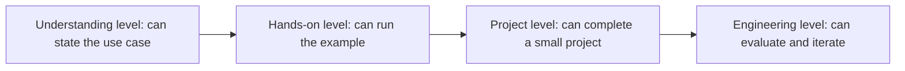

# Full-Course Competency Assessment and Passing Standards

This page answers one core question: how much do you need to learn before you can truly say you’ve mastered it? In AI full-stack learning, progress should not be judged only by “finishing the chapters.” It should also be judged by whether you can explain concepts, run code successfully, complete projects, evaluate results, review failures, and organize this evidence into something you can show.

## One Diagram to Understand Skill Progression

In the first pass through the course, not every chapter needs to reach engineering level. But each major stage should have at least one project at project level. For RAG, Agent, and the capstone project, you should aim as close to engineering level as possible.

## Four-Level Competency Standards

| Level | Status | Ability Demonstration | Typical Evidence |
|---|---|---|---|
| Understanding level | Understands the concept | Can explain what problem the technology solves | Study notes, concept map, explanation of key terms |
| Hands-on level | Runs the minimal loop | Can independently run the example and adjust key parameters | Runnable scripts, command records, screenshots |
| Project level | Builds a complete small project | Has input, processing flow, output, error handling, and a README | Project repository, sample input/output, result explanation |
| Engineering level | Can evaluate and iterate | Has a baseline, metrics, logs, failure samples, and improvement records | Evaluation table, logs, failure samples, review report |

In the early stages, not every chapter needs to reach engineering level. But each major stage should have at least one project at project level. Once you enter RAG, Agent, and the capstone project, evaluation, logs, and failure samples should become the default requirements.

## Phase Passing Matrix

| Phase | Minimum Passing Standard | Recommended Passing Standard | What to Confirm Before Moving On |
|---|---|---|---|
| 1 Developer Tools Basics | Can use the command line, Git, and the development environment to run projects | Can create a repository, commit code, and write clear run instructions | No longer depends on copy-pasting paths and commands |
| 2 Python Programming Basics | Can write functions, read and write files, and handle exceptions | Can split scripts into modules and build a small API or CLI | Can independently troubleshoot common Python errors |
| 3 Data Analysis and Visualization | Can read data, clean it, perform statistics, and create charts | Can write a data analysis report with conclusions | Can explain how data quality affects conclusions |
| 4 AI Math Foundations | Can explain the intuition behind vectors, probability, and gradients | Can use small experiments to show how math concepts affect models | Does not memorize formulas as a black box |
| 5 Machine Learning | Can train a baseline and understand metrics | Can do feature processing, model comparison, and error analysis | Can distinguish training performance, generalization performance, and data issues |
| 6 Deep Learning and Transformer | Can run the training loop and read the curves | Can analyze overfitting, underfitting, and transfer learning results | Can understand why Transformer is suitable for sequence modeling |
| 7 Large Models and Prompt | Can design reusable Prompts and compare outputs | Can do structured output, version tracking, and regression samples | No longer judges Prompt quality purely by intuition |
| 8 LLM Applications and RAG | Can complete a Q&A prototype with source citations | Has chunking, retrieval logs, evaluation sets, and failure samples | Can tell whether a failure comes from retrieval, generation, or citation |
| 9 AI Agent | Can define tools and complete multi-step tasks | Has traces, tool logs, permission boundaries, and safety tests | Can explain when the Agent should stop and ask for confirmation |
| 10 Computer Vision | Can complete image classification, detection, or OCR experiments | Has data labeling, metrics, error samples, and visualization results | Can explain whether vision model failures come from data, labels, or the model |
| 11 Natural Language Processing | Can complete text classification, extraction, or summarization tasks | Can compare traditional NLP, deep learning, and LLM solutions | Can explain text representation, label boundaries, and evaluation methods |
| 12 AIGC and Multimodal | Can complete an image, speech, video, or multimodal understanding experiment | Has input materials, generation/understanding flow, quality standards, and human review | Does not judge generation quality only by subjective feeling |
| Capstone Project | Can run a complete AI application | Has deployment instructions, an evaluation report, failure review, and a demo script | Can clearly explain the architecture, metrics, limitations, and next steps in 3 minutes |

## Review Questions for Each Stage

After completing each stage, do not only ask, “Have I finished watching it?” Instead, ask: Can I explain in my own words what problem this stage solves? Have I personally run at least one minimal project? Have I kept a README, run commands, and sample output? Have I recorded at least one failure sample? If I reran the project next week, could I still reproduce the result?

If you cannot answer two or more of these questions, it is recommended that you first build up the project evidence before moving to the next stage. Course progress is not about going faster; it is about leaving verifiable results at every step.

## Additional Acceptance Criteria for AI Application Stages

Starting from Prompt, RAG, and Agent, projects should not be judged only by whether “the answer looks okay.” AI application projects should also check whether model calls have error handling, whether the Prompt has versioning, whether RAG can show sources and retrieval logs, whether the Agent has tool boundaries and execution traces, and whether the system can record cost, latency, and failure reasons.

| Project Type | Required Evidence to Keep | Unqualified Signals |
|---|---|---|
| Prompt project | Prompt versions, fixed inputs, output comparisons, failure samples | Only shows one successful output |
| RAG project | chunks, retrieval logs, eval questions, citation check | The answer has citations, but the citations do not support the conclusion |
| Agent project | tool schema, agent trace, max_steps, safety boundaries | It is unclear what the Agent did, and failures cannot be replayed |
| Deployment project | environment variable documentation, startup commands, logs, error handling | Can only run on a personal computer |

## Final Judgment Criteria

When you can explain a project from problem definition to how it runs, from technical approach to evaluation results, from successful samples to failure samples, and then from current limitations to the next iteration plan, it means the project is approaching portfolio quality. Real AI full-stack ability is not about knowing how many tool names you can list; it is about connecting the problem, data, model, engineering, evaluation, and review into a stable closed loop.
