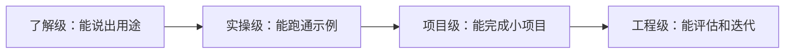

# 全课程能力评估与通关标准

这页用来回答一个核心问题：学到什么程度才算真正掌握？AI 全栈学习不能只用“看完章节”判断进度，更应该看你能不能解释概念、跑通代码、完成项目、评估结果、复盘失败，并把这些证据整理成可展示成果。

## 一图读懂：掌握程度怎么升级

第一遍学习不要求每一章都到工程级，但每个主阶段至少要有一个项目达到项目级。RAG、Agent 和毕业项目则要尽量接近工程级。

## 四级能力标准

| 等级 | 状态 | 能力表现 | 典型证据 |
|---|---|---|---|
| 了解级 | 看懂概念 | 能说出这个技术解决什么问题 | 学习笔记、概念图、关键术语解释 |
| 实操级 | 跑通最小闭环 | 能独立运行示例并修改关键参数 | 可运行脚本、命令记录、截图 |
| 项目级 | 做出完整小项目 | 有输入、处理流程、输出、异常处理和 README | 项目仓库、示例输入输出、结果说明 |
| 工程级 | 能评估和迭代 | 有 baseline、指标、日志、失败样本和改进记录 | 评估表、日志、失败样本、复盘报告 |

学习早期不需要每一章都达到工程级，但每个主阶段至少要有一个项目达到项目级。进入 RAG、Agent 和毕业项目后，评估、日志和失败样本应该成为默认要求。

## 阶段通关矩阵

| 阶段 | 最低通关标准 | 推荐通关标准 | 进入下一阶段前要确认 |
|---|---|---|---|
| 1 开发者工具基础 | 能使用命令行、Git 和开发环境运行项目 | 能创建仓库、提交代码、写清运行说明 | 不再依赖复制粘贴路径和命令 |
| 2 Python 编程基础 | 能写函数、读写文件、处理异常 | 能把脚本拆成模块并做一个小 API 或 CLI | 能独立排查常见 Python 报错 |
| 3 数据分析与可视化 | 能读取数据、清洗、统计和画图 | 能写一份有结论的数据分析报告 | 能解释数据质量如何影响结论 |
| 4 AI 数学基础 | 能解释向量、概率、梯度的直觉 | 能用小实验展示数学概念如何影响模型 | 不把公式当成黑箱记忆 |
| 5 机器学习 | 能训练 baseline 并看懂指标 | 能做特征处理、模型对比和错误分析 | 能区分训练效果、泛化效果和数据问题 |
| 6 深度学习与 Transformer | 能跑通训练循环并看曲线 | 能分析过拟合、欠拟合和迁移学习结果 | 能理解 Transformer 为什么适合序列建模 |
| 7 大模型与 Prompt | 能设计可复用 Prompt 并比较输出 | 能做结构化输出、版本记录和回归样本 | 不再只凭感觉判断 Prompt 好坏 |
| 8 LLM 应用与 RAG | 能完成带来源引用的问答原型 | 有切块、检索日志、评估集和失败样本 | 能判断失败来自检索、生成还是引用 |
| 9 AI Agent | 能定义工具并完成多步骤任务 | 有 trace、工具日志、权限边界和安全测试 | 能说明 Agent 何时应该停止和确认 |
| 10 计算机视觉 | 能完成图像分类、检测或 OCR 实验 | 有数据标注、指标、错误样本和可视化结果 | 能解释视觉模型失败来自数据、标注还是模型 |
| 11 自然语言处理 | 能完成文本分类、抽取或摘要任务 | 能比较传统 NLP、深度学习和 LLM 方案 | 能说明文本表示、标签边界和评估方式 |
| 12 AIGC 与多模态 | 能完成一个图片、语音、视频或多模态理解实验 | 有输入素材、生成/理解流程、质量标准和人工审核 | 不把生成效果只交给主观感觉判断 |
| 毕业项目 | 能运行完整 AI 应用 | 有部署说明、评估报告、失败复盘和演示脚本 | 能在 3 分钟内讲清架构、指标、限制和下一步 |

## 每阶段复盘问题

每完成一个阶段，不要只问“我看完了吗”，而要问：我能不能用自己的话解释这一阶段解决了什么问题；我是否亲手跑过一个最小项目；我是否留下了 README、运行命令和示例输出；我是否记录过至少一个失败样本；如果下周重新运行项目，我是否还能复现结果。

如果这些问题里有两项以上答不上来，建议先补项目证据，再进入下一阶段。课程进度不是越快越好，而是每一步都能留下可验证成果。

## AI 应用阶段的额外验收

从 Prompt、RAG、Agent 开始，项目不能只看“回答是否像样”。AI 应用项目还要检查模型调用是否有错误处理，Prompt 是否有版本，RAG 是否能展示来源和检索日志，Agent 是否有工具边界和执行轨迹，系统是否能记录成本、延迟和失败原因。

| 项目类型 | 必须保留的证据 | 不合格信号 |
|---|---|---|
| Prompt 项目 | Prompt 版本、固定输入、输出对比、失败样本 | 只展示一次成功输出 |
| RAG 项目 | chunks、retrieval logs、eval questions、citation check | 答案有引用但引用不支持结论 |
| Agent 项目 | tool schema、agent trace、max_steps、安全边界 | Agent 做了什么说不清，失败无法回放 |
| 部署项目 | 环境变量说明、启动命令、日志、错误处理 | 只能在个人电脑上运行 |

## 最终判断标准

当你能把一个项目从问题定义讲到运行方式，从技术路线讲到评估结果，从成功样本讲到失败样本，再从当前限制讲到下一步迭代，就说明它已经接近作品集级。真正的 AI 全栈能力不是知道多少工具名，而是能把问题、数据、模型、工程、评估和复盘连接成一个稳定闭环。
