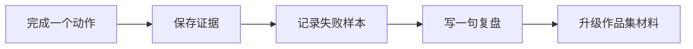

# 技能徽章与成就系统

徽章不是装饰，也不是让学习变成打卡游戏。每个徽章都对应一个可验证动作：能运行、能解释、能复现、能评估、能复盘。这样学习者既能获得轻松的成就感，也不会偏离真正要学的内容。

建议把徽章记录在自己的项目 README 或 `reports/badges.md` 中。每拿到一个徽章，都附上一条证据链接或截图说明。

## 一图读懂：徽章是证据链



| 徽章应该证明什么 | 常见证据 |
|---|---|
| 我能运行 | 命令记录、截图、示例输出 |
| 我能解释 | README、复盘段落、图表结论 |
| 我能复现 | 依赖说明、运行步骤、样例数据 |
| 我能评估 | 指标表、失败样本、对比实验 |
| 我能改进 | 版本记录、修复说明、下一步计划 |

## 徽章总览

| 阶段 | 徽章 | 解锁动作 | 证据 |
|---|---|---|---|
| 1 开发者工具 | 终端生存者 | 在终端完成目录、运行、提交全流程 | 命令记录、commit |
| 1 开发者工具 | Git 存档师 | 完成一次清晰提交并能回看变更 | Git log、diff 截图 |
| 2 Python | JSON 驯服者 | 读写 JSON 并处理损坏文件 | 正常和异常输入样例 |
| 2 Python | 异常捕手 | 让程序面对错误输入不崩溃 | 错误处理记录 |
| 3 数据分析 | 脏数据侦探 | 找出缺失、重复、异常值 | 数据质量检查表 |
| 3 数据分析 | 图表讲述者 | 每张图都有结论和局限 | 图表和解释文本 |
| 4 AI 数学 | 向量翻译官 | 用代码解释相似度或距离 | 小实验和解释 |
| 5 机器学习 | Baseline 守门员 | 先做 baseline 再做模型 | baseline 指标 |
| 6 深度学习 | Loss 观察员 | 保存并解释训练曲线 | loss 曲线、复盘 |
| 7 Prompt | Prompt 调教师 | 比较两个 Prompt 版本 | 版本表、输出对比 |
| 7 Prompt | Schema 守护者 | 校验结构化输出 | schema 通过率 |
| 8 RAG | 引用警察 | 检查答案是否被来源支持 | citation_check.csv |
| 8 RAG | 检索考古学家 | 能从日志定位检索失败 | retrieval_logs.jsonl |
| 9 Agent | Trace 记录员 | 保存可回放执行轨迹 | agent_traces.jsonl |
| 9 Agent | Agent 安全官 | 给高风险工具加人工确认 | 权限表、越权测试 |
| 毕业项目 | Demo 导演 | 准备可演示脚本 | demo_notes.md |
| 毕业项目 | 复盘作者 | 写出失败归因和下一步计划 | improvement_record.md |

第一遍学习时，每阶段拿 1 个徽章就够了。作品集阶段再回头补齐关键徽章。

## 新手前 10 个推荐徽章

如果你刚开始，不要被所有徽章吓到。先拿下面 10 个，基本就能完成主线第一轮。

| 顺序 | 徽章 | 为什么先拿它 |
|---|---|---|
| 1 | 终端生存者 | 解决“我不知道在哪里运行命令”的恐惧 |
| 2 | Git 存档师 | 让每次进步都有版本记录 |
| 3 | JSON 驯服者 | 第一次做出会保存数据的小程序 |
| 4 | 异常捕手 | 学会错误输入不是失败，而是测试样例 |
| 5 | 脏数据侦探 | 建立数据可信意识 |
| 6 | 图表讲述者 | 学会用图表讲一个结论 |
| 7 | Baseline 守门员 | 避免模型项目只有漂亮分数 |
| 8 | Prompt 调教师 | 知道 Prompt 也需要版本和测试 |
| 9 | 引用警察 | 建立 RAG 可信度意识 |
| 10 | Trace 记录员 | 学会 Agent 必须可复盘 |

这 10 个徽章覆盖了环境、代码、数据、模型、LLM、RAG 和 Agent 的最小能力链。

## 每阶段迷你成就卡

迷你成就卡适合放在章节或阶段结尾，用来给新人正反馈。它们不要求很大，但要让学习者知道自己刚刚完成了什么。

| 阶段 | 迷你成就卡 |
|---|---|
| 1 开发者工具 | 今天你让一个空文件夹变成了可追踪项目 |
| 2 Python | 今天你让程序第一次记住了数据 |
| 3 数据分析 | 今天你从一堆表格里找到了第一个可信结论 |
| 4 AI 数学 | 今天你把一个公式变成了可运行代码 |
| 5 机器学习 | 今天你让模型第一次接受 baseline 挑战 |
| 6 深度学习 | 今天你看见了 loss 如何变化 |
| 7 Prompt | 今天你让大模型按你的格式输出 |
| 8 RAG | 今天你让答案第一次带着证据出现 |
| 9 Agent | 今天你让 AI 不只回答，而是按步骤行动 |
| 10～12 | 今天你让 AI 处理了文字以外的世界 |
| 毕业项目 | 今天你把学习过程变成了可以展示的作品 |

这些成就卡可以减少新手“学了半天好像什么都没做”的感觉。

## 徽章证据怎么保存

徽章必须配证据，否则容易变成空泛打卡。建议统一保存到项目目录里。

```text
reports/
├── badges.md
├── failure_cases.md
├── improvement_record.md
└── demo_notes.md

evals/
├── prompt_eval_cases.csv
├── eval_questions.csv
└── citation_check.csv

logs/
├── retrieval_logs.jsonl
├── agent_traces.jsonl
└── tool_calls.jsonl
```

`badges.md` 可以很简单：徽章名、完成日期、对应文件、我学到了什么、下一步升级方向。

## 徽章记录模板

```md
## 徽章：RAG 引用警察

### 解锁日期
2026-04-27

### 我完成了什么
对 10 个 RAG 问答样例做 citation_ok 检查，标出 3 个引用不支持答案的失败样本。

### 证据文件
- evals/eval_questions.csv
- evals/citation_check.csv
- logs/retrieval_logs.jsonl

### 我学到了什么
答案看起来合理不等于有资料支持，RAG 项目必须把引用检查作为评估的一部分。

### 下一步
调整 chunk 和 query rewrite，再重新检查 citation_ok。
```

这个模板会把徽章和作品集证据连起来。以后写简历或面试讲项目时，不需要临时回忆，因为证据已经保存好了。

## 徽章升级规则

每个徽章都可以从基础版升级到作品集版。基础版证明你做过，作品集版证明你能讲清楚、能复现、能评估。

| 等级 | 标准 | 示例 |
|---|---|---|
| 基础徽章 | 完成一次动作 | 跑通一个 Prompt 并得到 JSON |
| 标准徽章 | 有记录和失败样本 | 保存 10 个输入输出和 2 个失败样本 |
| 作品集徽章 | 有评估和改进 | 比较两个 Prompt 版本并说明改进结果 |

如果时间有限，先拿基础徽章；如果准备作品集，再升级关键徽章。

## 团队或班级玩法

如果这套课用于教学或社群，可以让学习者每周展示一个徽章，而不是只汇报“我看了几章”。展示时只回答三个问题：我解锁了什么能力，我的证据在哪里，我遇到的一个失败是什么。

这样学习氛围会更轻松，因为大家分享的不只是成功，也包括真实错误和修复过程。新人会知道卡住是正常的，重要的是能复盘。
