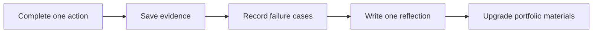

# Skill Badges and Achievement System

Badges are not decoration, and they are not meant to turn learning into a check-in game. Each badge corresponds to a verifiable action: can run, can explain, can reproduce, can evaluate, can review. In this way, learners can gain a sense of achievement without drifting away from what they actually need to learn.

It is recommended to record badges in your own project README or in `reports/badges.md`. Every time you earn a badge, attach a link to evidence or a screenshot description.

## Read at a glance: badges are an evidence chain



| What the badge should prove | Common evidence |
|---|---|
| I can run it | Command record, screenshots, sample output |
| I can explain it | README, reflection paragraph, chart conclusion |
| I can reproduce it | Dependency notes, run steps, sample data |
| I can evaluate it | Metrics table, failure cases, comparison experiments |
| I can improve it | Version history, fix notes, next-step plan |

## Badge overview

| Stage | Badge | Unlock action | Evidence |
|---|---|---|---|
| 1 Developer Tools | Terminal Survivor | Complete the full workflow of navigating directories, running commands, and committing in the terminal | Command record, commit |
| 1 Developer Tools | Git Archivist | Make one clear commit and be able to review the changes | Git log, diff screenshot |
| 2 Python | JSON Tamer | Read and write JSON and handle corrupted files | Normal and exception input examples |
| 2 Python | Exception Catcher | Keep the program from crashing when facing invalid input | Error-handling record |
| 3 Data Analysis | Dirty Data Detective | Find missing values, duplicates, and outliers | Data quality checklist |
| 3 Data Analysis | Chart Storyteller | Give every chart a conclusion and a limitation | Charts and explanatory text |
| 4 AI Math | Vector Translator | Use code to explain similarity or distance | Small experiment and explanation |
| 5 Machine Learning | Baseline Guardian | Build a baseline before building the model | Baseline metrics |
| 6 Deep Learning | Loss Observer | Save and explain the training curve | Loss curve, reflection |
| 7 Prompt | Prompt Tuner | Compare two Prompt versions | Version table, output comparison |
| 7 Prompt | Schema Guardian | Validate structured output | Schema pass rate |
| 8 RAG | Citation Police | Check whether the answer is supported by the source | citation_check.csv |
| 8 RAG | Retrieval Archaeologist | Locate retrieval failures from logs | retrieval_logs.jsonl |
| 9 Agent | Trace Recorder | Save replayable execution traces | agent_traces.jsonl |
| 9 Agent | Agent Security Officer | Add human confirmation for high-risk tools | Permission table, privilege-escalation test |
| Graduation Project | Demo Director | Prepare a demo script | demo_notes.md |
| Graduation Project | Reflection Writer | Write the failure analysis and next-step plan | improvement_record.md |

In the first pass through the course, earning one badge per stage is enough. When you reach the portfolio stage, come back and fill in the key badges.

## Recommended first 10 badges for beginners

If you are just starting, do not be intimidated by all the badges. First earn the 10 below, and you will basically complete the first round of the main learning path.

| Order | Badge | Why earn it first |
|---|---|---|
| 1 | Terminal Survivor | Removes the fear of “I don’t know where to run commands” |
| 2 | Git Archivist | Makes every bit of progress have a version history |
| 3 | JSON Tamer | First small program that can save data |
| 4 | Exception Catcher | Learn that invalid input is not failure, but test data |
| 5 | Dirty Data Detective | Build awareness of data trustworthiness |
| 6 | Chart Storyteller | Learn to use a chart to tell one conclusion |
| 7 | Baseline Guardian | Avoid model projects that only have pretty scores |
| 8 | Prompt Tuner | Learn that Prompts also need versioning and testing |
| 9 | Citation Police | Build RAG trustworthiness awareness |
| 10 | Trace Recorder | Learn that Agents must be reviewable |

These 10 badges cover the minimum capability chain for environment, code, data, model, LLM, RAG, and Agent.

## Mini achievement cards for each stage

Mini achievement cards are suitable for the end of a chapter or stage, to give beginners positive feedback. They do not need to be big, but they should help learners know what they just completed.

| Stage | Mini achievement card |
|---|---|
| 1 Developer Tools | Today you turned an empty folder into a trackable project |
| 2 Python | Today you made the program remember data for the first time |
| 3 Data Analysis | Today you found the first trustworthy conclusion from a pile of tables |
| 4 AI Math | Today you turned a formula into runnable code |
| 5 Machine Learning | Today you made the model face a baseline challenge for the first time |
| 6 Deep Learning | Today you saw how loss changes |
| 7 Prompt | Today you made the LLM output in your format |
| 8 RAG | Today you made the answer appear with evidence for the first time |
| 9 Agent | Today you made AI do more than answer, by taking action step by step |
| 10–12 | Today you made AI handle a world beyond text |
| Graduation Project | Today you turned the learning process into a presentable project |

These achievement cards can reduce the beginner feeling of “I studied for so long, but it seems like I did nothing.”

## How to save badge evidence

Badges must come with evidence, otherwise they can easily become empty check-ins. It is recommended to save everything consistently in the project directory.

```text
reports/
├── badges.md
├── failure_cases.md
├── improvement_record.md
└── demo_notes.md

evals/
├── prompt_eval_cases.csv
├── eval_questions.csv
└── citation_check.csv

logs/
├── retrieval_logs.jsonl
├── agent_traces.jsonl
└── tool_calls.jsonl
```

`badges.md` can be very simple: badge name, completion date, corresponding file, what I learned, and the next upgrade direction.

## Badge record template

```md
## Badge: RAG Citation Police

### Unlock date
2026-04-27

### What I completed
Performed citation_ok checks on 10 RAG Q&A samples and marked 3 failure cases where the citations did not support the answer.

### Evidence files
- evals/eval_questions.csv
- evals/citation_check.csv
- logs/retrieval_logs.jsonl

### What I learned
An answer looking reasonable does not mean it is supported by sources. RAG projects must treat citation checks as part of evaluation.

### Next step
Adjust chunking and query rewrite, then check citation_ok again.
```

This template connects badges with portfolio evidence. Later, when you write your resume or talk about the project in an interview, you do not need to remember everything on the spot, because the evidence has already been saved.

## Badge upgrade rules

Every badge can be upgraded from a basic version to a portfolio version. A basic badge proves that you did it; a portfolio badge proves that you can explain it clearly, reproduce it, and evaluate it.

| Level | Standard | Example |
|---|---|---|
| Basic badge | Complete one action | Run one Prompt successfully and get JSON |
| Standard badge | Has records and failure cases | Save 10 input-output pairs and 2 failure cases |
| Portfolio badge | Has evaluation and improvement | Compare two Prompt versions and explain the improvement result |

If time is limited, earn the basic badge first; if you are preparing a portfolio, then upgrade the key badges.

## Team or class activities

If this course is used for teaching or in a community, you can have learners present one badge each week instead of only reporting “I read a few chapters.” During the presentation, answer only three questions: what ability did I unlock, where is my evidence, and what is one failure I encountered.

This makes the learning atmosphere more relaxed, because everyone shares not only success, but also real mistakes and the repair process. Beginners will know that getting stuck is normal, and what matters is being able to reflect and improve.
