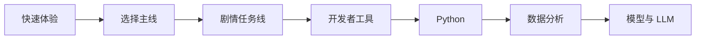

# 新手轻松学习指南

如果你刚开始学 AI 全栈，觉得目录很长、名词很多、项目很多，这是正常的。你不需要一口气理解所有东西，也不需要一开始就做出完整 AI 产品。第一遍最重要的是建立信心：能运行一个小东西，能看懂一点输出，能记录一次失败，能知道下一步去哪。

这页的目标是降低学习压力，让新人学起来更轻松，但不降低学习质量。

## 第一原则：先玩，再懂，再做深

很多人一上来就想把概念全部弄懂，结果卡在第一周。更好的顺序是先玩一下，看到效果；再理解它大概怎么工作；最后在项目里做深。

| 阶段 | 你应该追求什么 | 不必追求什么 |
|---|---|---|
| 第一次接触 | 跑出结果，建立直觉 | 完全理解所有代码 |
| 第一遍主线 | 每阶段完成最小项目 | 学完所有分支和高级细节 |
| 第二遍补强 | 回看卡点和薄弱章节 | 从头重学所有内容 |
| 作品集阶段 | 让项目可运行、可解释、可评估 | 功能越多越好 |

如果一个概念看三遍还不懂，先记下它，继续往后做最小项目。很多概念要在项目里遇到两三次才会真正理解。

## 新手最轻松的 7 天启动法

第一周不要安排太满。目标是建立节奏，而不是证明自己很强。

| 天数 | 任务 | 完成标准 |
|---|---|---|
| 第 1 天 | 看 30 分钟快速体验 | 跑出一个 AI 示例或看懂输出 |
| 第 2 天 | 读能力地图和四条主线 | 选一条路线，不再纠结 |
| 第 3 天 | 配好终端和 Python | 能运行 `python --version` |
| 第 4 天 | 建一个学习项目文件夹 | 有 README 和一次 Git 提交 |
| 第 5 天 | 写一个最小 Python 脚本 | 能输入或输出一条学习任务 |
| 第 6 天 | 故意制造一个小错误 | 把错误和修复写下来 |
| 第 7 天 | 做一次周复盘 | 写下本周学会了什么、卡在哪里 |

这一周完成后，你就已经有了环境、项目、代码、错误记录和复盘，不再只是“准备学习”。

## 遇到难点时的减压策略

AI 学习里有几类常见压力源：数学看不懂、代码报错、模型名词太多、项目太大、结果不稳定。它们都有对应的减压方法。

| 压力源 | 容易产生的想法 | 更好的处理方式 |
|---|---|---|
| 数学看不懂 | 我是不是不适合学 AI | 先理解直觉和用途，用代码跑一个例子 |
| 报错很多 | 我写代码太差 | 把报错当 Debug 侦探任务，记录线索 |
| 名词太多 | 我要先背完术语 | 只记当前项目用到的 5 个词 |
| 项目太大 | 我做不出来完整产品 | 先做基础版，只完成一个输入到输出闭环 |
| LLM 不稳定 | 大模型太玄学 | 固定测试样例，比较 Prompt 版本 |
| RAG 答不准 | 我系统设计失败了 | 先关闭生成，只看检索结果 |
| Agent 乱跑 | Agent 太难控制 | 限制工具、步数和权限，先保存 trace |

学习轻松不是避开困难，而是把困难切小，让每次只解决一个具体问题。

## 每天只做三件小事

如果你每天时间不多，可以用“三件小事”推进：一个输入、一个输出、一个记录。

| 小事 | 例子 | 为什么有效 |
|---|---|---|
| 一个输入 | 一个命令、一个 CSV、一个 Prompt、一个问题 | 防止任务太抽象 |
| 一个输出 | 一行结果、一张图、一个 JSON、一个回答 | 让进度可见 |
| 一个记录 | 一句解释、一个失败样本、一个 README 更新 | 让学习可复盘 |

只要今天有输入、有输出、有记录，就算有效学习。不要用“我看了多少页”作为唯一标准。

## 新手不要一开始做这些事

有些事看起来高级，但太早做会增加挫败感。

| 暂时不要 | 原因 | 什么时候再做 |
|---|---|---|
| 一开始追复杂框架 | 容易被配置和抽象淹没 | 跑通最小项目后 |
| 一开始做完整前后端 | 工程量太大，容易偏离 AI 主线 | 有稳定 API 和功能后 |
| 一开始训练大模型 | 成本高、反馈慢、错误难定位 | 理解 DL 和微调基础后 |
| 一开始同时学 CV、NLP、多模态 | 分支太多，主线会散 | 毕业项目选方向时 |
| 一开始追最新工具名 | 工具变化快，底层能力更重要 | 理解问题层后再选工具 |

第一遍学习最重要的是主线闭环。新工具可以先收藏，不必立刻追。

## 用“学习存档”减轻焦虑

很多新人焦虑，是因为学了很多但看不到积累。解决办法是给自己建一个学习存档。

```text
learning-archive/
├── weekly-notes.md
├── commands.md
├── failure_cases.md
├── badges.md
└── project-links.md
```

每周只写 10 分钟：本周跑通了什么，遇到什么错误，修复了什么，下一周只做哪一件事。长期看，这会变成你的学习证据和作品集素材。

## 一章学不懂怎么办

如果一章读完很懵，不要立刻重读三遍。先做下面这个最小闭环。

| 步骤 | 问题 |
|---|---|
| 1 | 这一章解决什么问题？ |
| 2 | 它的输入是什么？ |
| 3 | 它的输出是什么？ |
| 4 | 我能不能跑一个最小例子？ |
| 5 | 它和当前项目有什么关系？ |
| 6 | 如果失败，最可能错在哪里？ |

能回答这六个问题，就可以先进入下一节。细节可以在项目卡住时再回来补。

## 新手最推荐的学习顺序

如果你没有明确目标，建议这样走：快速体验，四条主线学习路线，AI 学习助手剧情任务线，开发者工具基础，Python 编程基础，数据分析与可视化，然后再进入模型和 LLM。



学习到 RAG 或 Agent 时，如果觉得混乱，就回到剧情线理解：Prompt 是让助手会表达，RAG 是让助手会查资料，Agent 是让助手会分步做任务。

## 给新人的复盘提示词

你可以用下面的提示词让 AI 帮你复盘学习，但不要让 AI 代替你完成项目。你提供真实记录，AI 帮你整理和指出下一步。

```text
我正在学习 AI 全栈课程，目前在第 X 阶段。
这是我今天运行的命令、输出和遇到的错误：
【粘贴内容】

请帮我做三件事：
1. 用新手能懂的话解释我今天实际学到了什么。
2. 判断这个错误属于环境、Python、数据、模型、Prompt、RAG、Agent 还是部署。
3. 给我一个明天 30 分钟内能完成的最小下一步。

不要给我太多扩展资料，只给最小可执行建议。
```

这个提示词的关键是“最小下一步”。新人最需要的不是更多资料，而是下一步能做什么。

## 轻松学习不等于降低标准

这套课程对作品的要求仍然很明确：项目要能运行，要有示例输入输出，要有失败样本，要能评估，要能复盘。新手友好只是把这些要求拆小，让你每次完成一点，而不是最后一次性面对巨大压力。

你不需要每天都学很多。只要持续把每个小结果保存下来，几个月后你会发现自己已经从“只会看教程”变成“能做、能查、能修、能讲项目”的学习者。