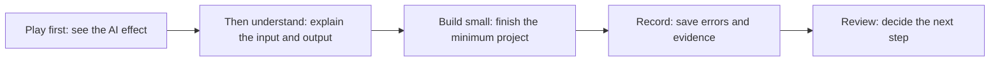
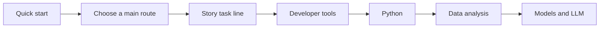

# A Beginner-Friendly Learning Guide

If you are just starting to learn AI full-stack and feel that the outline is long, there are many terms, and there are many projects, that is completely normal. You do not need to understand everything at once, and you do not need to build a complete AI product right away. The most important thing on your first pass is to build confidence: run something small, understand a little of the output, record one failure, and know where to go next.

The goal of this page is to reduce learning pressure and make it easier for beginners to learn, without lowering learning quality.

## Understand at a Glance: How Beginners Should Learn on the First Pass



| What to focus on first | What not to obsess over first |
|---|---|
| Get a result running | Understand all principles at once |
| Understand input and output | Memorize all terms |
| Save one failure record | Make the project perfect from the start |
| Finish one small loop each week | Chase every new AI tool at the same time |

## First Principle: Play First, Understand Later, Then Go Deeper

Many people try to fully understand all the concepts right away, and then get stuck in the first week. A better order is to play with it first and see the effect; then understand roughly how it works; and finally go deeper in a project.

| Stage | What you should aim for | What you do not need to aim for |
|---|---|---|
| First contact | Get results and build intuition | Fully understand all the code |
| First main pass | Finish the minimum project at each stage | Learn all branches and advanced details |
| Second pass for reinforcement | Review stuck points and weak chapters | Relearn everything from scratch |
| Portfolio stage | Make the project runnable, explainable, and evaluable | The more features, the better |

If you still do not understand a concept after reading it three times, write it down and keep moving with the minimum project. Many concepts only become clear after you run into them two or three times in a project.

## The Easiest 7-Day Start Plan for Beginners

Do not schedule too much in the first week. The goal is to build a rhythm, not to prove how strong you are.

| Day | Task | Completion standard |
|---|---|---|
| Day 1 | Watch a 30-minute quick start | Run an AI example or understand the output |
| Day 2 | Read the capability map and the four main paths | Choose one route and stop hesitating |
| Day 3 | Set up your terminal and Python | Can run `python --version` |
| Day 4 | Create a learning project folder | Have a README and one Git commit |
| Day 5 | Write a minimal Python script | Can input or output one learning task |
| Day 6 | Intentionally create a small error | Write down the error and the fix |
| Day 7 | Do a weekly review | Write down what you learned and where you got stuck |

After finishing this week, you will already have an environment, a project, code, error records, and a review. You will no longer just be “getting ready to learn.”

## Decompression Strategies When You Hit Difficult Points

There are several common sources of stress in AI learning: math is hard to understand, code throws errors, there are too many model terms, projects are too big, and results are unstable. Each one has a matching way to reduce pressure.

| Stress source | Easy-to-have thought | Better way to handle it |
|---|---|---|
| Math is hard to understand | Maybe I am not cut out for AI | First understand the intuition and purpose, then run an example with code |
| Many errors | I am bad at coding | Treat errors as a debugging detective task and record clues |
| Too many terms | I need to memorize all the terminology first | Only remember the 5 terms used in the current project |
| Project is too big | I cannot build a complete product | Start with the basic version and only finish one input-to-output loop |
| LLM is unstable | Large models are too mysterious | Fix test cases and compare Prompt versions |
| RAG is inaccurate | My system design failed | Turn off generation first and only look at retrieval results |
| Agent behaves randomly | Agent is too hard to control | Limit tools, steps, and permissions, and save the trace first |

Learning in a relaxed way does not mean avoiding difficulty. It means breaking difficulty into smaller pieces so that each time you solve only one specific problem.

## Do Only Three Small Things Each Day

If you do not have much time every day, you can move forward with “three small things”: one input, one output, and one record.

| Small thing | Example | Why it works |
|---|---|---|
| One input | One command, one CSV, one Prompt, one question | Prevents the task from becoming too abstract |
| One output | One line of result, one chart, one JSON, one answer | Makes progress visible |
| One record | One sentence of explanation, one failed sample, one README update | Makes learning reviewable |

As long as you have input, output, and a record today, it counts as effective learning. Do not use “how many pages I read” as your only standard.

## Things Beginners Should Not Do at the Start

Some things look advanced, but doing them too early will increase frustration.

| Do not do yet | Reason | When to do it again |
|---|---|---|
| Chase complex frameworks from the start | Easy to get buried by configuration and abstraction | After running a minimum project successfully |
| Build a complete front end and back end at the start | Too much engineering work, easy to drift away from the AI main line | After you have a stable API and features |
| Train large models at the start | High cost, slow feedback, hard-to-locate errors | After understanding DL and fine-tuning basics |
| Learn CV, NLP, and multimodal all at once | Too many branches, the main line will become scattered | When choosing a direction for a capstone project |
| Chase the latest tool names at the start | Tools change quickly; core skills matter more | Choose tools after understanding the problem layer |

For the first pass, the most important thing is the main-line loop. New tools can be bookmarked first; you do not need to chase them right away.

## Use a “Learning Archive” to Reduce Anxiety

Many beginners feel anxious because they have learned a lot but cannot see their accumulation. The solution is to create a learning archive for yourself.

```text
learning-archive/
├── weekly-notes.md
├── commands.md
├── failure_cases.md
├── badges.md
└── project-links.md
```

Spend just 10 minutes each week writing down what you got working, what errors you encountered, what you fixed, and what single thing you will do next week. Over time, this becomes your learning evidence and portfolio material.

## What If You Do Not Understand a Chapter?

If you finish a chapter and feel confused, do not immediately reread it three times. First complete this minimum loop.

| Step | Question |
|---|---|
| 1 | What problem does this chapter solve? |
| 2 | What is its input? |
| 3 | What is its output? |
| 4 | Can I run a minimum example? |
| 5 | What is its relationship to the current project? |
| 6 | If it fails, where is the most likely mistake? |

If you can answer these six questions, you can move on to the next section first. You can come back later to fill in the details when the project gets stuck.

## The Most Recommended Learning Order for Beginners

If you do not have a clear goal, it is recommended to go in this order: quick start, the four main learning routes, the AI learning assistant story task line, developer tool basics, Python programming basics, data analysis and visualization, and then move into models and LLM.



When you get to RAG or Agent and feel confused, go back to the story line to understand it: Prompt helps the assistant express itself, RAG helps the assistant look up information, and Agent helps the assistant complete tasks step by step.

## Review Prompts for Beginners

You can use the following Prompt to ask AI to help you review your learning, but do not let AI replace you in finishing the project. You provide the real records, and AI helps you organize them and point out the next step.

```text
I am learning the AI full-stack course, and I am currently at stage X.
Here are the commands I ran today, the output, and the errors I encountered:
【paste content】

Please help me with three things:
1. Explain in beginner-friendly language what I actually learned today.
2. Determine whether this error belongs to the environment, Python, data, model, Prompt, RAG, Agent, or deployment.
3. Give me the smallest next step that I can complete within 30 minutes tomorrow.

Do not give me too many extended resources. Only give the smallest actionable advice.
```

The key idea in this Prompt is the “smallest next step.” What beginners need most is not more materials, but what they can do next.

## Learning Easily Does Not Mean Lowering Standards

This course still has clear requirements for projects: they must run, they must have example inputs and outputs, they must have failure samples, they must be evaluable, and they must be reviewable. Being beginner-friendly only means splitting these requirements into smaller pieces, so that you complete a little each time instead of facing huge pressure all at once at the end.

You do not need to learn a lot every day. As long as you keep saving each small result, after a few months you will find that you have moved from “only knowing how to follow tutorials” to “being able to build, check, fix, and explain projects.”
