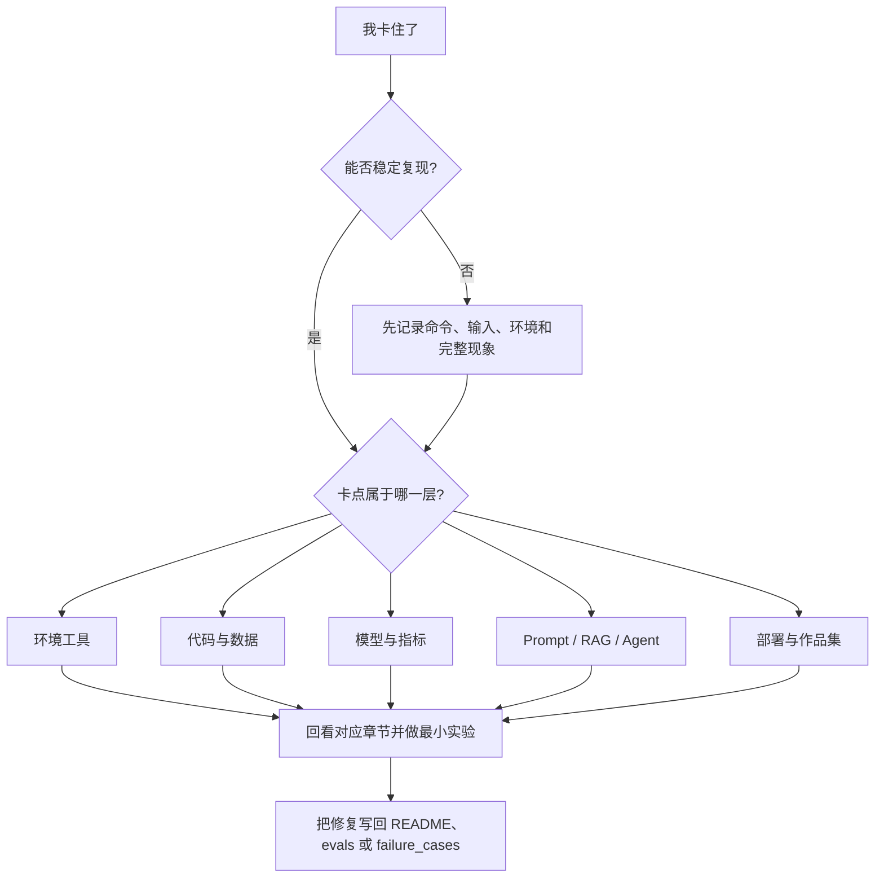

# 学习卡点诊断地图

学习 AI 全栈时，卡住并不说明你不适合学，而是说明当前项目暴露了某一层能力缺口。最有效的处理方式不是继续硬读后面的章节，而是先判断卡点属于哪一层，再回到对应内容做一个最小复现实验。

这页和 [常见错误与排障索引](/intro/troubleshooting-index) 的区别是：排障索引更偏具体错误，这页更偏学习路线和项目回流。你可以把它当成“从失败现象反查课程章节”的地图。

## 诊断总流程



遇到卡点时，先问四个问题：我能不能复现，输入是什么，预期是什么，实际是什么。如果这四项都说不清，优先补记录，而不是补知识点。

## 一张表快速定位

| 卡点现象 | 多半缺的是 | 优先回看 | 最小修复动作 | 作品集证据 |
|---|---|---|---|---|
| 命令跑不起来、环境混乱 | 开发工具和运行环境 | 1 开发者工具基础、环境准备 | 在新终端按 README 重跑一次 | 命令记录、环境版本、修复说明 |
| Python 脚本经常路径错、文件读不到 | 文件路径、异常处理、项目结构 | 2 Python 编程基础 | 写一个最小文件读写脚本 | 输入文件、输出文件、异常样例 |
| 数据分析结论不可信 | 数据质量和清洗流程 | 3 数据分析与可视化 | 打印缺失、重复、异常值检查 | 数据字典、清洗日志、图表解释 |
| 看不懂相似度、loss、概率或指标 | 数学直觉和指标解释 | 4 AI 数学基础 | 用 5 行代码复现一个指标 | 小实验、手算说明、指标边界 |
| 模型分数很高但不敢相信 | 数据泄漏、baseline、评估方式 | 5 机器学习 | 重做 train/test 划分和 Dummy baseline | baseline、指标表、错误样本 |
| 训练不收敛、shape mismatch | 深度学习训练循环 | 6 深度学习与 Transformer | 打印 tensor shape，跑小数据过拟合测试 | 训练日志、曲线、失败样本 |
| LLM 输出格式飘、JSON 不稳定 | Prompt、schema、校验重试 | 7 大模型与 Prompt | 固定 10 个输入做输出对比 | Prompt 版本、schema 校验结果 |
| RAG 答非所问或引用不支持 | 文档处理、检索、RAG 评估 | 8 LLM 应用与 RAG | 只打印检索结果，不调用模型 | chunks、retrieval logs、citation_check |
| Agent 循环或乱用工具 | 目标边界、工具 schema、停止条件 | 9 AI Agent | 限制 3 步并保存 trace | agent_traces、tool_calls、安全边界 |
| 多模态输出看起来好但不可控 | 素材、审核、导出和质量标准 | 10～12 方向拓展 | 保存输入素材和人工审核记录 | 素材来源、审核表、失败样本 |
| 项目能跑但讲不清 | README、评估和复盘不足 | 项目交付标准、作品集清单 | 补运行方式、示例、失败样本 | README、demo_notes、improvement_record |
| 本地能跑，别人跑不起来 | 依赖、配置、部署说明 | 工程化、环境准备、部署章节 | 在干净目录按 README 重跑 | `.env.example`、依赖文件、部署日志 |

定位以后，不要只“看一遍相关章节”。更有效的是做一个最小修复动作，并把结果写回项目资料。

## 环境和工具卡点

环境问题最容易让新手误以为自己学不会。其实它通常和当前目录、PATH、Python 环境、Node 依赖、Git 状态有关。

| 现象 | 先查什么 | 回流章节 | 修复后补什么 |
|---|---|---|---|
| `command not found` | 命令是否安装，当前 shell 是否加载 PATH | 终端与命令行、包管理器 | README 增加安装命令 |
| `ModuleNotFoundError` | pip 是否装到当前 Python 环境 | Python 环境、虚拟环境 | `requirements.txt` 或依赖说明 |
| `npm run start` 失败 | 是否在项目根目录，是否安装依赖 | 开发环境配置 | 记录 Node 版本和启动命令 |
| Git 提交失败 | 是否初始化、暂存、配置身份 | Git 与版本管理 | 记录 `git status` 排查步骤 |

最小实验是：关闭当前终端，打开新终端，从项目根目录按 README 完整运行一次。如果跑不通，说明 README 或环境说明还不够完整。

## Python、数据和项目结构卡点

如果代码能写一点，但经常在路径、JSON、DataFrame、编码、空数据上卡住，说明需要回到“数据进入程序以后如何被检查和保护”。

| 现象 | 可能原因 | 最小实验 | 回流章节 |
|---|---|---|---|
| 相对路径一换目录就失效 | 没有理解工作目录 | 打印 `Path.cwd()` 和目标文件路径 | Python 文件读写 |
| JSON 文件损坏后程序崩溃 | 缺少异常处理 | 准备一个损坏 JSON 测试 | 异常处理、文件 I/O |
| DataFrame 列名对不上 | header、空格、大小写、分隔符问题 | 打印 `df.columns.tolist()` | Pandas 读取与清洗 |
| 图表有结论但解释薄弱 | 没有连接业务问题 | 给每张图写一句“回答什么问题” | 数据可视化最佳实践 |

这一层修好以后，项目应该多出异常输入样例、空输入样例、文件损坏样例或数据质量检查表。

## 模型和指标卡点

模型阶段的常见误区是只看分数，不看分数是否可信。凡是遇到“分数太高、分数太低、解释不清、调参没方向”，都应该回到 baseline、划分、指标和错误样本。

| 现象 | 先排查 | 最小实验 | 应留下的证据 |
|---|---|---|---|
| 准确率异常高 | 数据泄漏、重复样本、答案字段 | 删除可疑特征，重新训练 baseline | 泄漏检查记录 |
| 验证集很差 | 过拟合、数据量少、划分不合理 | 对比训练/验证曲线 | 曲线和错误样本 |
| loss 不降 | 学习率、标签格式、归一化 | 小数据过拟合测试 | 配置和训练日志 |
| 指标讲不清 | 指标和业务问题不匹配 | 用 5 个样本手算指标 | 指标解释文档 |

如果项目里没有 baseline，就不要急着说模型优化。先做一个最简单的 baseline，很多问题会自然暴露。

## Prompt 和 LLM 卡点

LLM 项目最常见的卡点是“看起来会回答，但不稳定”。如果输出格式漂移、字段缺失、幻觉、成本突然升高，就要把 Prompt 当成可测试组件，而不是一次性文字。

| 现象 | 可能原因 | 最小修复 | 评估材料 |
|---|---|---|---|
| JSON 少字段 | schema 不清楚或没有校验 | 增加 required 字段和校验 | prompt_eval_cases.csv |
| 同一问题输出差异大 | Prompt 约束弱、温度高、样例不足 | 固定 10 个输入比较版本 | Prompt 版本表 |
| 回答编造事实 | 没有限制信息来源 | 要求无依据时拒答 | 失败样本和拒答样例 |
| 成本高 | 上下文太长、重试过多 | 记录 token 和请求次数 | llm_calls.jsonl |

Prompt 阶段的目标不是写出一条万能提示词，而是建立版本、测试和回归意识。

## RAG 卡点

RAG 失败时，不要先怪模型。先把模型关掉，只看检索结果。只要检索没有命中正确资料，后面的生成很难可靠。

| 现象 | 定位顺序 | 最小实验 | 回流章节 |
|---|---|---|---|
| 检索不到相关文档 | 文档是否导入、chunk 是否合理、query 是否匹配 | 用原文关键词检索 | 文档处理、向量检索 |
| 检索到了但答案错 | Prompt 是否要求基于来源，模型是否忽略片段 | 把检索片段直接喂给模型 | RAG 生成和引用 |
| 引用不支持答案 | citation 是否精确到片段，答案句子是否可对齐 | 人工标注 citation_ok | RAG 评估 |
| 问题稍微改写就失败 | query rewrite、同义词、metadata 过滤不足 | 固定 10 个改写问题测试 | 检索优化 |

RAG 项目的核心证据包括 eval_questions、gold_doc、gold_answer、citation_ok、retrieval_logs 和失败类型统计。

## Agent 卡点

Agent 卡住时，通常不是“模型不够聪明”，而是目标、工具、状态和停止条件没有设计好。Agent 项目必须能复盘每一步，否则一次成功演示不够可信。

| 现象 | 先查什么 | 最小修复 | 作品证据 |
|---|---|---|---|
| 一直循环 | 目标是否过宽，停止条件是否清楚 | 设置最大步数和完成条件 | trace 对比 |
| 工具参数错 | schema、示例、必填字段是否清楚 | 手写一次工具调用 | tool schema 和错误样本 |
| 工具选错 | 工具描述重叠或权限边界不清 | 合并或重写工具描述 | tool_calls.jsonl |
| 越权操作 | 是否区分只读、写入、删除、发送 | 高风险动作人工确认 | 安全边界说明 |
| 完成但不可复盘 | 没有记录 thought/action/observation | 保存 agent_traces.jsonl | trace replay 样例 |

Agent 的最小验收不是“完成一个任务”，而是“失败时能说清楚哪一步错了”。

## 作品集和课程安排卡点

有些学习者不是技术卡住，而是课程安排和项目表达卡住：学了很多但不知道怎么展示，项目能跑但讲不清，或者每阶段都像从零开始。

| 现象 | 问题本质 | 回流页面 | 修复动作 |
|---|---|---|---|
| 不知道先学什么 | 路线选择不清 | 四条主线学习路线 | 选定一条路线，坚持一个阶段 |
| 每阶段项目割裂 | 缺少贯穿项目 | AI 学习助手版本路线图 | 把阶段产出合并到同一项目 |
| 项目很多但不成作品集 | 缺少交付标准 | 项目页交付标准、作品集清单 | 统一 README、截图、评估和复盘 |
| 学完一章就忘 | 没有最小练习 | 课程页面使用指南 | 每章补一个可运行动作 |
| 毕业项目不知道选什么 | 输入材料和目标不清 | 毕业项目设计指南 | 用决策树选方向 |

当你觉得课程太大时，不要增加新资料。先减少当前目标：只完成当前路线、当前阶段、当前项目版本的最低交付。

## 卡点记录模板

每次卡住后，建议把它记录成一个可复用条目。这样你的失败不会浪费，而会变成作品集里的工程证据。

```md
## 卡点标题

### 当前阶段
我正在学习哪一站，做哪个项目版本。

### 现象
我执行了什么命令或输入了什么内容，实际发生了什么。

### 预期
我原本以为应该发生什么。

### 归因层级
环境 / Python / 数据 / 数学指标 / 机器学习 / 深度学习 / Prompt / RAG / Agent / 部署 / 作品集表达。

### 最小复现
用最小输入或最小命令复现这个问题。

### 回流章节
我回看了哪些课程页面。

### 修复动作
我改了什么，为什么这样改。

### 回归检查
以后用哪个测试样例确认它没有复发。
```

学习顺畅不是从不失败，而是失败以后能快速定位、修复、记录和回归。每次卡点都能沉淀成一条证据，课程就会越学越轻。