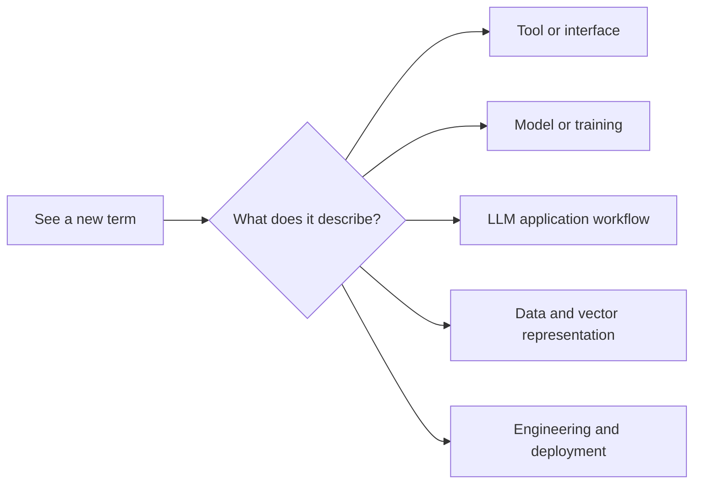

# Common Concept Comparison Table

## What this section is for

This page is not a formal tutorial for any single knowledge point. Instead, it is a “concept map.” When you see terms like API, SDK, model, training, inference, Prompt, RAG, Agent, Token, and Embedding in the course, you can come here first for a quick comparison and avoid mixing similar concepts together.

## First, decide what category it belongs to

| If it is talking about | Where to look first |
|---|---|
| How to call it, how to integrate it | Development and invocation-related |
| How the model learns, how it serves | Model and serving-related |
| Prompt, RAG, Agent, fine-tuning | LLM application-related |
| Token, Embedding, Chunk | Data and vector-related |
| Deployment, logs, evaluation, security | Engineering-focused pages |

## How to use this table

When beginners read it for the first time, they do not need to memorize every term. The goal is to build a rough boundary first: which one is a tool, which one is a model, which one is a workflow, and which one is an application architecture. Learners with experience can use it as a terminology calibration table and, later on, try to use more precise words in project explanations, technical documentation, or interview answers.

---

## Development and invocation-related

| Easy-to-confuse concept | Simple understanding | Key difference |
|---|---|---|
| API | An entry point for programs to call a service | You send a request according to the contract, and it returns a result |
| SDK | A packaged set of development tools | An SDK usually makes it easier to call an API |
| Library | A reusable collection of code | You actively call it in your own program |
| Framework | A skeleton that helps organize application structure | You usually need to write code according to the framework’s rules |
| CLI | Command-line tool | Used by entering commands in a terminal |
| Web API | An API exposed through HTTP | Often used to connect front-end and back-end, model services, and external systems |

For example, the model capabilities of OpenAI or Anthropic are usually exposed through a Web API; a Python SDK then wraps the HTTP request details so you can complete the call with just a few lines of Python code.

---

## Model and serving-related

| Easy-to-confuse concept | Simple understanding | Key difference |
|---|---|---|
| Model | The core of an AI system with learned parameters | The model itself is responsible for inference or generation |
| Model serving | Wrapping a model into a callable service | Responsible for interfaces, concurrency, authentication, logs, and deployment |
| Inference | Using a model to get output | Does not change model parameters |
| Training | Updating model parameters with data | Requires data, compute, loss functions, and optimization |
| Fine-tuning | Continuing training on top of an existing model | Usually used to adapt to a domain, format, or task |
| Deployment | Making a service reliably accessible to others | Includes runtime environment, monitoring, scaling, and security |

Many beginners mix up “calling a model” and “training a model.” Calling a model is like using a finished tool, while training a model is reshaping the tool itself.

---

## LLM application-related

| Easy-to-confuse concept | Simple understanding | Key difference |
|---|---|---|
| Prompt | The input and task instructions given to the model | Affects how the model answers this time |
| System Prompt | Higher-priority behavior settings | Often used to set role, boundaries, and output style |
| Few-shot | Providing a few examples in the prompt | Teaches the model to imitate a format or way of thinking through examples |
| Structured Output | Requiring the model to output a fixed structure | Often used for JSON, tables, and field extraction |
| Function Calling | Letting the model choose and fill tool parameters | The model does not execute the tool directly; the system does |
| Tool Use | The model completes tasks through external tools | Includes tools such as search, code, databases, and files |

Prompt is more like “how to ask this time,” while tool calling is more like “which external capability should the model use next.” They can be used together, but they solve different problems.

---

## RAG, fine-tuning, and Agent

| Easy-to-confuse concept | Problems it is good for | Problems it is not good for |
|---|---|---|
| Prompt | Unclear task definition, unstable output format, needing to express requirements better | Making the model magically know private knowledge |
| RAG | Answering based on external documents, private knowledge, or up-to-date materials | Changing the model’s own capabilities or style |
| Fine-tuning | Helping the model reliably master a specific format, style, or domain task | Dynamically reading large amounts of the latest information |
| Agent | Tasks with multiple steps, tool use, and route adjustment based on intermediate results | Fixed, simple, high-risk workflows that must be fully controllable |
| Workflow | Automated processes with fixed steps and clear rules | Open-ended tasks with uncertain paths |

A practical rule of thumb is: if the problem is just a poor way of asking, improve the Prompt first; if knowledge is missing, prefer RAG; if format and style are unstable over the long term, consider fine-tuning; if the task requires multi-step actions and tool selection, consider an Agent.

---

## Data and vector-related

| Easy-to-confuse concept | Simple understanding | Key difference |
|---|---|---|
| Token | The basic piece of text processed by the model | It may be a character, word, subword, or symbol fragment |
| Embedding | Representing text, images, and so on as vectors | Makes similarity computation and retrieval easier |
| Vector database | A system for storing and retrieving vectors | Often used for similarity-based recall in RAG |
| Context window | The range of input the model can see at one time | Anything beyond it cannot be directly used by the model |
| Chunk | A piece created by splitting a document | RAG usually retrieves chunks, not entire documents |
| Metadata | Additional information | Such as source, title, page number, permissions, and time |

A common RAG pipeline is: first split documents into Chunks, then convert them into Embeddings and store them in a vector database; when the user asks a question, convert the question into a vector as well, retrieve similar Chunks, and put them into the context window for the model to answer.

---

## Suggested terminology consistency across the course

To reduce the learning burden for beginners, later articles should use the same naming style as much as possible: the first time a term appears, write the full Chinese and English name, and then use the abbreviation afterward. For example, “Retrieval-Augmented Generation (RAG)”, “Embedding”, “Tool Use / Function Calling”, and “Agent”. If a concept appears repeatedly across different stages, it is best to explain where it will be used later the first time it appears.

| Recommended wording | Acceptable abbreviation | Avoid mixing |
|---|---|---|
| Retrieval-Augmented Generation (RAG) | RAG | Do not sometimes write knowledge base and sometimes write vector database to stand in for the entire RAG workflow |
| Embedding | Embedding, vector representation | Do not equate Embedding with a vector database |
| Tool Use / Function Calling | tool calling, function calling | Do not mix up “the model choosing a tool” and “the system executing the tool” as one step |
| Agent | Agent | Do not call every LLM application with tools an Agent |
| Workflow | fixed workflow | Do not confuse fixed automation processes with open-ended Agents |
| Fine-tuning | fine-tuning | Do not call Prompt adjustments fine-tuning |

## Cross-stage review path

Many concepts do not appear in only one stage. You can review them in the following way: when learning RAG evaluation, go back to Station 5 to look at metrics and error analysis; when learning Agent tool calling, go back to Station 8 to look at Function Calling; when learning Transformer and LLM context, go back to Station 6 to look at Attention; when learning multimodal applications, go back to Stations 10 and 11 to look at vision and text tasks respectively. In this way, the whole course becomes an interconnected knowledge network rather than isolated chapters.

---

## Study advice

If you are a beginner, do not try to memorize all the terms at once. Whenever you encounter a new project, come back to this table and ask three questions: am I calling a service or training a model; am I filling a knowledge gap or changing the model’s behavior; do I need a fixed workflow or do I need an Agent to plan on its own?

If you already have experience, you can further train your technical expression: when writing a project README, try to clearly state “which model service I used, through which API I called it, whether I used RAG, whether I used tool calling, what the evaluation metrics are, and where the failure boundaries are.” This will make your project feel more like a real engineering delivery, rather than just a Demo that happens to run successfully.
