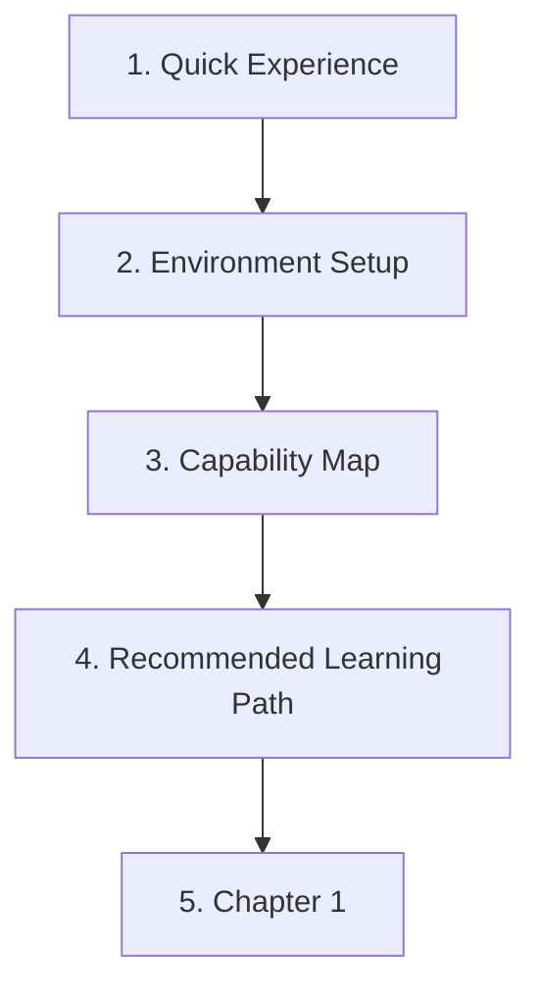

# Course Page Guide

This page answers one practical question: **which page should I open next?**

If you are new, do not read every intro page first. Start with a small win, prepare the minimum tools, then use the maps only when you need direction.

## First Pass: Open These in Order

| Step | Page | What to do |
| --- | --- | --- |
| 1 | [30-Minute AI Quick Experience](/intro/quick-experience) | Run one tiny AI example first. Do not study all terms yet. |
| 2 | [Environment Setup](/intro/environment-setup) | Prepare Python, VS Code, Git, and a project folder. Leave advanced tools for later. |
| 3 | [AI Full-Stack Capability Map](/intro/ai-fullstack-map) | Look at the picture and remember the main layers. |
| 4 | [Recommended Learning Path](/intro/learning-path) | Pick the default route unless you already have a strong reason to skip. |
| 5 | [Chapter 1: Developer Tools](/ch01-tools) | Start building a reproducible learning workspace. |

## The Course Structure in Plain Words

| Part | Meaning | How to use it |
| --- | --- | --- |
| Intro pages | Quick start, setup, map, route, and terms | Read only the first few pages first. Use the rest as reference. |
| Stage home page | Explains why a stage matters and what you will build | Read it before starting a new stage. |
| `0.0 Study Guide and Task Sheet` | Combines learning order, required tasks, and pass criteria | Keep it open while studying the stage. |
| Numbered lessons | Teach concepts, code, output, and common mistakes | Follow the order unless you are using them to fill a gap. |
| Workshop or stage project | Turns the stage into a runnable artifact | Do it after the main theory of that stage, not before. |
| Optional references | FAQ, troubleshooting, portfolio, career, and deeper routes | Open only when you are stuck or planning a project. |

## A Good Learning Rhythm

For most pages, use this loop:

1. Look at the picture or flow first.
2. Run the smallest code example.
3. Compare your output with the expected output.
4. Record one note: command, result, error, or screenshot.
5. Return to the project task.

This keeps the course from becoming a reading marathon. The goal is not “I have seen the page.” The goal is “I can run something, explain the result, and keep evidence.”

## When to Skim

Skim pages about badges, career paths, portfolio standards, long schedules, and optional routes on the first pass. They are useful, but they are not the starting line.

Read them later when you need to decide pace, prepare a portfolio, debug a blocker, or choose a specialization.

## If You Feel Lost

Ask one layer question first:

> Is my current blocker about tools, code, data, model behavior, LLM application logic, Agent actions, or deployment?

Then open the matching page:

| Blocker | Open first |
| --- | --- |
| Commands, folders, Git, Python environment | Chapter 1 and environment setup |
| Python syntax or script structure | Chapter 2 study guide |
| Data files, tables, charts | Chapter 3 study guide |
| Model concepts, metrics, evaluation | Chapters 4-6 |
| Prompt, RAG, LLM app behavior | Chapters 7-8 |
| Agent steps, tools, memory, permissions | Chapter 9 |
| Images, video, multimodal output | Chapter 12 |

When in doubt, go back to the current stage's `0.0 Study Guide and Task Sheet`, finish the minimum task, and move forward.
