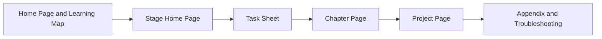

# Course Page Guide

As the course content becomes richer, each stage will include a stage home page, study guide, task sheet, chapter pages, and project pages. These are not duplicate content; they serve different learning actions. You do not need to read every page from start to finish each time. Instead, choose the entry point based on your current goal.

## One-Page Overview: How the Pages Work Together



| Current goal | Where to look first |
|---|---|
| Not sure where to start | Home page, quick start, recommended learning path |
| Preparing to enter a new stage | Stage home page, study guide, task sheet |
| Want to move a project forward quickly | Task sheet, project page, delivery criteria |
| Running into errors or unfamiliar terms | Troubleshooting index, glossary, FAQ |

## Role of Each Page

| Page type | Main purpose | When to read it |
| --- | --- | --- |
| Home page | Quickly get started with the whole course | When entering the course for the first time, or when you do not know where to begin |
| Learning map | Understand the roadmap, projects, terms, troubleshooting, and portfolio requirements | Before starting to learn, or when you need to re-plan your path |
| Stage home page | Decide what this stage teaches, why it matters, and how it connects to previous and next stages | Before entering a new stage |
| Study guide | Arrange the order and method for studying the chapters | When preparing to study a stage systematically |
| Stage task sheet | Clarify the exercises, projects, and pass criteria for the stage | Revisit repeatedly during the learning process |
| Chapter page | Learn specific concepts, code, and practical methods | Read chapter by chapter in order, or use it to fill knowledge gaps |
| Project page | Turn what you learned into a runnable deliverable | When completing stage exercises or building portfolio work |
| Appendix and glossary | Look up concepts, resources, troubleshooting, and extra references | When you hit a blocker or see unfamiliar terms |

If this is your first time learning, the recommended order is: Home page → Quick Start → AI Full-Stack Capability Map → Recommended Learning Path → Stage Home Page → Stage Task Sheet → Chapter Pages → Project Pages. After that, for each new stage, repeat the rhythm of “Stage Home Page + Task Sheet + Chapters + Project.”

## How to Avoid Repetitive Reading

If you just want to move forward quickly, prioritize the task sheet and project page. The task sheet tells you the minimum deliverable, and the project page tells you how to turn the knowledge into a real artifact. If you cannot complete a task, go back to the relevant chapter to review the concept and code.

If you already have relevant experience, you can first read the stage home page and task sheet, then jump directly to the project page. For example, if you already know Python, you do not need to read every Python basics chapter word for word. Instead, complete the command-line tool, file I/O, and API mini-projects, and confirm that there are no critical gaps.

If you are preparing a portfolio, prioritize the project roadmap, AI learning assistant growth path, portfolio evaluation checklist, and graduation project design guide. Chapter content is support material; the project deliverables are the main thread.

## Three Learning Modes

The quick start mode is suitable for people who want to get something running first. You only need to complete the minimum output in each stage task sheet and do not need to go deep into every theory. This mode helps you build positive feedback quickly.

The systematic learning mode is suitable for people who want to build complete AI full-stack capability. You should follow the stage home pages and study guides, complete the task sheet for each stage, and finish at least one stage project.

The portfolio mode is suitable for people whose goal is job hunting, career transition, or showcasing their work. You should iterate around one continuous project and keep every stage’s output in the README, experiment log, screenshots, test set, and failure samples.

## Page Maintenance Principles

When adding new content later, try to keep this division of responsibilities. The stage home page is for positioning, the study guide is for sequence, the task sheet is for delivery, the chapter pages are for knowledge, the project page is for the final work, and the appendix is for reference. This way, the course becomes richer as content grows, not more chaotic.

## Standard Structure for Stage Home Pages

To make each stage read more consistently, a stage home page should ideally handle six things: explain the stage focus, provide a learning challenge map, separate the beginner minimum path from the advanced path, list the stage learning route, clarify the stage project and deliverables, and finally provide the pass criteria.

| Module | Purpose | What not to write it as |
|---|---|---|
| Stage focus | Explain what problem this stage solves | Do not just list tool names |
| Learning challenge map | Show how the knowledge connects through a flowchart | Do not replace detailed chapters |
| Beginner/advanced path | Reduce decision cost for learners with different backgrounds | Do not make everyone learn to the same depth |
| Learning route | Tell learners which chapter to read first and which to read next | Do not simply copy the chapter titles |
| Stage deliverables | Clarify the minimum version and portfolio version evidence | Do not just write “complete the project” |
| Pass criteria | Decide whether the learner can move to the next stage | Do not use “finished reading the course” as the criterion |

If a stage home page is too short, prioritize adding the “beginner minimum pass path,” “stage project,” “stage deliverables,” and “stage pass criteria.” If a stage home page is too long, move details into the study guide, task sheet, or project page.

## Standard Closing Template for Chapter Pages

A chapter page should explain one concept clearly, but it should not stop at “the concept has been explained.” To help learners leave each lesson with a verifiable action, key chapter pages should keep four short modules at the end.

| Closing module | Purpose | Minimum format |
|---|---|---|
| Minimum exercise for this section | Turn the concept into an executable action | Provide 1 command, code snippet, or check task |
| Common failure points | Tell learners where they are most likely to go wrong | List 2–4 symptoms, causes, and fix directions |
| Relationship to the stage project | Explain which project capability this section supports | Connect it to the task sheet, project page, or an ongoing project version |
| Check before moving to the next section | Prevent “I read it but still cannot use it” | Use 3 questions to confirm whether they can continue |

When chapter content is long, keep the closing modules short. Do not turn them into another large block of explanation. Their goal is to remind learners: after finishing this section, what should they be able to run, explain, and record?

A sample structure can look like this:

~~~md
## Minimum Exercise for This Section

Use the method from this section to process a minimal example, and save the input, output, and run command.

## Common Failure Points

| Symptom | Common cause | Fix direction |
|---|---|---|
| The example does not run | Path or dependency mismatch | Go back to the README and check the working directory and environment |

## Relationship to the Stage Project

The capability from this section will be used in a module of the stage project, such as data cleaning, model evaluation, Prompt versioning, or Agent trace.

## Check Before Moving to the Next Section

Can you reproduce the example in this section on your own? Can you explain why the output looks like this? Have you recorded one failure case or boundary case?
~~~

## Reading Tags: Required, Project Reference, and Optional Deep Dive

As the course grows, learners should not be led to believe that every page needs the same level of close reading. When maintaining chapters later, it is recommended to add three kinds of tags to the stage home page, study guide, or chapter list.

| Tag | Meaning | Applicable pages |
|---|---|---|
| Required | Must be understood in the first pass; otherwise later learning will often get stuck | Basic concepts, core workflows, key evaluation methods |
| Project reference | Come back to this when building a project; the first pass can be a quick skim | API parameters, deployment details, framework comparisons, extension tips |
| Optional deep dive | Learn later if you are interested in the topic or need it for a portfolio | Advanced algorithms, frontier methods, complex optimization, industry topics |

Each stage home page can add a small “How to Read It the First Time” table that divides the stage chapters into these three categories. This does not remove content, but it does reduce learning pressure.

After each edit to course content, navigation, or new pages, it is recommended to run the following in the project root:

```bash
npm run validate:docs
```

This command checks Markdown code blocks, internal links, sidebar document references, and the syntax of `sidebars.js`. If it fails, first fix the issues according to the FAIL output, then continue submitting.

After validation passes, run:

```bash
npm run clean
```

This command clears the Docusaurus-generated cache and build artifacts, preventing old paths, old pages, or local temporary paths from remaining in `.docusaurus` or `build`. After completing these two steps, making the Git commit will be more stable.
