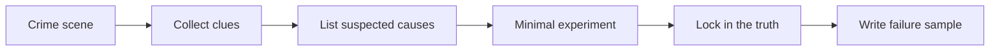

# Debug Detective Mission Set


Debug is not where learning fails; it is where engineering learning truly begins. Many beginners find it boring because tutorials only show the success path. But in real projects, the most valuable skill often comes from asking, “Why didn’t it work as expected?”

This page turns common errors into detective missions. Each mission includes the case, clues, suspected causes, investigation steps, the truth, and a repair record. You can guess first, then check the suggested debugging direction.

## First, identify which type of case it is

| Symptom | First things to suspect |
|---|---|
| Command not found, environment inconsistent | Directory, PATH, dependencies, virtual environment |
| File opens but the program cannot understand it | Encoding, format, empty file, broken JSON |
| Data column missing or results look strange | Column names, separators, missing values, duplicates, leakage |
| Model score is unusually high or unusually low | Split method, baseline, metrics, data quality |
| LLM output format drifts | Prompt constraints, schema, validation, and retries |
| RAG answer has no source | Retrieval, chunking, metadata, citation checks |
| Agent does not stop or overreaches permissions | Tool permissions, max steps, stop conditions, human confirmation |

## How to play the detective mission

When you hit a case, do not rush to the answer. Follow these four steps first: save the full symptom, propose 2–3 suspected causes, eliminate them with a minimal experiment, and finally write the truth into a repair record.



Each detective mission should leave behind an evidence file, such as `failure_cases.md`, `debug_notes.md`, `retrieval_logs.jsonl`, `agent_traces.jsonl`, or a troubleshooting note in the README.

## Case 1: The missing command

| Item | Content |
|---|---|
| Crime scene | After typing `python`, `pip`, `npm`, or `docusaurus` in the terminal, it says command not found |
| Clues | It sometimes works on the same computer and sometimes does not; the behavior changes after switching terminals |
| Suspected causes | Command not installed, PATH not taking effect, not in the project root, virtual environment not activated |
| Investigation steps | Run `pwd`, `which python`, `python --version`, `npm --version` to confirm the current directory and tool locations |
| Truth direction | It is an environment and path issue, not a code logic issue |
| Repair evidence | Add installation commands, running directory, and version notes to the README |

This case trains environment awareness. For beginners, the first step is not writing complex code, but knowing which directory you are in, which interpreter you are using, and which command you are running.

## Case 2: The JSON treasure chest that won’t open

| Item | Content |
|---|---|
| Crime scene | The program throws `JSONDecodeError` when reading `tasks.json` |
| Clues | The file exists, but after opening it, you find a missing bracket, an extra comma, or an empty file |
| Suspected causes | The file was manually broken, writing was interrupted, or JSONL was read as JSON |
| Investigation steps | Use a minimal script with `json.loads` to read a small piece of content, check whether the file is empty, and confirm whether the format is JSON or JSONL |
| Truth direction | The data file format is broken, and the program lacks exception handling |
| Repair evidence | Add broken-file hints, backup logic, or rebuilding logic |

This case trains input defense. In real projects, files, APIs, and user input can all break, and the program must not only work on ideal input.

## Case 3: The missing DataFrame column

| Item | Content |
|---|---|
| Crime scene | Pandas raises `KeyError: 'minutes'` or says a column does not exist |
| Clues | The CSV looks like it has that column, but the program cannot read it |
| Suspected causes | Column name has spaces, different capitalization, wrong separator, wrong header row, or encoding issues |
| Investigation steps | Print `df.columns.tolist()`, check `df.head()`, and confirm the `read_csv` parameters |
| Truth direction | It is a data reading and field normalization problem |
| Repair evidence | Add column cleaning, a data dictionary, and reading parameter documentation |

This case trains first-glance data inspection. Before analyzing, checking column names, row counts, missing values, and samples is more important than jumping straight into modeling.

## Case 4: A model score that is too good to be true

| Item | Content |
|---|---|
| Crime scene | The model accuracy is 99%, but it becomes unstable with slightly different data |
| Clues | Features may include the answer, training and test sets may overlap, or the split happens after the wrong step |
| Suspected causes | Data leakage, duplicate samples, target variable included in features, evaluation set too small |
| Investigation steps | Check whether train/test were split first, remove suspicious features, train a Dummy baseline, and compare duplicate samples |
| Truth direction | The score is not trustworthy; the model is not actually that strong |
| Repair evidence | Leakage check records, baseline metrics, and bad sample analysis |

This case trains evaluation awareness. A nice-looking score does not always mean a good model; being able to explain where the score comes from is the real skill.

## Case 5: The JSON drift incident

| Item | Content |
|---|---|
| Crime scene | The LLM sometimes outputs valid JSON, sometimes adds an explanation, and sometimes misses fields |
| Clues | The Prompt only says “please output JSON,” but there is no field schema, example, or validation |
| Suspected causes | Constraints are too weak, output is not validated, there is no failed retry, and the test inputs are too few |
| Investigation steps | Fix 10 inputs, save the raw outputs, and validate with a JSON parser and schema |
| Truth direction | Prompt is not a one-time copywriting task; it is a component that must be tested |
| Repair evidence | Prompt version table, schema pass rate, and failure samples |

This case trains Prompt engineering reliability. One success does not mean stability; only a fixed test set can show the real problem.

## Case 6: RAG cannot find evidence

| Item | Content |
|---|---|
| Crime scene | The user asks something clearly covered in the docs, but the RAG system answers off-topic or says it does not know |
| Clues | Retrieval did not hit the correct chunk, or it hit one but metadata was lost |
| Suspected causes | Documents were not imported, chunk size is too large or too small, query wording does not match, top-k is too small, or the embedding is not suitable |
| Investigation steps | Temporarily turn off generation and only print retrieval results; search using keywords from the original text; check chunk content and metadata |
| Truth direction | Retrieval already failed before generation |
| Repair evidence | `retrieval_logs`, chunk samples, `eval_questions`, and failure type statistics |

This case trains layered RAG debugging. Look at retrieval first, then generation, then citations. Do not blame everything on the model.

## Case 7: The citation hallucination case

| Item | Content |
|---|---|
| Crime scene | The RAG answer looks correct, but the cited passages do not actually support it |
| Clues | The answer may come from the model’s general knowledge rather than the retrieved materials; the citation is just decoration |
| Suspected causes | The Prompt does not require sentence-level grounding, citation granularity is too coarse, and the retrieved chunks do not align with the answer |
| Investigation steps | Label the supporting passage for each answer sentence and add a `citation_ok` field |
| Truth direction | Having a citation does not mean the answer is supported by evidence |
| Repair evidence | `citation_check.csv`, failed questions, and the repaired Prompt |

This case trains factual consistency. A portfolio RAG project must show citation checks, not just answers.

## Case 8: The Agent spinning in place

| Item | Content |
|---|---|
| Crime scene | The Agent keeps repeating plans and calling the same tool without ever finishing |
| Clues | The thought and observation at each step are very similar, and the goal has no completion condition |
| Suspected causes | The task is too broad, the stop condition is unclear, the tool returns unclear results, or there is no max step limit |
| Investigation steps | Limit the run to 3 steps, and print `action`, `input`, `observation`, and the `done` decision |
| Truth direction | The Agent lacks boundaries; it is not that the model needs more freedom |
| Repair evidence | `agent_traces.jsonl`, stop condition notes, and trace comparisons before and after the fix |

This case trains controllable Agent design. The more an Agent can act, the more it needs boundaries.

## Case 9: The quietly over-privileged tool

| Item | Content |
|---|---|
| Crime scene | The Agent called a delete, send, write, or external operation that it should not have called |
| Clues | Tool descriptions have no risk levels, the system has no human confirmation, and tests only cover the success path |
| Suspected causes | The tool allowlist is too broad, permissions are not tiered, there is no dry-run, and there are no audit logs |
| Investigation steps | Classify tools into read-only, write, send, and delete levels; high-risk tools should require human confirmation by default |
| Truth direction | It is a permission design problem, not something a single Prompt can fully solve |
| Repair evidence | Tool permission table, over-privilege test cases, and human confirmation screenshots or logs |

This case trains safety boundaries. If a portfolio Agent project can show how it prevents over-privileged actions, it will be much more convincing than simply showing automation.

## Case 10: Works on my machine, not on yours

| Item | Content |
|---|---|
| Crime scene | It works on your computer, but fails when a classmate or deployment environment tries it |
| Clues | The README is missing dependencies, environment variables, data files, startup directory, or versions |
| Suspected causes | Implicit dependencies, local absolute paths, sample data not committed, missing `.env.example` |
| Investigation steps | Clone into a clean directory and run from scratch according to the README |
| Truth direction | The project delivery is incomplete; it is not that the user does not know how to use it |
| Repair evidence | Update the README, dependency files, `.env.example`, and startup logs |

This case trains delivery awareness. Making it run on your own machine is only the first step; being reproducible by others is what makes it a portfolio project.

## Detective notes template

```md
## Case: RAG cannot find evidence

### Crime scene
The user asked “What is the difference between Agent and RAG?”, and the system gave a very general answer without citing the correct section.

### Known clues
The retrieval results only hit the RAG section and did not hit the Agent section.

### Suspected causes
The document import range was too narrow, metadata did not preserve stage information, and the query was not rewritten.

### Investigation steps
Turn off generation and only print the top-5 retrieval results; search again using the keywords “Agent tool calling” and “agent”.

### Truth
The index only imported ch08-rag and did not import ch09-agent.

### Fix
Expand the document import range and save stage and title in metadata.

### Regression check
Add this issue to eval_questions.csv.
```

The goal of the Debug Detective Mission Set is to make errors playable, inspectable, and reviewable. Each time you solve a case, you gain one more piece of real engineering experience.
