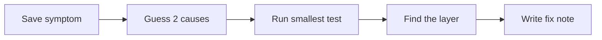

# Debug Detective Mission Set


Debug is not proof that you failed. It is how engineering skill grows.

When something breaks, do not jump to random fixes. Use the same investigation loop every time:



## Case Cards

| Case | Symptom | Check first | Evidence to keep |
| --- | --- | --- | --- |
| Missing command | `python`, `pip`, `npm`, or `docusaurus` not found | Current folder, PATH, installed version, active environment | terminal output and version notes |
| Broken JSON | `JSONDecodeError` | Empty file, missing bracket, extra comma, JSON vs JSONL | broken sample and recovery logic |
| Missing DataFrame column | `KeyError: 'minutes'` | `df.columns.tolist()`, separator, header row, spaces | cleaned column names and data dictionary |
| Too-good model score | Accuracy is suspiciously high | Data leakage, duplicate rows, target in features, baseline | baseline metrics and leakage check |
| LLM JSON drift | Output sometimes breaks the schema | Prompt examples, parser validation, retry logic | prompt version table and failed outputs |
| RAG misses evidence | Answer has no useful source | Print retrieval results before generation | retrieval logs and missed questions |
| Citation mismatch | Citation exists but does not support answer | Sentence-level support check | citation check table |
| Agent loops forever | Same tool or plan repeats | Max steps, stop condition, trace fields | `agent_traces.jsonl` |
| Tool over-permission | Agent calls write/send/delete too freely | Tool risk levels, allowlist, human confirmation | permission table and blocked-action test |
| Works only locally | Others cannot run the project | README, dependencies, `.env.example`, sample data | clean-run log |

## Minimal Repair Note

Use this template in `failure_cases.md`, `debug_notes.md`, or your README:

```md
## Case

Symptom:
What I expected:
What actually happened:
Suspected layer:
Smallest test:
Root cause:
Fix:
Regression check:
```

The goal is not to collect errors. The goal is to make the next similar error easier to locate.
