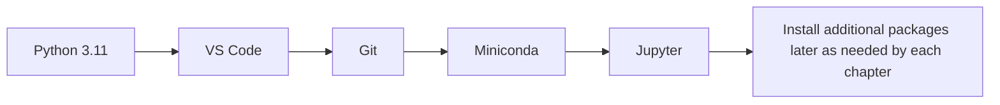

# Environment Setup

> **Goal:** Make sure your computer meets the requirements and understand which tools need to be installed
> **Note:** This is only an overview. Detailed installation steps for each tool are covered in the corresponding chapters of Part 1: Developer Tools Basics, with step-by-step tutorials.

---

## What beginners should install first



| Stage | Environment strategy |
|---|---|
| Chapters 1–5 | A regular computer is enough. First set up Python, VS Code, Git, and Miniconda |
| After Chapter 6 | Consider Colab, cloud GPUs, or a local GPU when you start needing deep learning |
| Chapters 8–9 | Focus on API keys, vector databases, logging, and environment variables |
| Chapter 12 | Add image, audio, and video tools as needed for multimodal projects |

## Hardware requirements

### Learning Chapters 1–5 (Tools + Python + Data Analysis + Math + ML)

Any computer that works normally is fine:

| Item | Minimum | Recommended |
|-------|---------|-------------|
| CPU | Any dual-core | 4 cores or more |
| Memory | 4GB | 8GB or more |
| Storage | 20GB free space | SSD, 50GB free |
| GPU | **Not required** | Not required |
| Operating system | Windows 10/11, macOS 10.15+, Ubuntu 20.04+ | Any of these |

:::tip
If your computer is very old, don’t worry. All code in Chapters 1–5 can run on [Google Colab](https://colab.research.google.com) with just a browser.
:::

### Starting from Chapter 6: Deep Learning and Transformer Basics

To train neural networks starting in Chapter 6, you will need a GPU:

| Option | Description | Cost | Recommendation |
|------|------|------|:---:|
| **Google Colab** | Free T4 GPU, zero setup | Free (Pro version $10/month) | ⭐⭐⭐⭐⭐ |
| **AutoDL** | Cloud GPU service in China, billed by the hour | About 2–3 yuan/hour | ⭐⭐⭐⭐ |
| **Local NVIDIA GPU** | VRAM ≥ 8GB | One-time investment | ⭐⭐⭐ |

:::info No need to buy a GPU in advance
It usually takes about 4–6 months to finish Chapters 1–5. Only when you reach Chapter 6: Deep Learning and Transformer Basics should you start thinking about a GPU. The course includes a detailed [hardware and cloud resources guide](/appendix/hardware) before you enter the deep learning section.
:::

---

## Software list

Below is the software used throughout the course, listed by stage. **Right now, you only need to install the first two items**. The others can wait until you reach those stages.

### Needed now (Part 1: Developer Tools Basics shows you how to install them)

| Software | What it is | Why you need it |
|------|-------|----------|
| **Python 3.10+** | Programming language | All code is written in Python |
| **VS Code** | Code editor | Write code, debug, and browse files |
| **Git** | Version control tool | Manage code and upload to GitHub |
| **Miniconda** | Python environment manager | Create isolated virtual environments to avoid package conflicts |

### Needed for Part 2: Python Programming Basics

| Software/Library | Purpose |
|---------|------|
| `requests` | Send HTTP requests (web scraping, API calls) |
| `beautifulsoup4` | Parse HTML (web scraping) |
| `fastapi` + `uvicorn` | Develop Web APIs |

### Needed for Part 3: Data Analysis and Visualization

| Software/Library | Purpose |
|---------|------|
| **Jupyter Notebook** | Interactive programming environment (a must-have for data analysis) |
| `numpy` | Scientific computing |
| `pandas` | Data processing |
| `matplotlib` + `seaborn` | Data visualization |

### Needed for Part 6: Deep Learning and Transformer Basics

| Software/Library | Purpose |
|---------|------|
| `torch` (PyTorch) | Deep learning framework |
| `torchvision` | Image-related tools |
| CUDA Toolkit (for local GPU users) | GPU acceleration |

### Install as needed in later stages

| Software/Library | Stage | Purpose |
|---------|------|------|
| `transformers` | 7 / 11 | Hugging Face pretrained models |
| `langchain` | 8 / 9 | Framework for building LLM applications |
| `docker` | 8 | Containerized deployment |
| `chromadb` / `faiss` | 8 | Vector databases |
| `openai` / `anthropic` | 8 | Large model API calls |

---

## Recommended environment setup

For the earlier chapters, you can install packages gradually as each chapter requires them.
But if you want to learn steadily from Chapter 6: Deep Learning and Transformer Basics all the way through Chapter 9: AI Agents and Intelligent Agent Systems, and Chapter 12: AIGC and Multimodality, a safer approach is to prepare a complete “course example environment” up front.

Two dependency files have already been added to the repository root:

| File | Scope |
|------|----------|
| `requirements-course-core.txt` | Chapters 1–5 + most traditional machine learning / engineering examples |
| `requirements-course-ai.txt` | Common deep learning / Transformers / LLM dependencies needed after Chapter 6: Deep Learning and Transformer Basics |

### Recommended installation order

First create a new conda environment:

```bash
conda create -n ai-course python=3.11 -y
conda activate ai-course
```

Then install the basic dependencies:

```bash
pip install -r requirements-course-core.txt
```

If you are ready to study Chapter 6: Deep Learning and Transformer Basics and beyond, install the AI-related dependencies too:

```bash
pip install -r requirements-course-ai.txt
```

:::warning About PyTorch
`requirements-course-ai.txt` already includes `torch`.
If you are using:

- an NVIDIA GPU
- Apple Silicon
- or a specific CUDA version

it is better to first install the PyTorch version that matches your machine according to the official PyTorch installation instructions, and then install the other libraries in this file.
:::

### A more reliable practice

The `pip install ...` commands in later course pages can still be used on their own,
but if you plan to systematically work through the full main track, it is better to maintain one unified environment first. This helps avoid:

- package version conflicts from installing dependencies separately in each chapter
- situations where you understand the examples but cannot run them locally

---

## Choosing a Python version

**Python 3.11 is recommended.** Why?

- Python 3.11 is 10–60% faster than 3.10
- All mainstream AI libraries currently support Python 3.11
- Python 3.12/3.13 are too new, so some libraries may not be fully compatible yet

:::warning Do not use Python 3.8 or lower
Many newer AI libraries no longer support Python 3.8/3.9. If you already have an older Python installed on your computer, you do not need to uninstall it. Just use Miniconda to create a new Python 3.11 environment (Part 1: Developer Tools Basics will show you how).
:::

---

## Operating system notes

### Windows users

- It is recommended to install **Windows Terminal** (built into Windows 11; download it from the Microsoft Store on Windows 10)
- For the command line, **PowerShell** or **Git Bash** is recommended
- If you run into Python package installation problems, use Miniconda first

### macOS users

- It is recommended to install the **Homebrew** package manager
- macOS includes Python 2 by default—do not use it. Install Python 3.11 through Miniconda
- PyTorch support for Apple Silicon (M1/M2/M3/M4) is already very good, and you can use MPS acceleration

### Linux (Ubuntu) users

- Most AI tools work best on Linux
- Ubuntu 22.04 LTS is recommended
- Installing NVIDIA GPU drivers may require a few extra steps (covered in Part 1: Developer Tools Basics)

---

## Network environment

Some resources require access to the global internet:

| Resource | Global internet required? | Alternative |
|------|:---:|---------|
| Google Colab | Yes | AutoDL, local Jupyter |
| GitHub | Required in some regions | Gitee as a mirror |
| HuggingFace | Required in some regions | HuggingFace mirror site |
| PyPI (pip sources) | No, but overseas mirrors may be slow | Use Tsinghua or Alibaba mirrors |
| OpenAI API | Yes | Domestic LLM APIs (Qwen, DeepSeek) |

### Configure a domestic pip mirror in China (recommended)

If you are in China, `pip` package installation can be very slow. Run the following command to configure the Tsinghua mirror once and for all:

```bash
pip config set global.index-url https://pypi.tuna.tsinghua.edu.cn/simple
```

After that, all `pip install` commands will download from the Tsinghua mirror, which is much faster.

---


:::tip Don’t be afraid of environment issues
Setting up the environment is a “pain” every developer has to go through. If you get stuck:
1. Copy the full error message
2. Paste it into Google search (English search usually works better)
3. 99% of environment issues have already happened to someone else, and Stack Overflow will almost certainly have an answer
4. If nothing works, continue learning with Google Colab and solve the environment issues later
5. If code in chapters after Chapter 5: Machine Learning Basics does not run, first check whether you have installed the dependencies according to the unified environment plan above
:::
