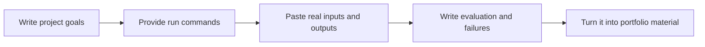

# Experiment Log and README Templates

When building AI projects, code is only part of the work. What truly demonstrates your ability is: why you made those choices, how you verified them, what failed, and what you plan to change next. The templates below can be copied directly into the README for each stage of the project.

## Understand the template at a glance



| Template section | Most commonly missed content |
|---|---|
| README | Example inputs/outputs and known limitations |
| Experiment log | Configuration, metrics, failure cases |
| RAG/Agent log | Retrieval logs, trace, tool calls |
| Retrospective | Why it failed, how to verify next |

## Project README template

````md
# Project Name

## Project Goal

What problem does this project solve? What is the user input, and what is the system output?

## How to Run

```bash
python main.py
```

## Example Input and Output

Input:

```text
Put a real input here
```

Output:

```text
Put the system output here
```

## Project Structure

```text
project/
  main.py
  data/
  README.md
```

## Method Overview

What data, model, tool, or API did you use? Why did you choose it?

## Evaluation Method

What metrics are used to judge performance? What is the baseline? Are there any error samples?

## Problems Encountered

Record at least one environment, data, model, interface, or engineering issue, and how you investigated it.

## Next Steps

What will you improve in the next version? Why?
````

If the project has already reached the Prompt, RAG, Agent, or capstone stage, the README should also show the engineering loop, not just how to run it.

````md
## System Flow

User input -> Prompt / RAG / Agent -> Tool or knowledge base -> Model output -> Validation and logs

## LLM Call Layer

- Model:
- Prompt version:
- Structured output schema:
- Error handling: timeout / retry / fallback
- Cost tracking: tokens / latency

## RAG Layer

- Source materials:
- Chunking strategy:
- Metadata fields:
- Retrieval strategy: keyword / vector / hybrid / rerank
- Citation checking method:

## Agent / Tool Layer

- Tool list:
- Tool schema:
- Maximum steps:
- Human confirmation boundary:
- Trace example:

## Evaluation Results

| Experiment | Configuration | Metrics | Failure cases | Conclusion |
|---|---|---|---|---|
| baseline |  |  |  |  |
| exp-1 |  |  |  |  |

## Known Limitations

- Data scope:
- Model limitations:
- Cost / latency limitations:
- Safety boundaries:
````

This enhanced template is suitable for stage 8b, stage 9, and capstone projects. It helps others see that you can do more than call a model—you can design AI applications that are observable, measurable, and easy to review.

## Experiment log template

| Field | Content |
|---|---|
| Experiment date | For example, 2026-04-26 |
| Experiment goal | What you want to verify this time |
| Data / input | What data or samples were used |
| Method / configuration | Model, Prompt, parameters, tool version |
| Result | Metrics, screenshots, output samples |
| Failure cases | Which samples performed poorly |
| Conclusion | What you learned from this round |
| Next step | How you will change things next round |

## AI application experiment log template

When a project involves LLMs, Prompt, RAG, or Agent, it is recommended to use a more detailed experiment table.

| Field | Example | Description |
|---|---|---|
| `experiment_id` | `rag_exp_003` | Unique ID for each experiment |
| `goal` | Improve retrieval hit rate for synonym-based queries | The problem this experiment aims to solve |
| `baseline` | Keyword retrieval top-k=3 | What the control group is |
| `change` | Add query rewrite | Only change one main variable in this experiment |
| `prompt_version` | `qa_v2` | If the Prompt changed, record the version |
| `retrieval_config` | hybrid, top-k=5, rerank=true | RAG configuration |
| `agent_config` | max_steps=4, tools=search/read | Agent configuration |
| `metrics` | Hit@3=0.82, citation_ok=0.76 | Metric changes |
| `latency_cost` | avg_latency=1.2s, avg_tokens=900 | Cost and latency |
| `fixed_cases` | Fixed 6 refund-related synonym queries | Which failure cases improved |
| `new_failures` | 2 certificate-related issues were wrongly rewritten | New side effects |
| `decision` | Keep it, but restrict rewrite rules | Whether to adopt this change |

## Error sample log template

| Sample | Expected result | Actual result | Possible cause | Improvement direction |
|---|---|---|---|---|
| Example 1 | Should answer A | Actually answered B | Retrieval missed the target | Adjust chunking or query rewrite |

## AI application failure case template

| Field | Example |
|---|---|
| User input | “Can I still get a refund in my case?” |
| Expected result | Match the refund policy and explain the 7-day rule and study-progress conditions |
| Actual result | Only answered “You can apply for a refund,” and missed the conditions |
| Failure stage | generation / citation |
| Related logs | request_id=`req_001`, source=`refund_policy` |
| Possible cause | The prompt did not ask to preserve restriction conditions |
| Fix action | Add a `conditions` field to the output format |
| Regression test | Add `eval_questions.csv` and test it every time afterward |

## Recommended minimum project log files

After entering the AI application stage, it is recommended to keep at least these files. Not every project must have all of them, but the closer you are to a portfolio, the more these pieces of evidence should be visible.

```text
logs/
├── llm_calls.jsonl
├── retrieval_logs.jsonl
├── agent_traces.jsonl
├── tool_calls.jsonl
└── safety_audit.jsonl

reports/
├── baseline.md
├── failure_cases.md
└── improvement_record.md
```

## Why you should keep recording

If you only keep the final code, it is hard for others to see your growth process. Recording experiments, failures, and improvements can prove that you are not just able to run a demo—you can iterate on a system like an engineer.
