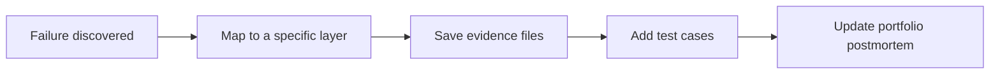

# Index of Failure Cases and Evaluation Templates

AI projects should not only showcase success stories. The closer you get to a portfolio-worthy project, the more you need to explain: under what inputs the system fails, which layer the failure belongs to, how to reproduce it, and how to regression test after fixing it. This page brings together the failure cases and evaluation templates scattered throughout the course into one index, so you can quickly find what you need while building projects.

## First look at the diagram: from failure to evaluation materials



| What you have on hand | What to check first |
|---|---|
| Error messages and command output | Environment, Python, deployment layers |
| Wrong answers or hallucinations | Prompt, RAG, citation checks |
| Tool misuse or endless loops | Agent, tool permissions, trace |
| Abnormal metrics or unstable results | Data, model, evaluation set |

## Check by failure layer

| Failure layer | Common symptoms | Review first | Evidence to keep |
|---|---|---|---|
| Environment and tools | Command not found, dependency conflicts, Git commit failure | 1 Developer tools basics, environment setup, troubleshooting index | Command logs, environment versions, error screenshots |
| Python programs | Wrong file path, JSON parsing failure, confusing function logic | 2 Python programming basics | Input/output examples, exception logs, fix records |
| Data analysis | Missing data, duplicates, or outliers make conclusions untrustworthy | 3 Data analysis and visualization | Data dictionary, cleaning logs, chart explanations |
| Math and metrics | Similarity, probability, loss, or metrics are hard to explain | 4 AI math basics, 5 machine learning | Small experiments, metric explanations, postmortem notes |
| Machine learning | Data leakage, overfitting, unclear baseline | 5 Machine learning | train/test split, baseline, error samples |
| Deep learning | shape mismatch, loss not decreasing, insufficient GPU memory | 6 Deep learning and Transformer | training logs, curves, config files |
| Prompt | JSON parsing failure, missing fields, label drift | 7 LLM principles and Prompt | Prompt versions, fixed test cases, schema |
| RAG | Retrieval fails, citations are unsupported, answer hallucinations | 8 LLM applications and RAG | chunks, retrieval logs, eval questions |
| Agent | Wrong tool chosen, looping, permission overreach, missing trace | 9 AI Agent | tool schema, agent trace, safety boundaries |
| Multimodal | OCR errors, uncontrollable generation, copyright or portrait rights risks | 10 computer vision, 11 natural language processing, 12 AIGC and multimodal | source materials, manual review, export restrictions |
| Deployment and operations | Works locally but fails online, costs are uncontrollable | Engineering, graduation project guide | `.env.example`, logs, monitoring and rate-limiting notes |

## Prepare evaluation materials by project type

| Project type | Minimum evaluation materials | Portfolio-level evaluation materials |
|---|---|---|
| Python utility | 3 command input/output examples | Test cases for normal, error, empty input, file corruption, and more |
| Data analysis project | A data quality checklist | Data dictionary, before/after cleaning comparison, limitations of conclusions |
| Machine learning project | train/test metrics and baseline | Cross-validation, error samples, feature leakage checks |
| Deep learning project | loss curves and validation metrics | Config records, training logs, confusion matrix, failed images or text |
| Prompt project | fixed input-output comparisons | Prompt version table, schema validation, regression test set |
| RAG project | 10 fixed questions and source checks | gold_doc, gold_answer, citation_ok, failure-type statistics |
| Agent project | 3–5 fixed tasks | Completion rate, average steps, tool error rate, permission overreach tests, and cost |
| Multimodal project | one complete end-to-end example from material to output | Success cases, failure cases, edge cases, manual editing and review records |
| Graduation project | 20–50 fixed test questions or tasks | baseline, optimization records, failure attribution, and demo script |

## Recommended file naming

It is recommended that each project keep at least one `reports/` or `evals/` directory. Keeping file names consistent will make portfolio organization much easier later.

```text
reports/
├── baseline.md
├── failure_cases.md
├── improvement_record.md
└── demo_notes.md

evals/
├── eval_questions.csv
├── prompt_eval_cases.csv
├── agent_tasks.jsonl
└── citation_check.csv

logs/
├── llm_calls.jsonl
├── retrieval_logs.jsonl
├── agent_traces.jsonl
└── tool_calls.jsonl
```

## Minimum format for a failure sample

```md
## Failure sample title

- Input: the real input that triggered the failure
- Expected: what should have happened
- Actual: the system's actual output or action
- Layer: environment / data / model / Prompt / RAG / Agent / deployment
- Evidence: logs, screenshots, trace, retrieval snippets, or code location
- Cause: the most likely explanation at present
- Fix: what you plan to change
- Regression: which test case will prevent this from happening again
```

Failure samples do not need to be long, but they must be reproducible. A failure that cannot be reproduced is only an impression; a failure that can be reproduced, located, and regression tested is engineering evidence that belongs in a portfolio.

## Relationship to other template pages

If you need the complete README and experiment log format, see [Experiment Log and README Template](/intro/experiment-log-template). If you are working on an LLM, Prompt, RAG, or Agent project, see [AI Application Failure Sample Library](/intro/ai-failure-samples). If you are preparing a graduation project, see [Graduation Project Design Guide](/intro/graduation-project-guide).
