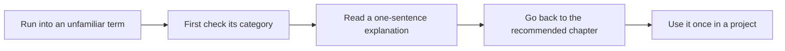

# AI Full-Stack Glossary

This glossary is not meant for memorization. It is here so that when you run into an unfamiliar term while reading the course, you can quickly check “what it means, where you should understand it first, and what it is easy to confuse it with.” If a concept still feels unclear for now, first understand what problem it solves, then come back to the relevant chapter for the details.

## Lookup path

| Term you see | Category to check first |
|---|---|
| Terminal, Git, API, JSON | Development basics |
| Features, labels, baseline, overfitting | Data and machine learning |
| Loss, Embedding, Attention, Token | Deep learning and large model basics |
| Prompt, RAG, Chunk, Citation | LLM, Prompt, and RAG |
| Agent, Tool, Trace, Guardrails | Agent and engineering |

## Development basics

| Term | Simple explanation | First recommended place to understand it |
| --- | --- | --- |
| Terminal | The entry point for interacting with the system using commands | Developer tools basics |
| Current directory | The location where commands are being executed; many path errors are related to it | Terminal and command line |
| Package manager | A tool for installing and managing dependencies, such as pip, npm, and conda | Development environment setup |
| Virtual environment | An environment that isolates Python dependencies for a project | Python environment |
| Git | A tool for tracking code version changes | Git and version management |
| Commit | A record of a code change that can be traced back later | Basic Git workflow |
| README | A project description file that tells others what the project is, how to run it, and how to verify it | Phase projects and portfolio |
| API | An interface for programs to exchange data and call capabilities | Python projects, LLM API calls |
| JSON | A common structured data format, suitable for APIs, configuration, and logs | Python files and API chapters |

## Data and machine learning

| Term | Simple explanation | Points that are easy to confuse |
| --- | --- | --- |
| Dataset | A collection of data used for analysis, training, or evaluation | A dataset is not the same as a training set; the training set is only part of it |
| Feature | Input information a model uses to predict or make decisions | More features is not always better; quality and leakage risk matter more |
| Label | The target a model is expected to predict in supervised learning | Classification labels and regression targets are different |
| Training set | The data used to let the model learn | It should not be used to represent final performance |
| Test set | The data used to evaluate generalization ability | It should not be repeatedly used for tuning |
| Validation set | The data used to choose models or tune parameters | Its role is different from the test set |
| Baseline | The simplest comparable starting model or rule | It is not a low-level approach, but a benchmark for judging whether improvements are effective |
| Data leakage | Information that the model should not have seen during training | It can make offline metrics look too high and real-world performance worse |
| Overfitting | The model memorizes the training data but cannot generalize to new data | A high training score does not mean the model is good |
| Recall | The proportion of truly relevant samples that are retrieved | Common in both RAG retrieval and classification tasks |
| F1 | A combined metric of precision and recall | More informative than accuracy when classes are imbalanced |

## Deep learning and large model basics

| Term | Simple explanation | First recommended place to understand it |
| --- | --- | --- |
| Tensor | A multi-dimensional array, the basic data structure of deep learning frameworks | PyTorch basics |
| Loss | The gap between the model’s prediction and the true target | The neural network training loop |
| Backpropagation | The process of computing how parameters should be adjusted based on the loss | Neural network basics |
| Optimizer | An algorithm that updates parameters based on gradients | PyTorch training loop |
| Embedding | Mapping text, images, or categories into vector representations | NLP, RAG, vector retrieval |
| Attention | A mechanism that helps the model decide which parts of the input matter more | Transformer basics |
| Transformer | An important foundational architecture for modern large models | Deep learning and Transformer |
| Token | The basic unit of text that a model processes | Large model principles and Prompt |
| Context Window | The length of context a model can see at one time | LLM application development |
| Pretraining | Learning general capabilities in advance on large-scale data | Large model pretraining |
| Fine-tuning | Continuing to train a model on specific data to adapt it to a task | Fine-tuning chapter |
| Alignment | Making model outputs more aligned with human intent, safety, and rules | Alignment chapter |

## LLM, Prompt, and RAG

| Term | Simple explanation | Points that are easy to confuse |
| --- | --- | --- |
| LLM | Large Language Model, capable of understanding and generating text | An LLM is not a complete application; it is only one core capability |
| Prompt | Task instructions, inputs, constraints, and output format given to the model | A Prompt is not magic; it is task design |
| System Prompt | A high-priority prompt that sets the model’s role, rules, and boundaries | Safety boundaries should not rely only on a normal user prompt |
| Structured Output | Making the model output JSON, tables, or fixed fields | It needs to work together with validation and retries |
| Function Calling | Making the model generate call arguments according to a tool schema | It does not execute the tool directly; execution is still controlled by the program |
| RAG | Retrieval-Augmented Generation, where external materials are retrieved and then given to the model for answering | RAG is not the same as a vector database; a vector database is only a common component |
| Chunk | A piece of text after document splitting | Too large hurts precision; too small loses context |
| Vector Database | A database for storing and retrieving vectors | It does not judge whether an answer is correct |
| Hybrid Search | Combining keyword search and vector search | Useful for balancing exact words and semantic similarity |
| Rerank | Reordering the initial retrieval results | Often used to improve the quality of the final context |
| Citation | The source referenced by an answer | Having a citation does not mean it truly supports the answer; it still needs to be checked |
| Hallucination | Content generated by the model that seems reasonable but is not reliable | RAG can reduce hallucinations but cannot completely eliminate them |

## Agent and engineering

| Term | Simple explanation | Points that are easy to confuse |
| --- | --- | --- |
| Agent | An AI workflow that can plan around a goal, call tools, and keep state | An Agent is not just a more talkative LLM; it is a system design |
| Tool | An external capability an Agent can call, such as search, calculation, or file operations | Tool permissions must be controlled |
| Memory | A mechanism for an Agent to store short-term or long-term context | More memory is not always better; contamination can create risks |
| Planning | The process of breaking a goal into steps | Plans need to be executable, stoppable, and reversible |
| Trace | A record of each step’s inputs, outputs, tools, and state in an Agent | An Agent without traces is hard to debug |
| Replay | Reproducing the execution process from a historical trace | Used for debugging and evaluation |
| Guardrails | Safety boundaries placed on inputs, outputs, tools, and permissions | You cannot rely only on the model to obey them on its own |
| Human-in-the-loop | Adding human review at key steps | Suitable for high-risk and irreversible operations |
| Observability | The ability to observe system logs, metrics, traces, and errors | It should not be added only after launch; it should start from the middle stage of the project |
| Deployment | Putting a project into an accessible environment | Successful deployment does not mean production readiness; monitoring and rollback are still needed |
| Evaluation | Judging how good a system is using samples, metrics, and human criteria | AI application evaluation usually needs both automatic metrics and human review |

## How to use the glossary

When you encounter an unfamiliar term, first see which category it belongs to, then go back to the corresponding stage and read on. Do not stop the whole learning flow just because one term is not clear yet. In your first pass, you only need to know what problem it solves, what its input and output are, and how it relates to the current project. When you actually use it in a project, you can then fill in the deeper principles and implementation details.
