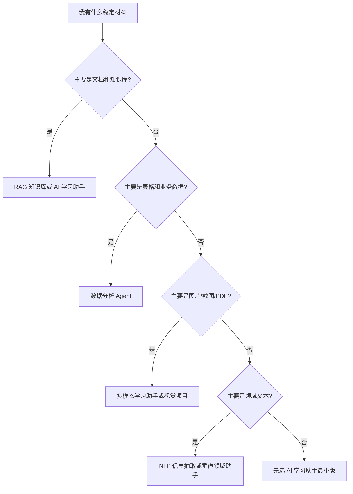

# 毕业项目设计指南


毕业项目不是再做一个更大的练习，而是把整套课程中学到的开发工具、Python、数据处理、机器学习、深度学习、LLM 应用、RAG、Agent、部署与评估串成一个完整作品。它的目标不是证明你“看过很多章节”，而是证明你能独立把一个真实问题拆成需求、数据、模型、系统、评估和迭代计划。

如果你不知道选什么题，优先选择贯穿课程的“AI 学习助手”。因为这个项目天然覆盖知识库处理、检索、问答、引用、学习计划、工具调用、日志、评估和部署，既能体现 AI 应用能力，也能体现工程化思维。

## 毕业项目应该解决什么问题

一个合格的毕业项目需要先说明用户是谁、问题是什么、为什么需要 AI、没有 AI 时怎么做、AI 加入后希望提升什么。不要一开始就写“我要做一个 RAG 系统”或“我要做一个 Agent”，因为 RAG 和 Agent 只是实现手段，不是项目目标。

更好的描述方式是：学习者在阅读课程时经常不知道先学哪一章、某个概念和前后章节有什么关系、遇到报错时应该查哪里，因此项目要提供一个课程问答与学习规划助手。它可以读取课程文档，回答问题时给出来源，按学习目标推荐路径，并在用户遇到卡点时生成排障步骤。

## 毕业项目选题决策树

如果你不知道该选哪个毕业项目，不要先问“哪个技术最热门”，而要先问“我最容易拿到什么材料、最容易定义什么评估标准、最想展示哪类能力”。可以按下面的顺序选择。



| 选择条件 | 推荐方向 | 最小闭环 | 评估重点 |
| --- | --- | --- | --- |
| 有课程文档、公司文档或知识库 | RAG / AI 学习助手 | 导入文档、检索、回答、引用 | 命中率、引用支持、无答案处理 |
| 有 CSV、Excel 或业务指标 | 数据分析 Agent | 读取数据、生成图表和报告 | 分析正确性、代码安全、图表解释 |
| 有图片、截图、PDF 或课件 | 多模态学习助手 | 提取视觉信息并结构化 | OCR/解析质量、不确定性、人工审核 |
| 有评论、合同、简历或客服文本 | NLP / 领域助手 | 分类、抽取或摘要 | 标签边界、字段准确率、事实一致性 |
| 想展示完整 AI 应用工程能力 | AI 学习助手 | RAG + 工具调用 + 日志 + 评估 | 可复现、可观测、可复盘 |

默认推荐仍然是 AI 学习助手，因为它能自然覆盖 Prompt、RAG、Agent、日志、评估和部署。如果你有明确行业材料，再选择垂直领域助手；如果你有视觉或创意素材，再选择多模态或 AIGC 项目。

## 学到后面卡住时怎么回流

毕业项目会暴露前面没学稳的地方。不要把卡住理解成失败，它正好告诉你该回看哪一站。

| 项目卡点 | 优先回看 | 你要补的能力 |
| --- | --- | --- |
| README 里的命令别人跑不通 | 1 开发者工具基础 | 环境、路径、依赖、Git 和可复现说明 |
| Python 脚本越写越乱 | 2 Python 编程基础 | 函数拆分、异常处理、模块组织和文件读写 |
| RAG 文档切分和数据处理混乱 | 3 数据分析与可视化 | 数据清洗、字段说明、数据质量记录 |
| Embedding、相似度或指标听不懂 | 4 AI 数学基础 | 向量、概率、梯度和评估直觉 |
| 模型分数不可信 | 5 机器学习 | baseline、数据划分、指标和错误分析 |
| 训练曲线看不懂 | 6 深度学习与 Transformer | loss、优化器、过拟合和训练诊断 |
| Prompt 输出不稳定 | 7 大模型原理与 Prompt | 结构化输出、Prompt 版本和固定测试样本 |
| RAG 答案错但不知道错在哪 | 8 LLM 应用与 RAG | 检索日志、引用检查、评估集和失败归因 |
| Agent 行为不可控 | 9 AI Agent | 工具 schema、trace、权限边界和人工确认 |
| 多模态结果无法交付 | 10 计算机视觉、11 自然语言处理、12 AIGC 与多模态 | 标注、素材来源、审核清单和导出格式 |

真正成熟的毕业项目不是一次做对，而是每次失败都能定位到具体层：数据、检索、Prompt、工具、模型、部署或评估。这个回流表可以作为项目复盘时的检查清单。


## 最小可交付版本

毕业项目的第一版应该控制范围，只做一条最短路径。以 AI 学习助手为例，最小版本只需要完成：读取一批 Markdown 课程文档，切分并建立索引，接收一个学习问题，返回答案和来源，保存一次问答日志，并提供 10 个固定测试问题。

这个版本不需要复杂 UI，不需要多 Agent，不需要长期记忆，也不需要自动规划所有学习任务。先让系统可运行、可观察、可评估，然后再扩展功能。毕业项目最常见的问题不是技术不够，而是范围太大，导致最后没有任何一个闭环真正可用。

## 标准版本结构

标准版本建议包含六个模块：数据接入、核心能力、交互入口、评估体系、可观测性和部署说明。

数据接入负责说明数据从哪里来、如何清洗、如何切分、如何更新。核心能力负责说明使用了哪些模型、检索策略、提示词、工具或 Agent 流程。交互入口可以是命令行、Notebook、Web 页面或 API。评估体系需要包含固定问题集、预期答案要点、引用检查和失败样本分析。可观测性需要记录请求、检索片段、模型输出、工具调用、耗时和错误。部署说明需要让别人能在新环境里复现运行。

## 挑战版本方向

当标准版本稳定后，可以选择一个挑战方向深入。不要同时做太多挑战项，否则容易失控。适合的挑战包括：加入用户学习画像和个性化路径，加入多轮对话记忆，加入工具调用来生成复习计划或练习题，加入权限与敏感内容过滤，加入自动评估面板，加入前端页面，或者把项目部署到云服务器。

挑战版本的价值不在于“功能更多”，而在于你能解释为什么增加这个功能、它解决了什么问题、带来了什么代价、如何评估它是否真的更好。

## README 必备内容

毕业项目的 README 应该让评审者不用问你也能理解项目。至少包含项目背景、目标用户、功能清单、架构图、运行方式、示例输入输出、评估方式、关键技术选择、失败样本、已知限制和下一步计划。

其中最容易被忽略的是失败样本和已知限制。作品集项目不需要假装完美。相反，能清楚说明系统在哪些问题上失败、为什么失败、下一步如何修复，往往更能体现工程能力。

## 评估与复盘标准

毕业项目至少准备 20 到 50 个测试问题或任务。对于 RAG 类项目，评估检索是否命中、答案是否引用来源、引用是否支持结论、回答是否出现幻觉。对于 Agent 类项目，评估任务是否完成、工具是否调用正确、步骤是否可追踪、失败后是否能恢复。对于多模态项目，评估输出质量、一致性、可控性和人工审核流程。

复盘时不要只写“效果不错”。更好的复盘方式是把成功样本、失败样本、边界样本分开，说明每类样本暴露了什么问题。比如检索没命中可能是切分策略问题，答案不准确可能是提示词约束不足，工具调用错误可能是工具描述不清，成本过高可能是模型选择或上下文策略不合理。

## 毕业项目能力整合清单

毕业项目最重要的是把前面学过的能力串起来，而不是孤立展示某一个技术点。一个 AI 全栈毕业项目至少应该能说明下面这些层分别做了什么。

| 能力层 | 最小要求 | 作品集级要求 |
| --- | --- | --- |
| 问题定义 | 明确用户和场景 | 能说明为什么需要 AI，以及不用 AI 时的替代方案 |
| LLM API 层 | 有统一模型调用入口 | 记录 model、prompt_version、tokens、latency、error |
| Prompt 层 | 有可复用提示模板 | 有版本记录、固定测试输入和失败样本 |
| RAG 层 | 能检索资料并引用来源 | 有 chunk、metadata、top-k、score、citation check |
| Agent / 工具层 | 至少能调用一个工具 | 有工具 schema、权限边界、trace 和人工确认策略 |
| 评估层 | 有固定测试问题 | 有 baseline、指标、失败归因和改进记录 |
| 可观测性 | 保存基本日志 | 能回放一次请求的检索、模型调用和工具执行过程 |
| 部署层 | 能在新环境运行 | 有环境变量、启动命令、限制说明和线上排障方法 |

这张表可以作为毕业项目的总验收表。你不一定每一层都做得很复杂，但不能只有一个最终回答。评审者应该能看到系统从输入到输出经历了哪些步骤，以及每一步出了问题怎么查。

## 一个推荐的毕业作品目录

以 AI 学习助手或知识库助手为例，项目目录可以这样组织：

```text
ai-fullstack-final-project/
├── README.md
├── docs/
│   ├── architecture.md
│   ├── evaluation.md
│   └── failure_cases.md
├── data/
│   ├── raw/
│   ├── chunks.jsonl
│   └── eval_questions.csv
├── src/
│   ├── llm_client.py
│   ├── prompts.py
│   ├── retrieval.py
│   ├── agent.py
│   ├── observability.py
│   └── app.py
├── logs/
│   ├── llm_calls.jsonl
│   ├── retrieval_logs.jsonl
│   └── agent_traces.jsonl
└── reports/
    ├── baseline.md
    ├── improvement_record.md
    └── demo_notes.md
```

这个结构不是硬性规定，但它体现了一个重要思路：代码、数据、日志、评估和复盘要分开。这样别人看项目时，会更容易判断你是否真的理解完整工程链路。

## 毕业演示脚本

毕业项目最好准备一个固定演示脚本。演示时不要只现场随便问一个问题，而是按固定顺序展示完整闭环。

| 时间 | 展示内容 | 重点说明 |
| --- | --- | --- |
| 1 分钟 | 项目背景和用户问题 | 为什么这个问题值得做 |
| 2 分钟 | 系统架构 | LLM、RAG、Agent、日志分别在哪里 |
| 3 分钟 | 一次成功样例 | 输入、命中文档、答案、引用、trace |
| 2 分钟 | 一次失败样例 | 失败在哪一层，怎么定位 |
| 2 分钟 | 评估结果 | baseline、优化后、剩余问题 |
| 1 分钟 | 下一步计划 | 继续优化什么，为什么 |

能演示失败样例，是毕业项目从“展示作品”走向“展示工程能力”的关键。因为真实系统一定会失败，重要的是你能不能定位和改进。

## 面试时最可能被追问的问题

毕业项目进入作品集后，别人常问的不是“你用了什么框架”，而是这些问题：

| 问题 | 应该能回答什么 |
| --- | --- |
| 为什么用 RAG，而不是直接长上下文？ | 数据更新、引用、成本、可控性取舍 |
| 为什么需要 Agent，而不是固定工作流？ | 是否存在动态决策、多步工具、观察后再行动 |
| 如果答案错了怎么定位？ | 看检索日志、context、prompt、tool trace、引用检查 |
| 如何控制成本和延迟？ | top-k、上下文长度、模型选择、缓存、重试限制 |
| 如何处理高风险动作？ | 工具权限、人工确认、审计日志、回滚方案 |
| 项目还有什么限制？ | 数据规模、评估集覆盖、模型稳定性、部署约束 |

如果这些问题都能回答清楚，你的毕业项目就不只是“能跑”，而是可以讨论工程取舍。

## 毕业项目通关标准

| 层级 | 标准 | 说明 |
| --- | --- | --- |
| 最低通关 | 能跑通完整流程 | 有输入、处理、输出、日志和示例 |
| 推荐通关 | 能解释技术选择 | 能说明为什么用这个模型、框架、检索方式或工具设计 |
| 作品集通关 | 能评估和复盘 | 有测试集、指标、失败样本、改进计划和可复现 README |
| 面试通关 | 能回答取舍问题 | 能解释成本、延迟、安全、扩展性和替代方案 |

完成毕业项目后，你应该能用 3 分钟讲清楚项目背景，用 5 分钟演示核心流程，用 10 分钟解释技术架构，用 15 分钟讨论评估结果和改进方向。达到这个程度，项目就不只是课程作业，而是可以进入作品集的 AI 全栈项目。
