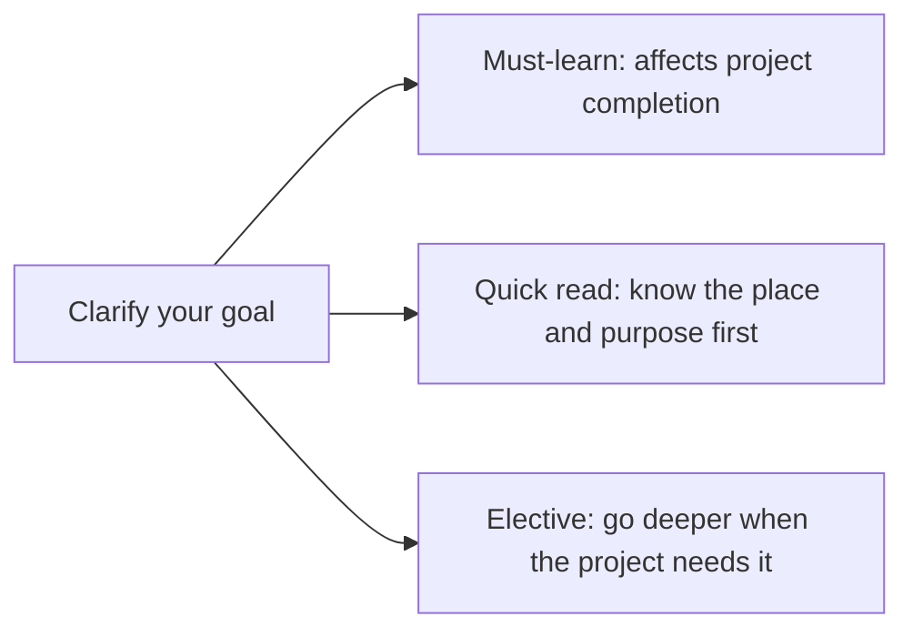

# Layered Learning Path: Must-Learn, Quick Read, and Electives

This course covers a lot of material, and different goals do not require the same way of reading. Based on your own goals, you can split the chapters into must-learn, quick-read, and elective deep-dive sections.

## One diagram to understand it all: one chapter, three ways to read it

| Reading style | Decision rule | How well you need to learn it |
|---|---|---|
| Must-learn | Without it, the current project cannot move forward | You can run the smallest example and explain the input and output |
| Quick read | You will use it later, but do not need to dig deep the first time | You know what problem it solves and the common pitfalls |
| Elective | Only related to a specific direction or capstone project | Add experiments and case studies when the project needs them |

## Path 1: LLM application engineering

Suitable for learners who want to quickly build AI applications, RAG, and Agent systems.

| Module | Recommended reading style |
|---|---|
| Development tools, Python, data analysis | Must-learn, at least complete a minimal project |
| AI math, machine learning, deep learning | Quickly go through the main line, and understand metrics, training, and evaluation |
| LLM principles, Prompt, RAG, Agent | Must-learn, this is the main battlefield |
| CV, traditional NLP, multimodal | Elective, based on project needs |
| Engineering, evaluation, safety | Must-learn, determines whether it can be launched |

## Path 2: Stronger model understanding

Suitable for people who want to go deeper into models, training, fine-tuning, and algorithms.

| Module | Recommended reading style |
|---|---|
| Math, machine learning, deep learning | Must-learn, and try to complete full experiments |
| CV, NLP, Transformer, pretraining | Must-learn or elective for deeper study |
| RAG, Agent | Quickly understand the boundary of application systems |
| Multimodal, AIGC | Choose based on research interests |

## Path 3: Portfolio path

Suitable for learners who want to turn the learning process into a portfolio.

| Stage | Portfolio focus |
|---|---|
| Python | A command-line tool or Web API |
| Data analysis | An EDA report that can be showcased |
| Machine learning | A prediction project with baseline and metrics |
| Deep learning | A training experiment with curves and failed samples |
| RAG | A knowledge-base Q&A assistant with citations and an evaluation set |
| Agent | A tool-using assistant with traceability and safety boundaries |
| Multimodal | A workflow project for images and text, voice, or video |

## How to decide whether you can skip ahead

If you can explain in your own words what problem this chapter solves, and you can complete the minimum project exit, then you can keep moving forward. Do not stop at the front because you have not fully mastered every detail. Many concepts will come back repeatedly in later projects.
