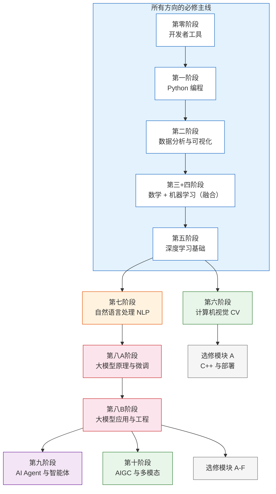

# 📌 学习路线

> 本课程共 **11 个主线阶段 + 6 个选修模块**，覆盖从开发工具到 AI Agent 的完整技术栈。  
> 你不需要全部学完——根据职业方向，选择适合自己的路径。

---

## 课程全局地图



**图例：** 白色 = 必修主线 · 橙色边框 = 条件必修 · 绿色 = 方向选修 · 紫色 = 高级必修 · 灰色 = 选修模块

---

## 课程总览表

### 主线阶段

| 阶段 | 名称 | 学什么 | 学时 | 属性 |
|:---:|------|-------|:---:|:---:|
| 零 | 开发者工具基础 | 终端、Git、VS Code、Jupyter | 8-12h | 必修 |
| 一 | Python 编程基础 | Python 语法、OOP、文件操作 | 90-130h | 必修 |
| 二 | 数据分析与可视化 | NumPy、Pandas、Matplotlib、Seaborn | 80-120h | 必修 |
| 三 | AI 数学基础 | 线性代数、概率统计、微积分（代码+可视化） | 40-60h | 必修 |
| 四 | 机器学习 | sklearn、回归、分类、集成学习、特征工程 | 120-160h | 必修 |
| 五 | 深度学习基础 | PyTorch、CNN、RNN、Transformer 基础 | 140-190h | 必修 |
| 六 | 计算机视觉 | OpenCV、目标检测、图像分割、YOLO | 120-180h | 方向选修 |
| 七 | 自然语言处理 | 文本处理、BERT、GPT、HuggingFace | 120-180h | ⚠️ 条件必修 |
| 八A | 大模型原理与微调 | Transformer 深入、Prompt 工程、LoRA | 90-120h | 必修 |
| 八B | 大模型应用与工程 | RAG、LLM 部署、LangChain、Docker | 90-120h | 必修 |
| 九 | AI Agent | Agent 架构、工具使用、记忆、MCP、多 Agent | 150-200h | 必修 |
| 十 | AIGC 与多模态 | Stable Diffusion、视频生成、数字人 | 80-120h | 方向选修 |

:::warning 关于第七阶段
第七阶段（NLP）对**大模型 / Agent 方向是条件必修**。第八阶段大量内容以 NLP 基础为前提。如果你选择跳过第七阶段，请务必完成第八A阶段开头的「NLP 核心速成」小节（约 10-15 小时）。
:::

### 选修模块

| 模块 | 名称 | 学什么 | 学时 | 适合谁 |
|:---:|------|-------|:---:|-------|
| A | C++ 与模型部署 | TensorRT、ONNX、Triton、边缘部署 | 120-180h | CV/NLP 工程师 |
| B | Python 进阶 | 装饰器、并发编程、asyncio、元编程 | 20-30h | 所有人（asyncio 是 8B 前置） |
| C | 经典 ML 补充 | SVM、KNN、朴素贝叶斯 | 20-30h | 想打牢 ML 基础的人 |
| D | AI 安全 | Prompt 注入、红队测试 | 8-12h | Agent / 应用开发者 |
| E | Web 前端速成 | HTML/CSS/JS/React | 15-20h | 需要做前端的人 |
| F | AI 产品思维 | 产品设计、成本核算 | 5-8h | 想做 AI 产品的人 |

:::info 选修模块 B 的特殊说明
模块 B 中的 **asyncio**（异步编程）是第八B阶段"AI 工程化实践"的前置知识。建议在进入第八B阶段前花 2-3 小时学完。
:::

---

## 各方向推荐路径

### 🔵 大模型应用 / AI Agent 方向（推荐）

```
零 → 一 → 二 → 三+四（融合） → 五 → 七（条件必修） → 八A → 八B → 九 → 求职
```

**核心投入：** 第八A/B + 第九阶段（大模型 + Agent）  
**选修建议：** 模块 B（asyncio）、模块 D（安全）  
**求职目标：** AI 应用工程师、Agent 开发工程师

### 🟢 CV 工程师方向

```
零 → 一 → 二 → 三+四（融合） → 五 → 六（重点） → 选修 A（部署） → 求职
```

**核心投入：** 第六阶段（CV），多做项目  
**选修建议：** 模块 A（部署是 CV 岗位的加分项）  
**求职目标：** CV 算法工程师、图像处理工程师

### 🟡 NLP 工程师方向

```
零 → 一 → 二 → 三+四（融合） → 五 → 七（重点） → 八A → 八B → 选修 A → 求职
```

**核心投入：** 第七阶段 + 第八A阶段  
**求职目标：** NLP 工程师、对话系统工程师

### 🟣 AIGC 方向

```
零 → 一 → 二 → 三+四（融合） → 五 → 七（建议） → 八A → 八B → 十（重点） → 求职
```

**核心投入：** 第十阶段（AIGC）  
**求职目标：** AIGC 工程师、多模态开发

### 🌈 全栈 AI 工程师（最强路线）

```
按顺序完成所有主线阶段 + 选修模块 A（部署）+ 选修模块 E（前端）
```

**时间：** 全职 16-20 个月  
**求职目标：** 高级 AI 工程师、Tech Lead

---

## 总学时估算

| 路径 | 涉及阶段 | 总学时 | 全职时间 | 兼职时间 |
|------|---------|:---:|:---:|:---:|
| 大模型+Agent | 零～五 + 七 + 八A/B + 九 | ~900h | 8-10月 | 16-20月 |
| CV | 零～六 + 选修A | ~900h | 10-12月 | 20-24月 |
| NLP | 零～五 + 七 + 八A/B | ~850h | 9-11月 | 18-22月 |
| AIGC | 零～五 + 七 + 八A/B + 十 | ~950h | 10-12月 | 20-24月 |
| 全栈 | 全部 | ~1400h | 16-20月 | 32-40月 |

:::note
学时是估算值，包含了看教程、写代码、做项目的总时间。个人差异很大，仅供参考。
:::

---

## 阶段之间的依赖关系

搞清楚"什么必须先学、什么可以跳过"：

| 阶段 | 前置要求 | 能否跳过 |
|------|---------|---------|
| 第零阶段 | 无 | 有开发经验的可快速过 |
| 第一阶段 | 第零 | 有 Python 基础的可跳部分内容 |
| 第二阶段 | 第一 | 不建议跳 |
| 第三阶段 | 第二 | 必须学，但与第四阶段融合 |
| 第四阶段 | 第三（同步进行） | 不建议跳 |
| 第五阶段 | 第三+四 | 不建议跳 |
| 第六阶段 | 第五 | CV 方向必学，其他可跳 |
| 第七阶段 | 第五 | 大模型方向条件必修 |
| 第八A阶段 | 第五（建议第七） | 不建议跳 |
| 第八B阶段 | 第八A | 不建议跳 |
| 第九阶段 | 第八A+B | 不建议跳 |
| 第十阶段 | 第八B | AIGC 方向必学 |

---
