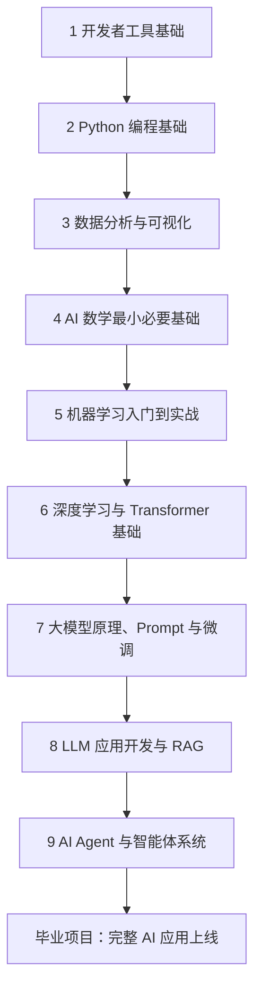
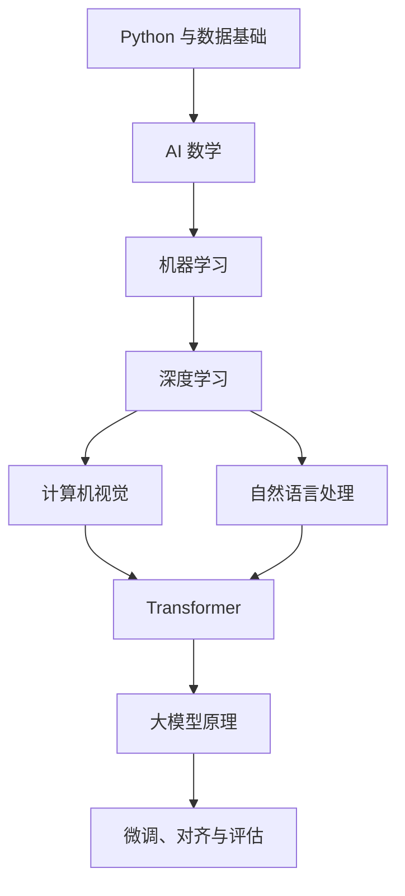

# 推荐学习路线

这套课程内容很多，但你不需要第一次就把所有分支推平。更好的方式是先选择一条主线，跑通从基础到项目的闭环，再根据兴趣补方向内容。

## 路线一：应用型 AI 全栈主线

这条路线适合大多数已经会一点编程、希望尽快做出 AI 应用的学习者。

```mermaid
flowchart TD
  A[1 开发者工具基础] --> B[2 Python 编程基础]
  B --> C[3 数据分析与可视化]
  C --> D[4 AI 数学最小必要基础]
  D --> E[5 机器学习入门到实战]
  E --> F[6 深度学习与 Transformer 基础]
  F --> G[7 大模型原理、Prompt 与微调]
  G --> H[8 LLM 应用开发与 RAG]
  H --> I[9 AI Agent 与智能体系统]
  I --> J[毕业项目：完整 AI 应用上线]
```

这条路线的特点是先建立完整主干，再逐步深入。你不需要一开始就成为数学或算法专家，但需要知道每一层为什么存在，以及它和后面的 LLM、RAG、Agent 有什么关系。

如果你的目标是做 AI 应用工程师、LLM 应用开发、RAG 系统、Agent 项目、AI 自动化工具，优先走这条路线。

## 路线二：模型理解加强路线

这条路线适合想更深入理解模型内部机制的人，尤其适合未来想做算法、训练、微调、评估或模型工程的学习者。

```mermaid
flowchart TD
  A[Python 与数据基础] --> B[AI 数学]
  B --> C[机器学习]
  C --> D[深度学习]
  D --> E[计算机视觉]
  D --> F[自然语言处理]
  E --> G[Transformer]
  F --> G
  G --> H[大模型原理]
  H --> I[微调、对齐与评估]
```

这条路线会更慢，但会让你对模型演进有更强的理解：为什么早期专家系统不够灵活，为什么机器学习需要特征工程，为什么深度学习依赖数据和算力，为什么 Transformer 成为大模型的核心架构。

如果你的目标是算法工程、模型微调、模型评估、研究助理、AI 方向研究生入门，可以优先走这条路线。

## 路线三：项目作品集路线

这条路线适合想边学边做，把学习过程变成作品集的人。

```mermaid
flowchart LR
  A[命令行小工具] --> B[数据分析报告]
  B --> C[机器学习预测模型]
  C --> D[深度学习分类项目]
  D --> E[LLM 聊天助手]
  E --> F[RAG 知识库]
  F --> G[Agent 自动化助手]
  G --> H[完整 AI 应用上线]
```

这条路线不是按知识点完整度设计，而是按“可展示成果”设计。每个项目都应该能回答三个问题：它解决什么问题，输入输出是什么，如何判断它做得好不好。

如果你的目标是求职、转行、做作品集、准备面试或展示能力，可以把这条路线和路线一结合起来。

## 如何选择

如果你不确定怎么选，默认选择路线一。它最适合从“会一点编程”过渡到“能做 AI 应用”。

如果你学习过程中发现自己总想知道模型内部发生了什么，就在机器学习和深度学习部分多停留一些时间，并补充 CV、NLP 和数学章节。

如果你希望更快看到成果，就每学完一个阶段都完成一个小项目。不要等课程全部学完才开始做项目，因为项目会反过来暴露你真正没掌握的地方。

## 建议学习节奏

第一遍学习时，不要追求所有细节都掌握。建议用“主线优先、项目驱动、方向后补”的方式推进。

每学完一个阶段，你至少应该完成一次复盘：这一阶段解决什么问题，我能否用自己的话解释核心概念，我是否亲手跑过代码，我是否有一个可展示的小产出。

如果某一章太难，可以先知道它在系统中的位置，再往后推进。AI 学习不是线性一次通过，而是不断回头补强的过程。