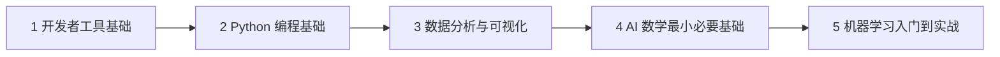
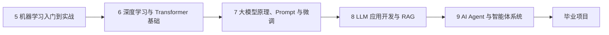
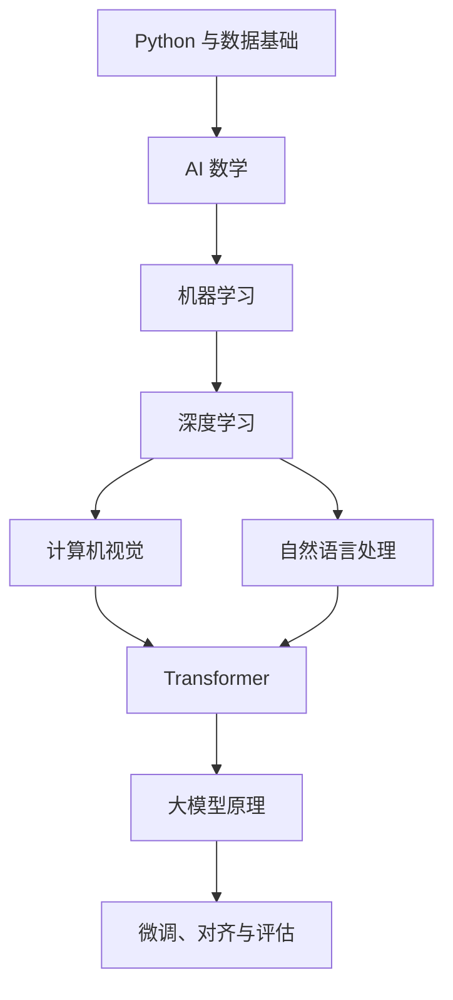
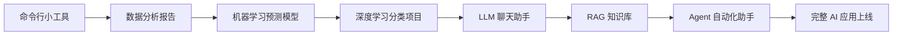

# 推荐学习路线

这套课程内容很多，但你不需要第一次就把所有分支推平。更好的方式是先选择一条主线，跑通从基础到项目的闭环，再根据兴趣补方向内容。

如果你的目标是跟上 2025～2026 年的 AI 应用工程，不要只追工具名。建议先读 [2025-2026 AI 应用技术地图](/intro/modern-ai-stack)，再用 [贯穿项目：AI 学习助手成长路线](/intro/ai-learning-assistant-project) 把 RAG、Agent、多模态和工程化串成一个作品；如果你已经有明确职业目标，可以参考 [角色路线选择](/intro/role-based-paths) 决定哪些章节精读，最后用 [AI 工程评估与上线清单](/intro/ai-engineering-checklist) 检查项目质量。

如果你更需要执行节奏，可以直接看 [学习节奏规划](/intro/learning-schedule)：里面把课程拆成 4 周、8 周和 12 周三种推进方式，每周都有明确交付物。

## 先选一种学习模式

不同学习者的最佳路线不一样。你可以先选一种模式，再决定每章读多深。

| 学习模式 | 适合谁 | 怎么学 | 不容易枯燥的关键 |
|---|---|---|---|
| 新人通关模式 | 会一点编程，但 AI 基础不系统 | 按路线一从 1 到 9 走，每阶段完成最小项目 | 每章只抓“能做什么”，不要一开始追所有细节 |
| 作品集模式 | 想求职、转行或展示能力 | 路线一 + 路线三同步推进，每阶段沉淀一个作品 | 每学一段都更新项目 README、截图和结果分析 |
| 深入理解模式 | 想做算法、训练、微调、评估 | 走路线二，数学、深度学习、Transformer 多停留 | 每个概念都问“它解决了上一代什么问题” |
| 快速应用模式 | 已有开发经验，想尽快做 LLM 应用 | 快速浏览 1～6，重点学 7～9 | 用一个真实业务问题贯穿 Prompt、RAG、Agent |

如果不确定选哪种，默认用“新人通关模式”：先跑通一条完整主线，再回头补强。

## 按时间和目标选择路线

学习路线不要只按兴趣选，也要按你能投入的时间和最终目标选。同一套课程可以有三种推进深度：先完成最小闭环，之后再补工程化和作品集证据。

| 当前情况 | 推荐路线 | 学习策略 | 阶段交付物 |
|---|---|---|---|
| 每周 3～5 小时 | 最小通关路线 | 每阶段只抓核心概念和一个最小项目 | README、运行命令、示例输出 |
| 每周 6～10 小时 | 应用工程路线 | 重点完成 Python、数据、Prompt、RAG、Agent | 小项目、日志、失败样本、评估表 |
| 准备作品集或求职 | 作品集路线 | 每个主阶段都沉淀可展示证据 | 截图/GIF、指标、复盘、部署说明 |
| 已有开发经验 | 快速应用路线 | 快速扫过基础，集中做 LLM 应用闭环 | LLM API、RAG、Agent、上线清单 |
| 想走模型/算法 | 模型理解路线 | 加深数学、机器学习、深度学习和 Transformer | 实验记录、模型对比、误差分析 |

选择路线后，不要频繁切换。更稳的做法是先完成一轮主线，再用 [全课程能力评估与通关标准](/intro/assessment-standards) 检查薄弱环节，最后回到对应章节补强。

## 路线切换规则

如果你在学习中发现路线不合适，可以按下面规则切换，而不是从头再来。

| 从哪里切换 | 什么时候切换 | 怎么补 |
|---|---|---|
| 新人通关 -> 作品集 | 已经完成 3 个以上阶段项目 | 回头补 README、截图、失败样本和评估方式 |
| 快速应用 -> 系统学习 | RAG 或 Agent 经常卡在基础问题 | 补 Python、数据处理、HTTP/API 和数据库基础 |
| 应用工程 -> 模型理解 | 开始关注模型效果和微调 | 补数学、机器学习、深度学习和 Transformer |
| 模型理解 -> 应用工程 | 想把模型能力做成产品 | 补后端接口、Prompt、RAG、日志和部署 |

路线切换的重点不是“重新学一遍”，而是补齐当前项目缺的能力。用项目暴露问题，再用章节补知识，学习会更顺。

## 项目闯关线：每一段都要留下一个作品

学习 AI 最容易枯燥的原因，是只看概念、没有产出。建议你把整套课当成一条作品升级线：每完成一个阶段，就留下一个能解释、能运行、能展示的小成果。

| 阶段 | 闯关任务 | 作品标准 |
|---|---|---|
| 1 开发者工具基础 | 搭好开发环境，学会命令行和 Git | 能从零创建项目、提交代码、说明运行方式 |
| 2 Python 编程基础 | 写一个能解决小问题的脚本或 API | 有输入、有输出、有异常处理，别人能运行 |
| 3 数据分析与可视化 | 分析一份真实或模拟数据 | 有清洗过程、关键图表、结论和局限 |
| 4 AI 数学最小必要基础 | 把公式翻译成模型直觉 | 能解释向量、概率、梯度分别在模型里做什么 |
| 5 机器学习入门到实战 | 做一个预测、分类或分群项目 | 有 baseline、指标、误差分析和改进方向 |
| 6 深度学习与 Transformer 基础 | 跑通一个神经网络训练实验 | 有训练曲线、测试结果和失败样本分析 |
| 7 大模型原理、Prompt 与微调 | 设计一组稳定 Prompt 或微调方案 | 能说明为什么用 Prompt、RAG 或微调 |
| 8 LLM 应用开发与 RAG | 做一个带引用的知识库助手 | 有文档处理、检索、回答、引用、RAGOps 日志和评估样例 |
| 9 AI Agent 与智能体系统 | 做一个能分步执行的 Agent | 有工具调用、执行轨迹、权限边界、失败处理和日志 |
| 10～12 方向拓展 | 选择计算机视觉、自然语言处理或 AIGC 多模态做毕业作品 | 有完整问题定义、技术路线、评估和展示材料 |

这条闯关线可以和任何学习路线叠加。新人可以做基础版，有经验的人可以把每个作品做成更完整的工程项目。

## 路线一：应用型 AI 全栈主线

这条路线适合大多数已经会一点编程、希望尽快做出 AI 应用的学习者。

```mermaid
flowchart LR
  A[1 开发者工具基础] --> B[2 Python 编程基础]
  B --> C[3 数据分析与可视化]
  C --> D[4 AI 数学最小必要基础]
  D --> E[5 机器学习入门到实战]
```

第一段先把编程、数据、数学和机器学习基础打通。这里的目标不是一次学成专家，而是让你能看懂数据、写出基本分析代码，并理解模型为什么需要训练和评估。

```mermaid
flowchart LR
  E[5 机器学习入门到实战] --> F[6 深度学习与 Transformer 基础]
  F --> G[7 大模型原理、Prompt 与微调]
  G --> H[8 LLM 应用开发与 RAG]
  H --> I[9 AI Agent 与智能体系统]
  I --> J[毕业项目]
```

这条路线的特点是先建立完整主干，再逐步深入。你不需要一开始就成为数学或算法专家，但需要知道每一层为什么存在，以及它和后面的 LLM、RAG、Agent 有什么关系。

如果你的目标是做 AI 应用工程师、LLM 应用开发、RAG 系统、Agent 项目、AI 自动化工具，优先走这条路线。

## 路线二：模型理解加强路线

这条路线适合想更深入理解模型内部机制的人，尤其适合未来想做算法、训练、微调、评估或模型工程的学习者。

```mermaid
flowchart TD
  A[Python 与数据基础] --> B[AI 数学]
  B --> C[机器学习]
  C --> D[深度学习]
  D --> E[计算机视觉]
  D --> F[自然语言处理]
  E --> G[Transformer]
  F --> G
  G --> H[大模型原理]
  H --> I[微调、对齐与评估]
```

这条路线会更慢，但会让你对模型演进有更强的理解：为什么早期专家系统不够灵活，为什么机器学习需要特征工程，为什么深度学习依赖数据和算力，为什么 Transformer 成为大模型的核心架构。

如果你的目标是算法工程、模型微调、模型评估、研究助理、AI 方向研究生入门，可以优先走这条路线。

## 路线三：项目作品集路线

这条路线适合想边学边做，把学习过程变成作品集的人。

```mermaid
flowchart LR
  A[命令行小工具] --> B[数据分析报告]
  B --> C[机器学习预测模型]
  C --> D[深度学习分类项目]
  D --> E[LLM 聊天助手]
  E --> F[RAG 知识库]
  F --> G[Agent 自动化助手]
  G --> H[完整 AI 应用上线]
```

这条路线不是按知识点完整度设计，而是按“可展示成果”设计。每个项目都应该能回答三个问题：它解决什么问题，输入输出是什么，如何判断它做得好不好。

如果你的目标是求职、转行、做作品集、准备面试或展示能力，可以把这条路线和路线一结合起来。

## 如何选择

如果你不确定怎么选，默认选择路线一。它最适合从“会一点编程”过渡到“能做 AI 应用”。

如果你学习过程中发现自己总想知道模型内部发生了什么，就在机器学习和深度学习部分多停留一些时间，并补充 CV、NLP 和数学章节。

如果你希望更快看到成果，就每学完一个阶段都完成一个小项目。不要等课程全部学完才开始做项目，因为项目会反过来暴露你真正没掌握的地方。

## 建议学习节奏

第一遍学习时，不要追求所有细节都掌握。建议用“主线优先、项目驱动、方向后补”的方式推进。

每学完一个阶段，你至少应该完成一次复盘：这一阶段解决什么问题，我能否用自己的话解释核心概念，我是否亲手跑过代码，我是否有一个可展示的小产出。

如果某一章太难，可以先知道它在系统中的位置，再往后推进。AI 学习不是线性一次通过，而是不断回头补强的过程。