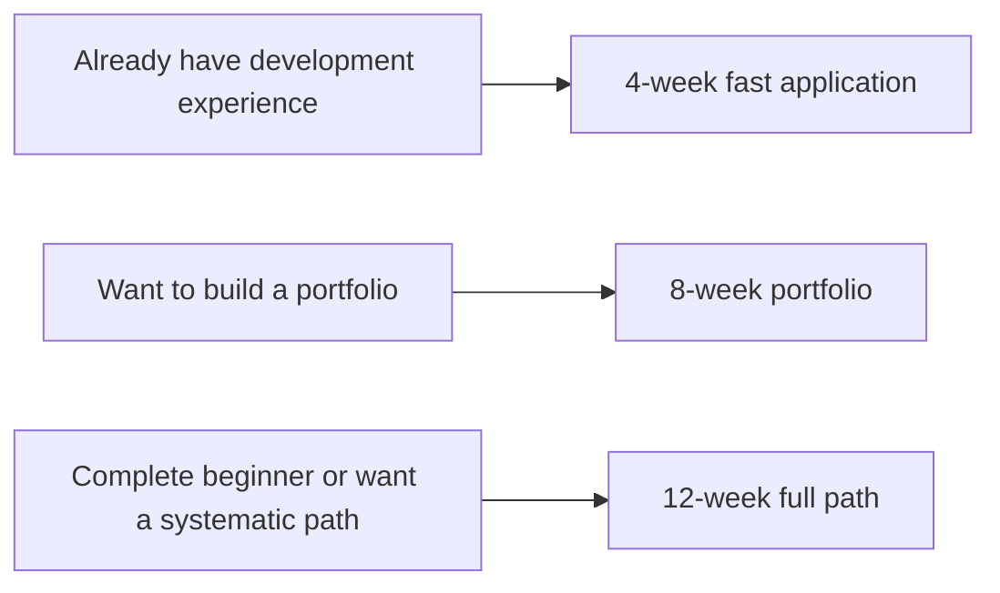

# Planning Your Learning Pace: How to Progress in 4, 8, or 12 Weeks

## What This Section Is About

This course contains a lot of content. If you move forward only by article count, it is very easy to end up learning in a scattered way. A better approach is to learn in time boxes: focus on one main goal each week and leave with a deliverable you can show.

This page does not define the only valid pace. Instead, it offers three practical plans: a 4-week fast application path, an 8-week portfolio path, and a 12-week full path. You can choose one based on your available time and background.

## Choose a Pace First

| Your current situation | Recommended pace |
|---|---|
| You already know how to code and just want to quickly build a RAG/Agent prototype | 4-week path |
| You want to switch to AI applications and need a solid portfolio | 8-week path |
| You are a beginner, your foundation is not systematic, and you often get stuck on environment or data issues | 12-week path |

## 4-Week Fast Application Path

This path is suitable for people who already have programming experience and want to quickly build an LLM / RAG / Agent prototype. It skips many details, but it cannot skip evaluation, logging, and boundaries.

| Week | Learning focus | Deliverable |
|---|---|---|
| Week 1 | Quickly review stations 1 to 6; cover the minimum concepts of Python, data, models, and Transformer | A runnable Python project skeleton and README |
| Week 2 | Read stations 7 to 8 carefully; complete a Prompt assistant and a minimal RAG | A course Q&A demo with source citations |
| Week 3 | Read station 9 carefully; complete a minimal Agent and tool-calling trace | An Agent that can break down tasks, call tools, and record its trace |
| Week 4 | Fill in engineering, evaluation, cost, security, and deployment notes | Project README, evaluation set, failure samples, and deployment notes |

The goal of the 4-week path is not to “learn everything,” but to quickly produce an AI application project you can clearly explain. It is suitable for a job-hunting sprint, for experienced developers transitioning into AI applications, or for validating whether you like this direction.

## 8-Week Portfolio Path

This path is suitable for most people who want to move into AI applications, RAG, or Agent development. It emphasizes producing a stage project every two weeks and then connecting them into a complete portfolio.

| Week | Learning focus | Deliverable |
|---|---|---|
| Week 1 | Stations 1 to 2: environment, Git, Python basics | Command-line learning assistant v0.2 |
| Week 2 | Station 3: data analysis and visualization | Learning data analysis report and charts |
| Week 3 | Stations 4 to 5: math intuition and machine learning | Learning task classification or progress prediction baseline |
| Week 4 | Station 6: deep learning and Transformer | A small training experiment and training curves |
| Week 5 | Station 7: LLM principles, Prompt, and fine-tuning | Prompt assistant, Prompt versions, and failure samples |
| Week 6 | Station 8: RAG and application development | A RAG assistant with citations, logs, and an evaluation set |
| Week 7 | Station 9: Agent systems | An Agent with tool calls, traces, and permission boundaries |
| Week 8 | Engineering wrap-up and exploration of next directions | Portfolio README, screenshots, deployment notes, and next-step plan |

The most important thing in the 8-week path is steady accumulation. At the end of each week, update the README: what new capability you added, how to run it, what the sample inputs and outputs are, what the failure samples are, and what you plan to improve next.

## 12-Week Full Path

This path is suitable for beginners or for people who want to systematically fill in their foundations. It covers programming, data, models, LLM applications, RAG, Agent, and multimodal directions more thoroughly and steadily.

| Week | Learning focus | Deliverable |
|---|---|---|
| Week 1 | Station 1: basics of developer tools | Git repository, environment screenshots, project directory |
| Week 2 | Station 2: Python programming basics | Command-line tool or simple API |
| Week 3 | Station 3: data analysis and visualization | Data cleaning, analysis charts, and conclusions |
| Week 4 | Station 4: minimum AI math foundation | Concepts cards and small experiments for vectors, probability, and gradients |
| Week 5 | Station 5: machine learning | Baseline, metrics, and error sample analysis |
| Week 6 | Station 6: deep learning and Transformer | Training experiment, loss curve, and review |
| Week 7 | Station 7: LLM principles, Prompt, and fine-tuning | Prompt assistant and Prompt evaluation notes |
| Week 8 | Station 8: RAG basics | Minimal RAG, source citations, and retrieval logs |
| Week 9 | Station 8 advanced: RAGOps and engineering | Evaluation set, failure samples, cost records, and deployment notes |
| Week 10 | Station 9: Agent basics and tools | Minimal Agent, tool schema, and execution trace |
| Week 11 | Station 9 advanced: AgentOps and security | Permission boundaries, human confirmation, failure recovery, and evaluation task set |
| Week 12 | Station 12: multimodal or capstone project in your chosen direction | Multimodal learning assistant, creative workspace, or direction-specific portfolio project |

The 12-week path is suitable for building a system from scratch. The key is not to learn a huge amount every day, but to have one result each week that you can save.

## Weekly Review Template

At the end of each week, it is recommended that you review your progress using the six questions below. Do not just write “I studied chapter X.”

| Review question | Example direction for an answer |
|---|---|
| What problem did I solve this week? | From not being able to handle documents to being able to answer with RAG and citations |
| What new ability did I add? | Document chunking, retrieval, citations, evaluation set |
| What code did I get running? | `python -m src.rag.demo` |
| What failure did I encounter? | Retrieval returned irrelevant passages |
| How did I diagnose it? | Printed the top-k passages and found the chunks were too short |
| What should I prioritize fixing next week? | Add Hybrid Search and a fixed evaluation set |

## How to Adjust for Different Backgrounds

If you already know Python, you can compress weeks 1 to 2 into a few days and leave more time for stations 8 to 9. If you have done machine learning before, you can quickly skim stations 4 to 6, but do not skip evaluation, training curves, or error samples, because these skills will continue to matter in RAG and Agent evaluation.

If you are a complete beginner, do not choose the 4-week path just because it looks fast. Beginners are usually better suited to the 12-week path, because the real bottlenecks in AI application engineering are often not model names, but environment setup, data formats, interface errors, logs, evaluation, and project boundaries.

## Passing Criteria

No matter which path you choose, you should end up with at least four types of materials: a runnable project repository, a README that explains the project goal and how to run it, a set of evaluation or test cases, and a record of failure samples and improvements.

If you can explain these materials clearly, it means you have not just “looked through the course,” but have already turned the course into your own project experience.
